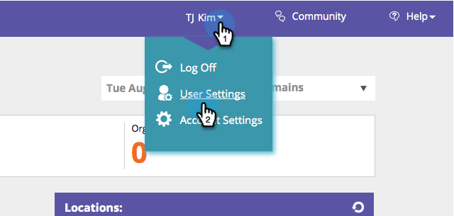

# Enable/Disable Report Subscriptions {#enable-disable-report-subscriptions}

Web Personalization has a several useful reports which are sent via email. Here's how to subscribe to them.

1. Log into Web Personalization. Under your login name, click **User Settings**.

   

1. Select the report you want to subscribe to and it's frequency. Click **Save**.

   

   That's it! To unsubscribe from the report simply uncheck and click **Save**.

