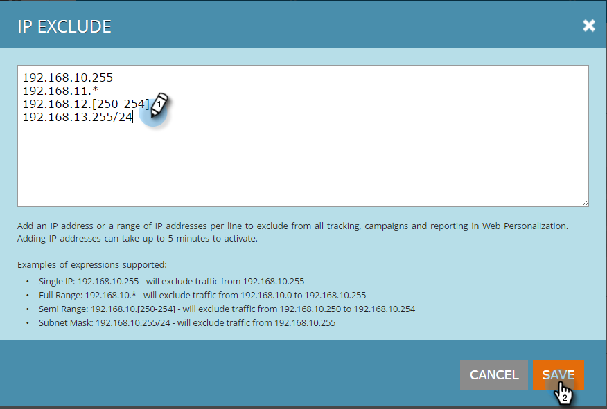

# Exclude Specific IPs from Being Tracked {#exclude-specific-ips-from-being-tracked}

Ever want to exclude your own employees and organization name from the tracking and reporting in [!UICONTROL Web Personalization]?

You can exclude individual IPs and all or part of a range of IPs.

>[!NOTE]
>
>This process can take up to five minutes to complete.

1. Log into [!UICONTROL Web Personalization] and under your login, click **[!UICONTROL Account Settings]**.

   

1. Scroll down to the **[!UICONTROL IP Exclude]** area. If you are excluding IP addresses for the first time, click in the empty **[!UICONTROL Exclude IP Addresses]** field.

   

1. Enter the individual IP(s) or ranges of IPs you want to exclude from tracking and reporting, and click **[!UICONTROL Save]**.

   

   >[!NOTE]
   >
   >You can exclude a single IPv4 or IPv6 address, or a full range, semi range, or by subnet mask. The items in the example above show one of each, based on the examples provided in the Marketo form itself.

1. The [!UICONTROL Exclude IP Addresses] field now lists the IP addresses you entered. To edit the IP exclusions, click the green plus to reopen the form.

   

   Did you see how easy that was? Now you can exclude all data from the IPs added, either individually or by range.
