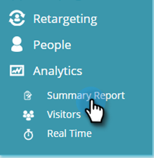
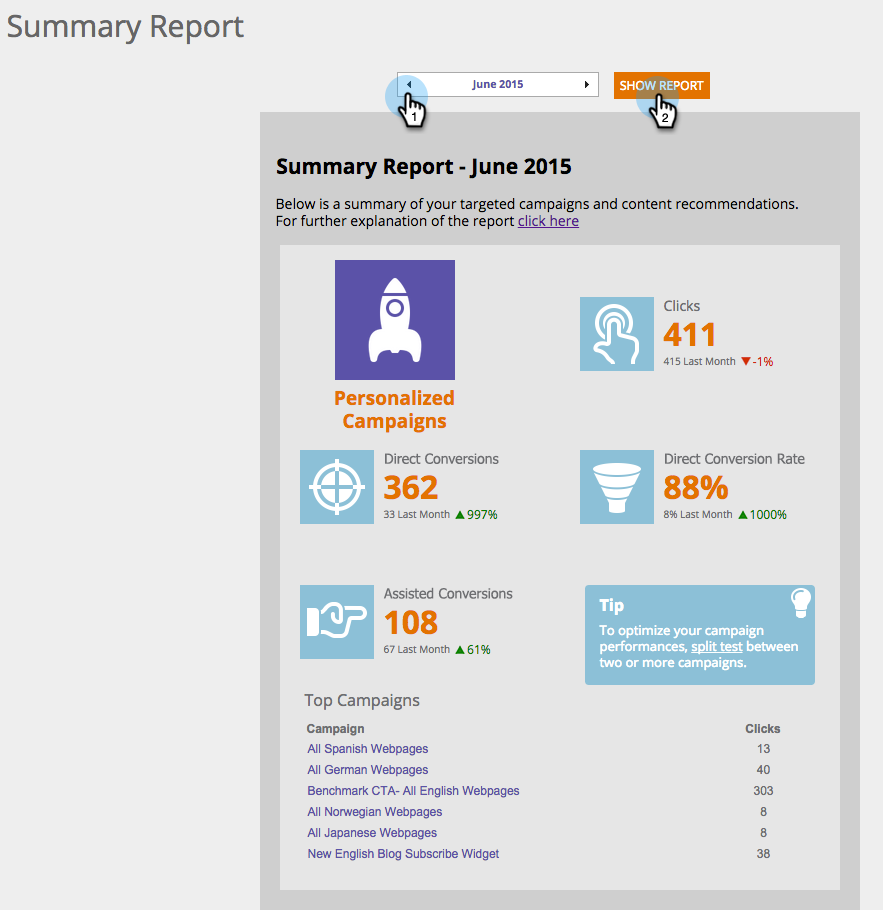

# Understanding the [!UICONTROL Summary Report] {#understanding-the-summary-report}

The [!UICONTROL Summary report] is a monthly view of all [!UICONTROL campaigns] and recommended content performance. It is based on number of [!UICONTROL clicks] and number of leads (direct or assisted) that engaged with the personalized campaign or recommended content and then became a known lead. The report compares the results to the previous month.

>[!NOTE]
>
>**Definition**
>
>[!UICONTROL Direct Conversion]: A web visitor who clicks on a personalized campaign or recommended content asset and in the same visit session proceeds to fill out any form on the website with their email address.
>
>[!UICONTROL Assisted Conversion]: A web visitor who fills out any form on the website and leaves their email address, who in a previous visit (within the last 6 months) clicked on a personalized campaign or recommended content asset.

In [!UICONTROL Web Personalization], go to **[!UICONTROL Analytics]** and **[!UICONTROL Summary Report]**.

Select **Month** and click **[!UICONTROL Show Report]**.

The first part of the report relates to Personalized Web Personalization campaigns and displays:

* **[!UICONTROL Clicks]** - all clicks on Web Personalization campaigns
* **[!UICONTROL Direct Conversions]** - all visitors who clicked on a Web Personalization campaign during the visit and filled out a form
* **[!UICONTROL Direct Conversion Rate]** - the percentage of visitors that became a direct lead after clicking a Web Personalization campaign. Direct leads divided by clicks
* **[!UICONTROL Assisted Conversions]** - all visitors who filled out a form and clicked a Web Personalization campaign in a previous visit (over the last 6 months)
* **[!UICONTROL Tip]s** - tips to optimize your Web Personalization campaign performances
* **[!UICONTROL Top Campaigns]** - the top performing campaigns during the selected time period, ordered by number of clicks

The second part of the report relates to Recommended Content from Web Personalization's content recommendation engine. It displays:

* **[!UICONTROL Clicks]** - all clicks on Web Personalization recommended content
* **[!UICONTROL Direct Conversions]** - all visitors who clicked on recommended content during their visit and filled out a form
* **[!UICONTROL Direct Conversion Rate]** - the percentage of visitors that became a direct lead after clicking recommended content. Direct leads divided by clicks
* **[!UICONTROL Assisted Conversions]** - all visitors who filled out a form and clicked on recommended content in a previous visit (over the last 6 months)
* **[!UICONTROL Tip]s** - tips to optimize using the Content Recommendation Engine
* **[!UICONTROL Top Recommendations]** - the top performing recommended content during the selected time period, ordered by number of clicks

>[!NOTE]
>
>Marketo Web Personalization captures the email address of the web visitor for any form completed on the website. This is viewed in the Web Personalization Leads page and is the lead that is used in the Summary report.
