# Custom RTP Dashboards in Google Universal Analytics {#custom-rtp-dashboards-in-google-universal-analytics}

>[!NOTE]
>
>**Prerequisites**
>
>[Integrate RTP with Google Universal Analytics](integrate-rtp-with-google-universal-analytics.md)

This post explains how to setup RTP dashboards in Google Universal Analytics (GUA).  The data sent from RTP to GUA can be set up as two separate custom dashboards called:

* RTP B2B
* RTP Engagement

## Setting up a Custom Dashboard {#setting-up-a-custom-dashboard}

1. Login to Google Analytics. Click on **Reporting **in the top menu. Click **Dashboards **and **+New Custom Dashboard.** 
   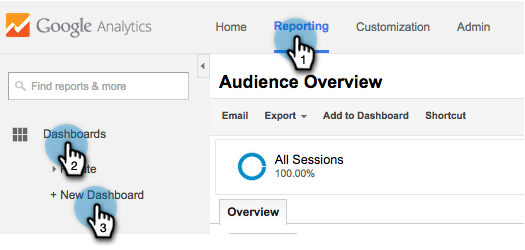

1. Select **Blank Canvas**, add a **Dashboard Name** and click **Create Dashboard**.

1. Click **Add Widget** to create a new widget.  
   

## RTP B2B Dashboard {#rtp-b-b-dashboard}

This dashboard allows users to analyze their website performance from a B2B perspective.

It provides information like visit source and onsite behavior by industry, revenue, size, Account-Based lists, and target segments.

The dashboard consists of 3 columns

* Traffic source
* Segmentation
* Firmographic drill down

1. Create a new dashboard called **RTP B2B Dashboard **and define the following widgets:

<table> 
 <thead> 
  <tr> 
   <th> 
    

      Column 1 - Traffic Sources 
    
</th> 
   <th> 
    
 <strong>Column 2 - Segmentation</strong> 
    
</th> 
   <th> 
    
 <strong>Column 3 - Firmographic Drill down</strong> 
    
</th> 
  </tr> 
 </thead> 
 <tbody> 
  <tr> 
   <td> 
    <ul> 
     <li>Name: Sessions by Segments and Channels</li> 
     <li>Widget type:&nbsp;Bar </li> 
     <li>Create a bar chart showing:&nbsp;Session</li> 
     <li>Grouped by: Event label</li> 
     <li>Pivot by: Default Channel Grouping</li> 
     <li>Filter:  Only Show | Event Category (containing) RTP-Segments</li> 
    </ul>

</td> 
   <td> 
    <ul> 
     <li>Name: # of RTP Segmented Users</li> 
     <li>Type: 2.1 Metric</li> 
     <li>Show the following metric:&nbsp;Users </li> 
     <li>Filter:  Only Show | Event Category (containing) RTP-Segments</li> 
    </ul>
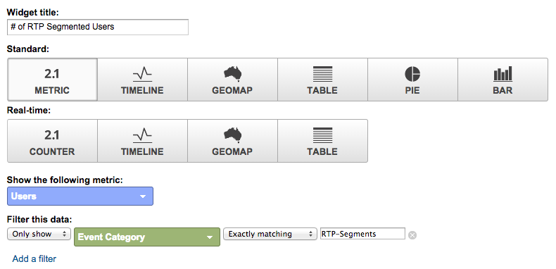
</td> 
   <td> 
    <ul> 
     <li>Name: Sessions by Industry</li> 
     <li>Type: Pie </li> 
     <li>Create a pie chart showing:&nbsp;Sessions</li> 
     <li>Grouped by:&nbsp;RTP-Industry</li> 
    </ul>

</td> 
  </tr> 
  <tr> 
   <th> 
    <ul> 
     <li><strong>Name: Sessions by Industry and Channels</strong></li> 
     <li><strong>Widget type:&nbsp;Bar</strong></li> 
     <li><strong>Create a bar chart showing:&nbsp;Session</strong></li> 
     <li><strong>Grouped by: RTP-Industry</strong></li> 
     <li><strong>Pivot by: Default Channel Grouping</strong> 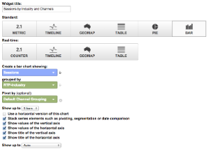</li> 
    </ul></th> 
   <th> 
    <ul> 
     <li><strong>Name: Segmented Sessions by Country</strong></li> 
     <li><strong>Type: Geomap</strong></li> 
     <li><strong>Plot selected metric:&nbsp;Country | Sessions</strong></li> 
     <li><strong>Select a region:&nbsp;The World</strong></li> 
     <li><strong>Filter: Only Show | Event Category (containing) RTP-Segments</strong></li> 
    </ul>
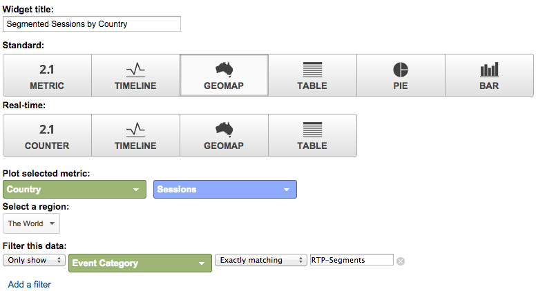
</th> 
   <th> 
    <ul> 
     <li><strong>Name: Sessions by RTP Category</strong></li> 
     <li><strong>Type: Pie</strong></li> 
     <li><strong>Create a pie chart showing:&nbsp;Sessions</strong></li> 
     <li><strong>Grouped by:&nbsp;RTP-Category</strong></li> 
    </ul>
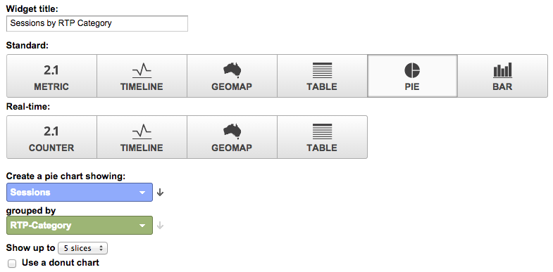
</th> 
  </tr> 
  <tr> 
   <th> </th> 
   <th> 
    <ul> 
     <li>Name: Top Target Segments</li> 
     <li>Type: Bar</li> 
     <li>Create a bar chart showing:&nbsp;Users</li> 
     <li>Grouped by:&nbsp;Event Action</li> 
     <li>Filter: Only Show | Event Category (containing) RTP-Segments</li> 
    </ul>
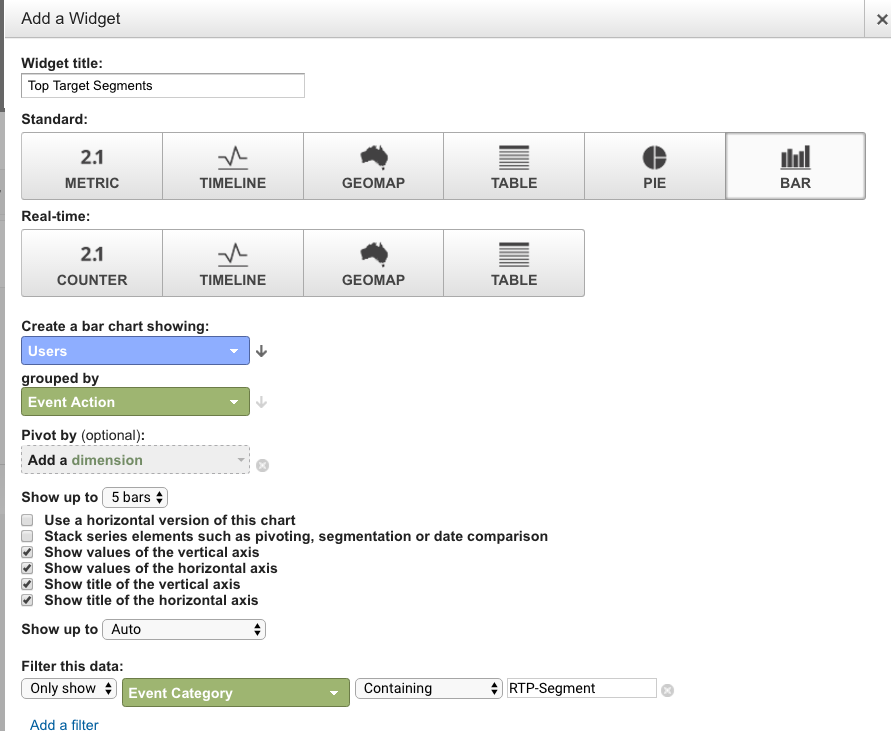
</th> 
   <th> 
    <ul> 
     <li>Name: Sessions by RTP-Groups</li> 
     <li>Type: Bar </li> 
     <li>Create a bar chart showing:&nbsp;Sessions</li> 
     <li>Grouped by:&nbsp;RTP-Group</li> 
    </ul>
<strong>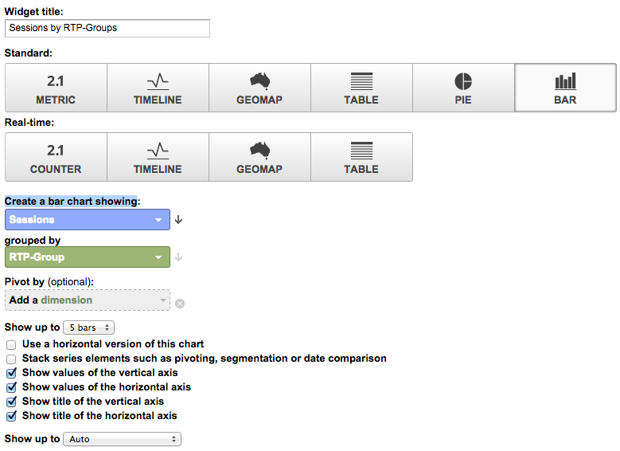</strong>
</th> 
  </tr> 
  <tr> 
   <th> </th> 
   <th> 
    <ul> 
     <li>Name: Sessions &amp; Goals by Top Segments</li> 
     <li>Type: Table </li> 
     <li>Display the following columns:&nbsp; Event Label | Sessions | Goal Conversion Rate</li> 
     <li>Filter:  Only Show | Event Category (containing) RTP-Segments</li> 
    </ul>
<strong>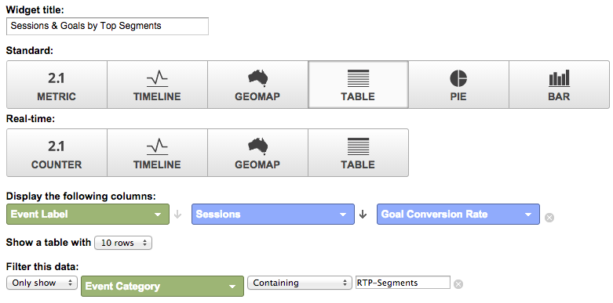</strong>
</th> 
   <th> </th> 
  </tr> 
 </tbody> 
</table>

## RTP Engagement Dashboard {#rtp-engagement-dashboard}

This dashboard allows users to analyze their RTP campaign performance and recommendation engine engagements. It provides comparison of avg. session duration and pages per session between:

*

    * Unengaged
    * Engaged (impressions and clicks on a personalized campaign)
    * Clicks on the Recommendation Engine and top recommended content

Create a new dashboard called **RTP Engagement Dashboard** and define the following widgets:

<table> 
 <thead> 
  <tr> 
   <th> 
    
 <strong>Column 1 Campaigns Exposure</strong> 
    
</th> 
   <th> 
    
 <strong>Column 2 Campaigns Clickthrough</strong> 
    
</th> 
   <th> 
    
 <strong>Column 3 Recommendation Engine</strong> 
    
</th> 
  </tr> 
 </thead> 
 <tbody> 
  <tr> 
   <td> 
    <ul> 
     <li>Name: <strong>Total CTA (Engagement)</strong></li> 
     <li>Type: <strong>2.1 Metric </strong></li> 
     <li>Show the following metric:&nbsp;<strong>Total Events</strong></li> 
     <li>Filters: <strong>[only show] Event Category (contains): RTP-Campaigns</strong> <strong>[only show] Event Action (exactly matcing): Impression</strong><strong>[don't show] Event Label (containing): #</strong></li> 
    </ul>
<strong>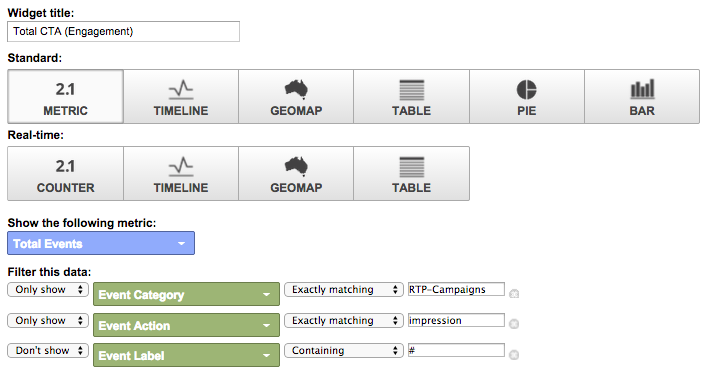</strong>
</td> 
   <td> 
    <ul> 
     <li>Name: <strong>Total CTA (Clickthrough)</strong></li> 
     <li>Type: <strong>2.1 Metric </strong></li> 
     <li>Show the following metric:&nbsp;<strong>Total Events</strong></li> 
     <li>Filters: <strong>[only show] Event Category (contains): RTP-Campaigns</strong> <strong>[only show] Event Action (exactly matching): Clicks</strong><strong>[don't show] Event Label (containing): #</strong></li> 
    </ul>
<strong></strong>
</td> 
   <td> 
    <ul> 
     <li>Name: <strong>CRE - Total Clicks</strong></li> 
     <li>Type: <strong>2.1 Metric</strong> </li> 
     <li>Show the following metric:&nbsp;<strong>Pageviews</strong></li> 
     <li>Filter:&nbsp;<strong>[only show] Page (containing): rcmd</strong></li> 
    </ul>
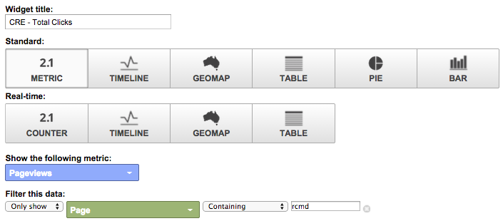
</td> 
  </tr> 
  <tr> 
   <td colspan="1"> 
    <ul> 
     <li>Name: <strong>Avg. Session Duration (Engagement)</strong></li> 
     <li>Type: <strong>2.1 Metric </strong></li> 
     <li>Show the following metric:&nbsp;<strong>Avg. Session Duration</strong></li> 
     <li>Filters: <strong>[only show] Event Category (exactly matching): RTP-Campaigns</strong> <strong>[only show] Event Action (exactly matching): impression</strong><strong>[don't show] Event Label (containing): #</strong></li> 
    </ul>
<strong></strong>
</td> 
   <td colspan="1"> 
    <ul> 
     <li>Name: <strong>Avg. Session Duration (Clickthrough)</strong></li> 
     <li>Type: <strong>2.1 Metric </strong></li> 
     <li>Show the following metric:&nbsp;<strong>Avg. Session Duration</strong></li> 
     <li>Filters: <strong>[only show] Event Category (exactly matching): RTP-Campaigns</strong> <strong>[only show] Event Action (exactly matching): clicks</strong><strong>[don't show] Event Label (containing): #</strong></li> 
    </ul>
<strong></strong>
</td> 
   <td colspan="1"> 
    <ul> 
     <li>Name: <strong>CRE - Top Recommended Content</strong></li> 
     <li>Type: <strong>Table</strong> </li> 
     <li>Display the following columns:&nbsp; <strong>Page Title | Pageviews</strong> </li> 
     <li>Filters: Filter:&nbsp;<strong>[only show] Page (containing): rcmd</strong></li> 
    </ul>

</td> 
  </tr> 
  <tr> 
   <td> 
    <ul> 
     <li>Name: <strong>Pages / Session (Engagement)</strong></li> 
     <li>Type: <strong>2.1 Metric </strong></li> 
     <li>Show the following metric:&nbsp;<strong>Pages / Session</strong></li> 
     <li>Filters: <strong>[only show] Event Category (exactly matching): RTP-Campaigns</strong></li> 
     <li><strong>[only show] Event Action (exactly matching): impression</strong></li> 
     <li><strong>[don't show] Event Label (containing): #</strong></li> 
    </ul>
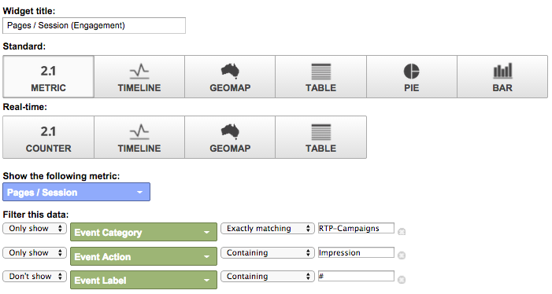
</td> 
   <td> 
    <ul> 
     <li>Name: <strong>Pages / Session (Clickthrough)</strong></li> 
     <li>Type: <strong>2.1 Metric </strong></li> 
     <li>Show the following metric:&nbsp;<strong>Pages / Session</strong></li> 
     <li>Filters: <strong>[only show] Event Category (exactly matching): RTP-Campaigns</strong></li> 
     <li><strong>[only show] Event Action (exactly matching): clicks</strong></li> 
     <li><strong>[don't show] Event Label (containing): #</strong></li> 
    </ul>
<strong></strong>
</td> 
   <td> </td> 
  </tr> 
  <tr> 
   <td> 
    <ul> 
     <li>Name: <strong>Impressions by CTA</strong></li> 
     <li>Type: <strong>Table</strong></li> 
     <li>Display the following columns:&nbsp;<strong>Event Label | Total Events | Users</strong></li> 
     <li>Filters: <strong>[only show] Event Category (exactly matching): RTP-Campaigns</strong> <strong>[only show] Event Action (exactly matching): impression</strong><strong>[don't show] Event Label (containing): #</strong></li> 
    </ul>
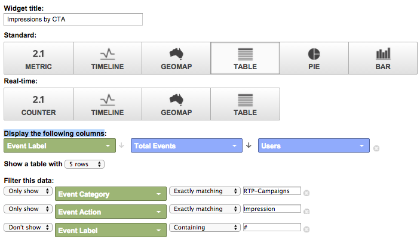
</td> 
   <td> 
    <ul> 
     <li>Name: <strong>Clickthrough by CTA</strong></li> 
     <li>Type: <strong>Table</strong></li> 
     <li>Display the following columns:&nbsp;<strong>Event Label | Total Events | Users</strong></li> 
     <li>Filters: <strong>[only show] Event Category (exactly matching): RTP-Campaigns</strong> <strong>[only show] Event Action (exactly matching): clicks</strong></li> 
    </ul>
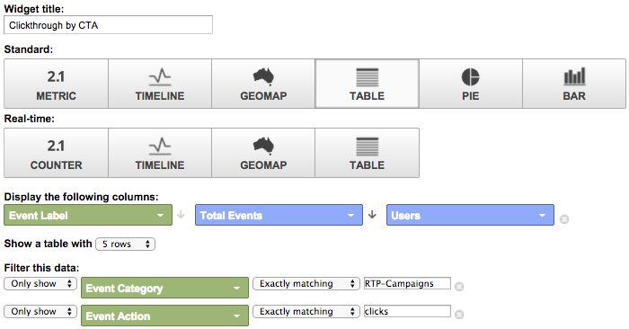
</td> 
   <td> </td> 
  </tr> 
 </tbody> 
</table>

>[!NOTE]
>
>**Related Articles**
>
>[Integrate RTP with Google Universal Analytics](integrate-rtp-with-google-universal-analytics.md)
>
>[Custom RTP Reports in Google Universal Analytics](custom-rtp-reports-in-google-universal-analytics.md)

