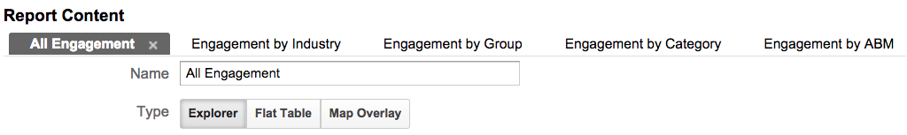

# Custom RTP Reports in Google Universal Analytics {#custom-rtp-reports-in-google-universal-analytics}

>[!PREREQUISITES]
>
>[Integrate RTP with Google Universal Analytics](/help/marketo/product-docs/web-personalization/reporting-for-web-personalization/web-analytics-integrations/integrate-rtp-with-google-universal-analytics.md)

This article explains how to setup RTP custom reports for Google Universal Analytics (GUA).  The data sent from RTP to GUA can be set up as two separate custom reports called:

* RTP B2B
* RTP Engagement

## Setting up a Custom Report {#setting-up-a-custom-report}

1. Log in to Google Analytics.

1. Click on **Customization** in the top menu.

1. Click **+New Custom Report**.

## RTP B2B Report {#rtp-b-b-report}

1. Name the report **RTP B2B Report**.

1. Name the 1st tab **Industry**.

>[!NOTE]
>
>You will **Duplicate this tab** and create additional similar ones - step 5)

1. Select the **Explorer** report type.

   

1. In the **Metric Groups** section, select the metrics that are relevant for your business.

    a. We recommend the following:

   

1. Duplicate this tab 4 times and name them:

    1. **Industry**
    1. **Group**
    1. **Category**
    1. **ABM**
    1. **Organizations**

   

1. In the **Dimension Drill downs** section set the relevant dimensions for each tab as below.

<table> 
 <thead> 
  <tr> 
   <th> 
    

      Tab Name 
    
</th> 
   <th> 
    

      Dimension Drill downs
    
</th> 
  </tr> 
 </thead> 
 <tbody> 
  <tr> 
   <td>Industry</td> 
   <td></td> 
  </tr> 
  <tr> 
   <td>Group</td> 
   <td></td> 
  </tr> 
  <tr> 
   <td>Category</td> 
   <td></td> 
  </tr> 
  <tr> 
   <td>ABM</td> 
   <td></td> 
  </tr> 
  <tr> 
   <td>Organizations</td> 
   <td></td> 
  </tr> 
 </tbody> 
</table>

1. Do not set any filters and set this report to be available for **All Web Site Data** (or change if relevant to specific Analytics account).

1. Click **Save**.

   

## RTP Engagement Report {#rtp-engagement-report}

1. Name the report **RTP Engagement Report**.

1. Set the 1st tab name to **All Engagement**.

>[!NOTE]
>
>You will Duplicate this tab and create additional similar ones - step 5)

1. Select the **Explorer** report type.

   

1. In the Metric Groups section, select the metrics that are relevant for your business. Here is a recommendation:

   

1. Duplicate this tab 4 times and name them:

    1. **All Engagement**
    1. **Engagement by Industry**
    1. **Engagement by Group**
    1. **Engagement by Category**
    1. **Engagement by ABM**

   

1. In the **Dimension Drill downs** section set the relevant dimensions for each tab as below:

<table> 
 <thead> 
  <tr> 
   <th> 
    

      Tab Name 
    
</th> 
   <th> 
    

      Dimension Drill downs 
    
</th> 
  </tr> 
 </thead> 
 <tbody> 
  <tr> 
   <td>All Engagement</td> 
   <td></td> 
  </tr> 
  <tr> 
   <td>Engagement by ABM</td> 
   <td></td> 
  </tr> 
  <tr> 
   <td>Engagement by Category</td> 
   <td></td> 
  </tr> 
  <tr> 
   <td>Engagement by Group</td> 
   <td></td> 
  </tr> 
  <tr> 
   <td>Engagement by Industry</td> 
   <td></td> 
  </tr> 
 </tbody> 
</table>

1. Set the following filters:

<table> 
 <thead> 
  <tr> 
   <th> 
    

      Inc/Exc 
    
</th> 
   <th> 
    

      Field 
    
</th> 
   <th> 
    

      Match type 
    
</th> 
   <th> 
    

      Values 
    
</th> 
   <th colspan="1"> 
    

      Comments 
    
</th> 
  </tr> 
 </thead> 
 <tbody> 
  <tr> 
   <td>
Include
</td> 
   <td>
Event Category
</td> 
   <td>Regex</td> 
   <td>RTP-Campaigns|RTP-Recommendations|RTP-Segments</td> 
   <td colspan="1">Will filter all other custom events that are not related to RTP</td> 
  </tr> 
  <tr> 
   <td>Exclude</td> 
   <td>Event Label</td> 
   <td>Regex</td> 
   <td>#</td> 
   <td colspan="1">Allows you to filter from your reports campaign using # in the campaign name</td> 
  </tr> 
 </tbody> 
</table>

1. Set this report to be available for **All Web Site Data** (or change if necessary).

   

1. Click **Save**.

>[!MORELIKETHIS]
>
>[Integrate RTP with Google Universal Analytics](/help/marketo/product-docs/web-personalization/reporting-for-web-personalization/web-analytics-integrations/integrate-rtp-with-google-universal-analytics.md)
>
>[Custom RTP Dashboards in Google Universal Analytics](/help/marketo/product-docs/web-personalization/reporting-for-web-personalization/web-analytics-integrations/custom-rtp-dashboards-in-google-universal-analytics.md)
