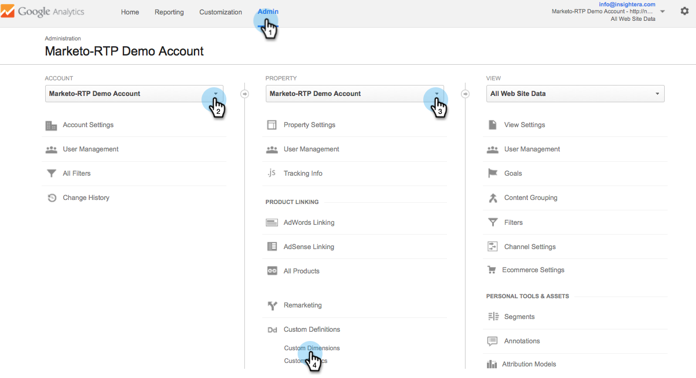
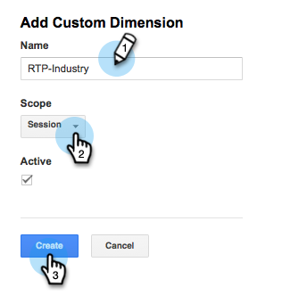
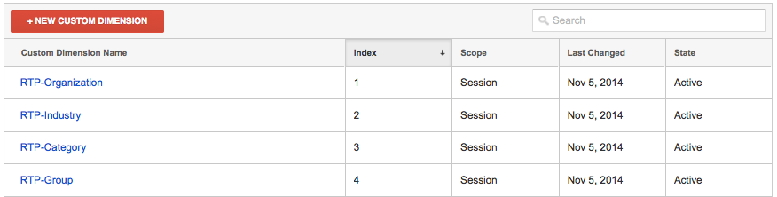
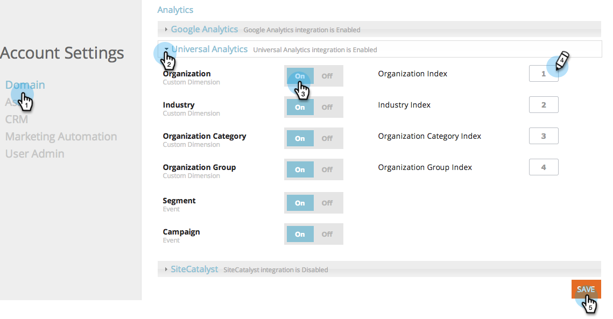

# Integrate RTP with Google Universal Analytics {#integrate-rtp-with-google-universal-analytics}

### What's in this article? {#whats-in-this-article}

[Intro](#intro)  
[Set up Custom Dimensions in GUA](#set-up-custom-dimensions-in-gua)  
[Activate the GUA integration in your RTP account](#activate-the-gua-integration-in-your-rtp-account)  
[Remove Old Dashboards in Google Analytics](#remove-old-dashboards-in-google-analytics)

#### Intro {#intro}

Leverage Google Universal Analytics (GUA) with Marketo Real-Time Personalization's (RTP) firmographic and personalization data to better measure and analyze your online marketing efforts.

This post explains how to set up and integrate the Marketo Real-Time Personalization (RTP) platform with Google Universal Analytics (GUA) accounts. RTP data can be appended to your GUA account allowing you to view and see the performance of organizations, industries, firmographics and RTP segments visiting your website.

**Google Universal Analytics**

Google Universal Analytics with RTP’s data provides you a better understanding of how B2B users interact with your online content and help measure and get better results from your personalization campaigns. [Read more about Google Universal Analytics](https://support.google.com/analytics/answer/2790010/?hl=en&authuser=1).

>[!NOTE]
>
>**`For Google Tag Manager Users Only`**
>
>No coding or special configuration needs to be done. Make sure you complete the following checklist:
>
>* `RTP dimensions are created in Google Universal Analytics`
>* [RTP tag is properly installed in Google Tag Manager](https://docs.marketo.com/display/public/DOCS/Implementing+RTP+using+Google+Tag+Manager)
>* `Google Universal Analytics Integration is enabled in the RTP's Account Settings`
>* [Google Universal Analytics tag is properly configured in Google Tag Manager](https://support.google.com/tagmanager/answer/6107124?hl=en)
>* [Google Tag Manager tag is properly installed your website](https://developers.google.com/tag-manager/quickstart)
>

#### Set up Custom Dimensions in GUA {#set-up-custom-dimensions-in-gua}

1. In Google Analytics,

    1. Go to **Admin**
    1. Select the **Account.**
    1. Select the **Property.**
    1. Select **Custom Definitions **and **Custom Dimensions.** 
       

1. Add a new custom dimension. Click **+New Custom Dimension** 
   

1. Add the following **Custom Dimensions:**

<table> 
 <tbody> 
  <tr> 
   <td>
<strong>Custom Dimension Name</strong>
</td> 
   <td>
<strong>Scope</strong>
</td> 
   <td>
<strong>Active</strong>
</td> 
  </tr> 
  <tr> 
   <td>
<strong>RTP-Organization</strong>
</td> 
   <td>
Session
</td> 
   <td>
✓
</td> 
  </tr> 
  <tr> 
   <td>
<strong>RTP-Industry</strong>
</td> 
   <td>
Session
</td> 
   <td>
✓
</td> 
  </tr> 
  <tr> 
   <td>
<strong>RTP-Category</strong>
</td> 
   <td>
Session
</td> 
   <td>
✓
</td> 
  </tr> 
  <tr> 
   <td>
<strong>RTP-Group</strong>
</td> 
   <td>
Session
</td> 
   <td>
✓
</td> 
  </tr> 
 </tbody> 
</table>

   >[!NOTE]
   >
   >**Custom Dimension Names** must be exactly as defined in the table above (otherwise custom RTP dashboards and reports in GUA won’t display correctly)

1. Add the **Name. **Select the Scope as **Session.** Click **Create.** 
   

Your Custom Dimension list should look like this.

Once you have activated the Custom Dimensions in GUA, go to the RTP platform to enable these dimensions within RTP.

#### Activate the GUA integration in your RTP account {#activate-the-gua-integration-in-your-rtp-account}

1. In the RTP platform, go to **Account Settings.**

   

1. Under **Account Settings**, click **Domain.**
1. Under **Analytics, **click **Google Universal Analytics**.
1. Turn **On** the relevant Custom Dimensions and Events to append this data from RTP to Google Universal Analytics.
1. Enter the **Index number** of the dimension aligned with the index number in GUA.
1. Click **Save**.

>[!NOTE]
>
>The Index Number for the Custom Dimension can be found in GUA under Custom Dimensions.
>
>Example: RTP-Industry Index Number equals 1, RTP-Organization Index Number equals 2.

#### Remove Old Dashboards in Google Analytics {#remove-old-dashboards-in-google-analytics}

1. In Google Analytics. Go to **Reporting.**
1. Click on **Dashboards.**
1. Select a **Dashboard **(RTP B2B or RTP Performance)
1. Click **Delete Dashboard**.

