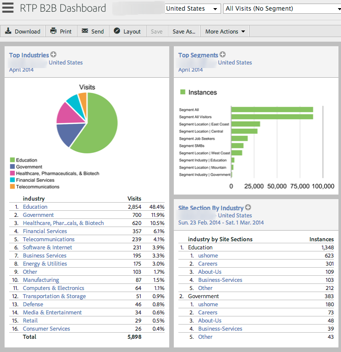
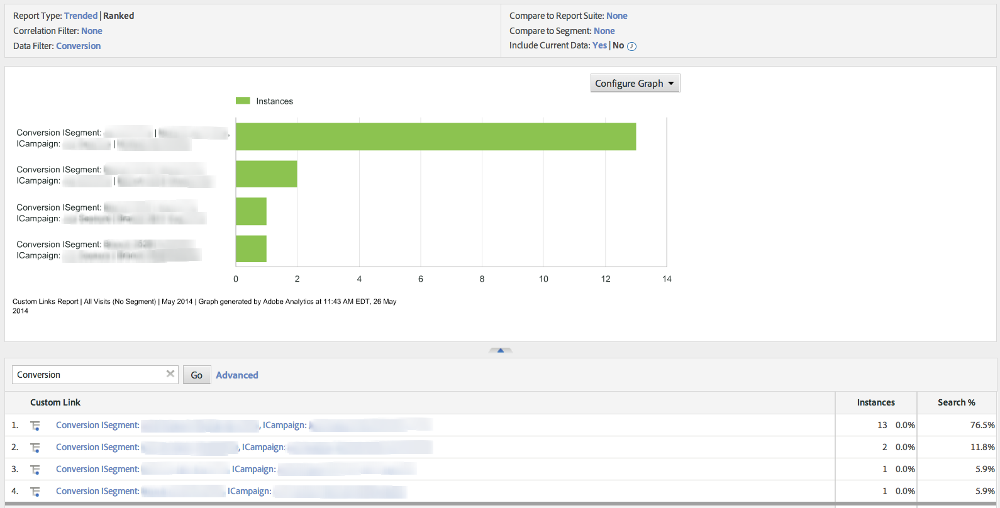
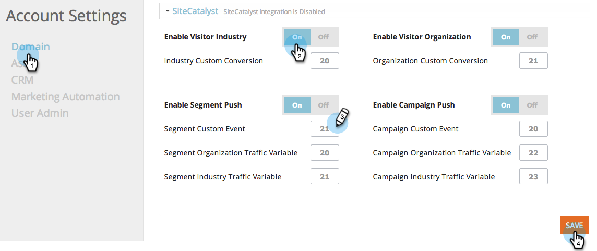
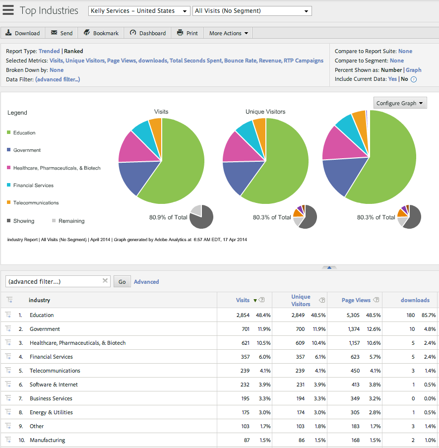
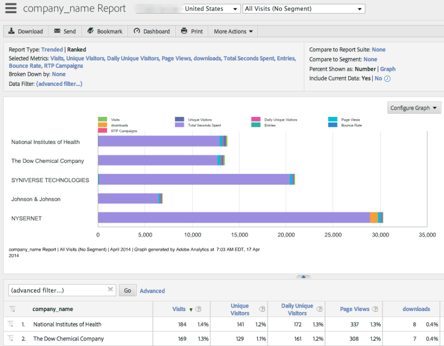
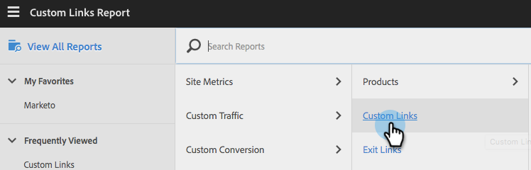

# Integrate with Adobe Analytics {#integrate-with-adobe-analytics}

## Intro {#intro}

Analyze your web analytics from a B2B perspective by viewing organization, industry and [!DNL Marketo Real-Time Personalization] (RTP) campaign data within your Adobe Analytics account.

This document enables the integration between [!DNL Marketo Real-Time Personalization] (RTP) and Adobe Adobe Analytics. Data from RTP will allow you to detect and analyze trends in all industry segments and organizations visiting your site and measure the effectiveness of your RTP campaigns, providing the insights and analysis to gain optimal results.

You can achieve this by looking at metrics such as the numbers of new versus returning visitors in each segment, analyzing click rates on campaigns, and discovering which industries and customized segments and real-time campaigns generated the best converting leads. Leverage this ability to gain the maximum benefit from your RTP account.

## RTP Audience Analytics {#rtp-audience-analytics}

With the RTP - AA integration, you have a new dimension within your web analytics interface. RTP automatically enhances your web analytics dashboards with:

1. Organization and industry data
1. Customized RTP segments
1. Named Account lists (Account-Based Marketing)

This enhances your B2B data and allows you to focus on relevant visitors by optimizing:

1. Outbound channels
1. Content
1. Retargeting

## Channel Report {#channel-report}

The RTP dashboard helps you understand the breakdown of your visitors according to verticals and RTP segments. You can see your visitor performance according to the industry and different marketing campaigns (paid, organic, social) related to that industry. The dashboard also provides a high-level overview of what site sections your visitors are viewing according to their industry type.

## Behavioral Report {#behavioral-report}

Different behavior reports can be created in Adobe Analytics based on organization, industry and RTP segment data. These Flow Reports visualize the path visitors take from one Page or Event to the next. This report can help you discover what content keeps visitors engaged with your site.

## RTP Performance {#rtp-performance}

View RTP campaign impressions and conversions under Custom Links in Adobe Analytics.

This Custom Link report will show impressions and conversions of campaigns under the following naming format:

* Impression ISegment: [RTP Segment Name], ICampaign: [RTP Campaign Name]
* Conversion ISegment: [RTP Segment Name], ICampaign: [RTP Campaign Name]

## Set up in Adobe Analytics {#set-up-in-adobe-analytics}

The integration uses the JavaScript API that Adobe Analytics offers. Custom conversion variables (eVar), custom events (event) and traffic variables are used in the integration. All must be enabled from within AA admin. You must set the conversion variables, custom events and traffic variables in AAor you won’t be able to see data in the suite even if you enabled it in RTP.

Complete the following steps to set up these variables in AA:

1. Go to **[!UICONTROL Admin Tools]** in your AA account.
1. Select the **[!UICONTROL Report Suite]** to be used with the integration.
1. Under **[!UICONTROL Edit Settings]**, go to **[!UICONTROL Conversion]** and select **[[!UICONTROL Conversion Variables]](https://microsite.omniture.com/t2/help/en_US/reference/#Edit_conversion_variables)**.  
   Select the [Conversion Variable](https://microsite.omniture.com/t2/help/en_US/reference/#Conversion_Variables_eVar) number (we recommend):

    1. Evar # 20 for Industry Custom Conversions
    1. Evar # 21 for Organization Custom Conversions

    >[!NOTE]
    >
    >If these # are taken select another available number. Align this number with the slot number in RTP Account Settings.

    1. Change Status to _[!UICONTROL Enabled_].

       1. Change Name to **Industry** and **Organization**. (This is how it will appear in the Report Suite.)

       1. Change Expire After field to **[!UICONTROL Visit]**.

1. Under **[!UICONTROL Edit Settings]** go to **[!UICONTROL Conversion]** and select **[[!UICONTROL Success Events]](https://microsite.omniture.com/t2/help/en_US/reference/#Configure_success_events)**.

    1. Select the Custom Success Events Event number (we recommend):

        1. event20 for RTP Campaigns
        1. event21 for RTP Segments

        >[!NOTE]
        >
        >If these # are taken select another available number. Align this number with the slot number in RTP Account Settings.

        1. Change the two events names to **RTP Campaigns** and **RTP Segments**. This is the name that will appear in the Report Suite.

    1. Select the Type field to be **Counter (no subrelations)**

1. Under **[!UICONTROL Edit Settings]** go to **[Traffic](https://microsite.omniture.com/t2/help/en_US/reference/#Traffic_Variable)** and select **[Traffic Variables](https://microsite.omniture.com/t2/help/en_US/reference/#Enable_traffic_variable_reports)**.

    1. Select the Traffic Variable Property # (we recommend):

        1. Property # 20 - Name: RTP Segment Organization
        1. Property # 21 - Name: RTP Segment Industry
        1. Property # 25 - Name: Campaign Organization
        1. Property # 26 - Name: RTP Campaign Industry

        >[!NOTE]
        >
        >If these # are taken select another available number. Align this number with the slot number in RTP Account Settings)

        1. Change the 4 property names. This is the name that will appear in the Report Suite.

    1. Select [!UICONTROL Enabled] field to **[!UICONTROL Enabled]**.

    1. Select [!UICONTROL Path Reports] field to **[!UICONTROL Enabled]**.

## Set up in [!DNL Marketo Real-Time Personalization] (RTP) {#set-up-in-marketo-real-time-personalization-rtp}

1. In the RTP platform, go to **[!UICONTROL Account Settings]**.

   

1. Under **[!UICONTROL Account Settings]**, click **[!UICONTROL Domain]**.
1. Under **[!UICONTROL Analytics]**, click **Adobe Analytics**.
1. Turn **[!UICONTROL On]** the Conversion, Custom and Traffic variable toggles.
1. Assign the Conversion, Event and Traffic Variables **slot numbers** to match the slot numbers created in AA
1. Click **[!UICONTROL Save]**.

>[!NOTE]
>
>Our recommended slot settings are
>
>**Conversion Variables**
>
>* [!UICONTROL Industry Custom Conversions] - Slot 20
>* [!UICONTROL Organization Custom Conversions] - Slot 21
>
>**Custom Events**
>
>* [!UICONTROL Campaign Custom Event] - Slot 20
>* [!UICONTROL Segment Custom Event] - Slot 21
>
>**Traffic Variables**
>
>* [!UICONTROL Segment Organization Traffic Variable] - Slot 20
>* [!UICONTROL Segment Industry Traffic Variable] - Slot 21
>* [!UICONTROL Campaign Organization Traffic Variable] - Slot 22
>* [!UICONTROL Campaign Industry Traffic Variable] - Slot 23
>
>**Make sure that these slot numbers align with the variables and events numbers created in AA.**

## Reports {#reports}

Create enhanced SiteAdobe Analytics reports according to organization names, industries and RTP segments and real-time campaigns data.

Examples of customized reports and dashboards in AA include:

* Performance by industry or defined segment (Account-Based named lists)
* Industry breakdown per KPI performance
* Pages viewed per organization
* Marketing channel performance according to Organization, Industry, Segments

**-Report Examples-**

**Top Industries Report**

   

**Organizations Report**

**Creating the RTP Dashboard**

Create a [new dashboard](https://microsite.omniture.com/t2/help/en_US/sc/user/t_dashboard_add.html), called **RTP Dashboard**. This dashboard will help understand the breakdown of your visitors according to verticals and RTP segments.

1. Click **[!UICONTROL Dashboard],** click **[!UICONTROL Add Dashboard]**.

1. Name the Dashboard **RTP Dashboard**.

1. Select the **dashboard size** 3 x 2, 2 x 2.

1. Create the [reportlet](https://microsite.omniture.com/t2/help/en_US/sc/user/t_dashboard_add_report.html#task_EC3AFBBAA51C45CEBAF632F841C305B3) and add [content to the dashboard](https://docs.marketo.com/Add%2520content%2520to%2520a%2520dashboard).

Adding the Industries Reportlet to the Dashboard

1. Go to **[!UICONTROL Custom Conversions]**, click on **[!UICONTROL Industry]**.

1. Configure Graph to **Pie Chart**.

1. Click on **[!UICONTROL Dashboard]**, add **[!UICONTROL Reportlet]**.

1. Name the report **Top Industries**.

1. Place in Dashboard **RTP Dashboard**.

1. Create **New**.

Adding the Segments Reportlet to the Dashboard

1. Go to **[!UICONTROL Site Metrics]**. Click on **[!UICONTROL Custom Events]**, **[!UICONTROL Segments]**.

1. Configure Graph to **Vertical Bar**.

1. Click on **[!UICONTROL Dashboard]**, add **[!UICONTROL Reportlet]**.

1. Name the report **Top Segments**.

1. Place in Dashboard **RTP Dashboard**.

1. Create **New**.

Your reportlets will be displayed in the dashboard.

## View Impressions and Clicks (Conversions) in Adobe Analytics {#view-impressions-and-clicks-conversions-in-adobe-analytics}

1. Click **[!UICONTROL Custom] Links**.

   

1. Search for Impressions to view Segment and Campaign names representing the number of impressions for the campaign.  
   

1. Search for Conversion to view Segment and Campaign names representing the number of clicks for the campaign.

   
