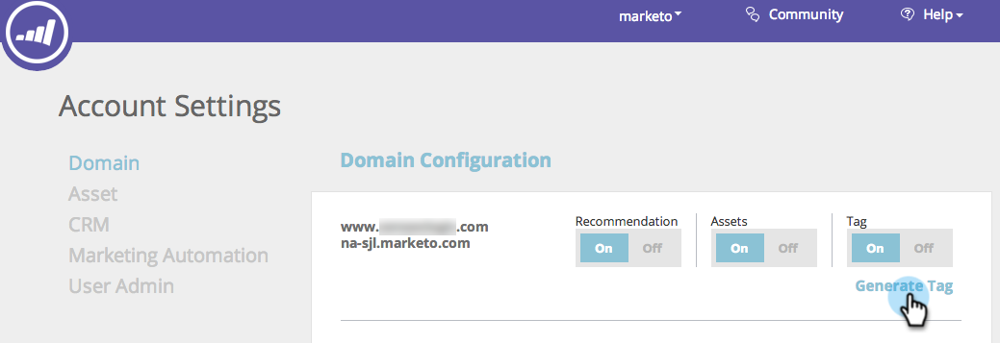
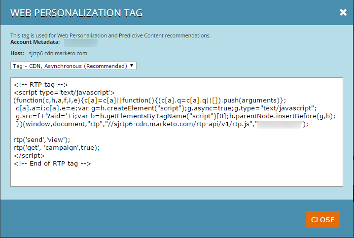

# Deploy the RTP JavaScript {#deploy-the-rtp-javascript}

To generate and set up your RTP tag please follow the installation instructions below

## Generate Tag {#generate-tag}

1. Log in to your RTP account. Go to **Account Settings**.

   

1. In **Domain** and **Domain Configuration**, locate the relevant domain and click **Generate Tag**.

   

1. Copy and paste the Web Personalization (RTP) tag into your website.

   

   >[!NOTE]
   >
   >Copy the RTP JavaScript tag and paste it as the first script in the header of your pages - between the `<head> </head>` tags.

   Make sure the tag appears on all pages including landing pages and sub-domains. Check this by right-clicking on your website’s page. Go to View Page Source in a web browser. Search: ‘RTP’.

1. Tag toggle set to **ON**.

   Confirm that the Tag toggle is set to ON. You should start seeing data flow into the Organization's tab.

   You are now set up with the RTP tag and ready to start [creating segments](/help/marketo/product-docs/web-personalization/using-web-segments/create-a-basic-web-segment.md) and real-time campaigns!

1. Verify tag is on all pages.
