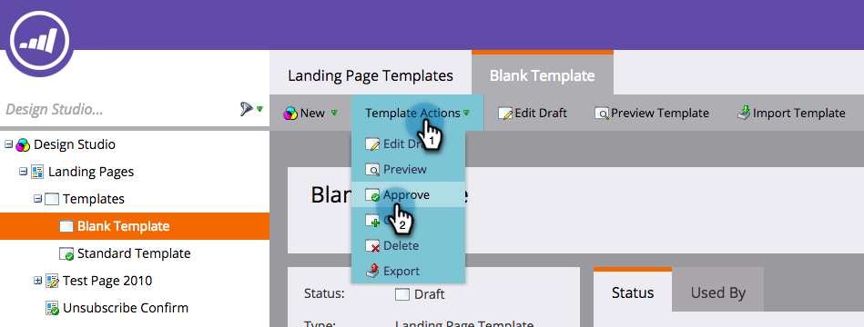

# Implementing RTP on Marketo Landing Pages {#implementing-rtp-on-marketo-landing-pages}

To implement your RTP tag please follow the installation instructions below:

1. Go to the **Design Studio.** Open the item you want to edit. Select **Template Actions**, select **Edit Draft**.

   

1. Make your template changes on the **HTML Source** tab.

   

1. In your RTP account, go to **Account Settings**.

   a. If you have already received your JavaScript tag from Support - continue to step 5.  

   

1. Under Domain, locate the relevant domain and click **Generate Tag**.  

   

   

1. Copy the RTP JavaScript tag and paste it to all your landing page templates between the **`<head> </head>`** tags.

1. Click **Save** and **Close** the window.

1. Back in the **Design Studio**, approve the landing page from **Template Actions**, click **Approve**.  

   

1. Finally, you’ll need to **re-approve** any landing pages using that template for the template changes to take effect. You can re-approve them all at once from the main Landing Pages section.

   

1. Verify that it appears on all pages including landing pages and sub-domains.

   You can do this by right-clicking on you website’s page. Go to **View Page Source.** Search for **RTP** to locate the tag.
