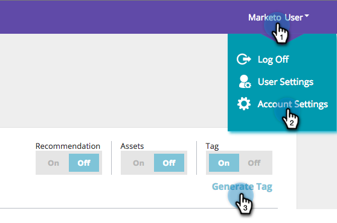

# Implementing RTP on Marketo Landing Pages {#implementing-rtp-on-marketo-landing-pages}

To implement your [!UICONTROL RTP tag] please follow the installation instructions below:

1. Go to the **[!UICONTROL Design Studio].** Open the item you want to edit. Select **[!UICONTROL Template Actions]**, select **[!UICONTROL Edit Draft]**.

   

1. Make your template changes on the **HTML Source** tab.

   

1. In your RTP account, go to **[!UICONTROL Account Settings]**.

   a. If you have already received your JavaScript tag from Support - continue to step 5.

   

1. Under [!UICONTROL Domain], locate the relevant domain and click **[!UICONTROL Generate Tag]**.

   

   

1. Copy the RTP JavaScript tag and paste it to all your landing page templates between the **`<head> </head>`** tags.

1. Click **[!UICONTROL Save]** and **[!UICONTROL Close]** the window.

1. Back in the **[!UICONTROL Design Studio]**, approve the landing page from **[!UICONTROL Template Actions]**, click **[!UICONTROL Approve]**.

   

1. Finally, you’ll need to **re-approve** any landing pages using that template for the template changes to take effect. You can re-approve them all at once from the main [!UICONTROL Landing Pages] section.

   

1. Verify that it appears on all pages including landing pages and sub-domains.

   You can do this by right-clicking on you website’s page. Go to **[!UICONTROL View Page Source].** Search for **[!UICONTROL RTP]** to locate the tag.
