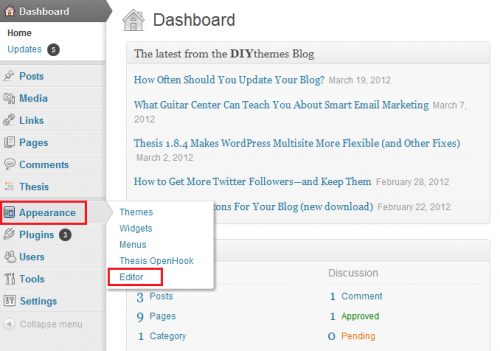

# Implementing RTP on Wordpress {#implementing-rtp-on-wordpress}

To implement your RTP tag please follow the installation instructions below:

1. Open up the **header.php** file of your **WordPress theme**.

   You can either use an FTP client to access your server or edit your theme files directly from the WordPress dashboard. Your file editor is located under the **Appearance** tab in the sidebar menu.

   

1. In the list of template files to the right of the text editor, find **header.php** and open it.

1. Go to **Account Settings**.

   a. If you have already received your JavaScript tag from Support - continue to step 5.  

   

1. Under Domain, locate the relevant domain and click **Generate Tag**.

   

1. Copy the RTP JavaScript tag and paste it to your website templates.

   a. Make sure it’s the first script at the header of the page - between the **`<head> </head>`** tags.

   

1. Click on **Update File** for the header.php file.

1. Verify that it appears on all pages including landing pages and sub-domains.

   a. You can do this by right-clicking on you website’s page. Go to **View Page Source.** Search for **RTP** to locate the tag.
