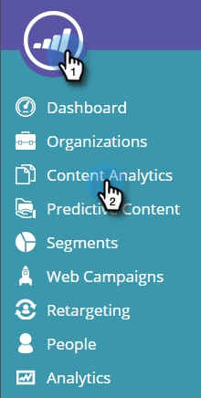
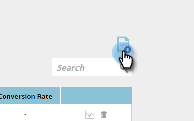
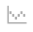

# Understanding Content Analytics {#understanding-content-analytics}

The Content Analytics page displays your discovered existing content (case studies, blog posts, videos, press releases, and so on) from your website. It also displays the performance of your content and people generated when visitors engage with them.

## View Content Analytics {#view-content-analytics}

Go to **Content Analytics**.

On the Content Analytics page, you can:

* Filter by Time Scope (Day, Week and Month)
* Search by Content Title and Content URL
* Sort in descending or ascending order by clicking the column title for Views, Direct Conversions, and Conversion Rate.

   

You can also export a file in CSV format by clicking the icon. 

The Analytics table provides the following details: 

<table> 
 <thead> 
  <tr> 
   <th colspan="1" rowspan="1">Name</th> 
   <th colspan="1" rowspan="1">Description</th> 
  </tr> 
 </thead> 
 <tbody> 
  <tr> 
   <td colspan="1" rowspan="1"><strong>Title</strong></td> 
   <td colspan="1" rowspan="1">Name of the digital content asset. Click <strong>Title</strong> to open the Content URL in a new tab.</td> 
  </tr> 
  <tr> 
   <td colspan="1">
<strong>Recommendation </strong><strong>Icon</strong>

<strong></strong>
</td> 
   <td colspan="1">Denotes if the the content piece has been added for <a href="#">Content Recommendations</a>.</td> 
  </tr> 
  <tr> 
   <td colspan="1" rowspan="1">
<strong>Views</strong>
</td> 
   <td colspan="1" rowspan="1">
The number of views from web visitors on the content asset. The amount of times it was viewed, opened, watched, or downloaded. Click the number of in the views column to drill down and see who viewed the content
</td> 
  </tr> 
  <tr> 
   <td colspan="1" rowspan="1"><strong>Direct Conversions</strong></td> 
   <td colspan="1" rowspan="1">Web visitors who viewed the content and filled out a form in the same visit</td> 
  </tr> 
  <tr> 
   <td colspan="1">
<strong>Analytics Icon</strong>

<strong></strong>
</td> 
   <td colspan="1">See more analytics on the content piece</td> 
  </tr> 
  <tr> 
   <td colspan="1">
<strong>Delete Icon</strong>

</td> 
   <td colspan="1">Deletes the content from Content Analytics</td> 
  </tr> 
 </tbody> 
</table>

## View Additional Content Analytics {#view-additional-content-analytics}

Click on the Analytics Icon of a content piece.

A dialog box opens with additional Content Analytics for that specific content piece.

The additional content analytics include:

**Analytics**

* **Views**: Views of that content piece for the time scope selected
* **Direct Conversions**: Web visitors who viewed the content and filled out a form in the same visit.
* **Conversion Rate****:** A percentage conversion rate calculated by Direct Conversions divided by Clicks

**Trends**

* A **Trends** graph showing the last 30 days of views of the specific content piece. Hover over the line graph to see the number of content views from a specific day

## Delete Content {#delete-content}

From the Content Analytics page, click on the delete icon of the Content you wish to delete. A message appears to confirm that you want to delete the Content.

>[!MORELIKETHIS]
>
>* [Enable the Content Recommendation Bar](../../../product-docs/predictive-content/enabling-predictive-content/enable-the-content-recommendation-bar.md)
>* [Enable Predictive Content for Web Rich Media](../../../product-docs/predictive-content/enabling-predictive-content/enable-predictive-content-for-web-rich-media.md)
