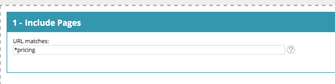
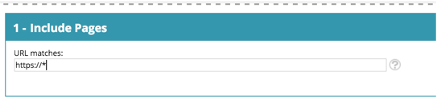
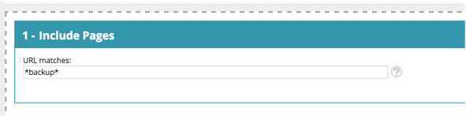

# Web Personalization Glossary {#web-personalization-glossary}

Some insights into the world and language of Marketo Web Personalization.

| Term |Definition |
|---|---|
| **Anonymous Visitor** |A web visitor who never filled out a form or left their details on the website.  |
| **Web Campaign** |A customized reaction associated with a specific segment.&nbsp;With Web Personalization, web campaigns include Dialogs, In Zones and Widgets. |
| **Clickstream** |The visitor's activity and URL path on the site and how long they visited each page |
| **ISP** |Internet Service Provider |
| **Known Visitor** |A web visitor who has completed a form and left their details (email address) on your website or clicked a link in a Marketo email. |
| **Account List** |A list of key account / organization names. Also known as an Account-Based Marketing (ABM) list. |
| **Segments** |A collection of visitors that meet the specified criteria defined in the [‘Set a Segment’ page](../../../product-docs/web-personalization/using-web-segments/web-segments.md). |
| **Split Testing** |A testing experiment with two or more variants to measure the difference in results. The goal is to identify changes to web pages that increase or maximize an outcome of interest. |
| **Wildcard** |A wildcard character (&#42; is used) that is used before or after a string to substitute for any other character or characters in a string. See the examples below. |

## Wildcard Examples {#wildcard-examples}

Here are three ways you can use a wildcard in Web Personalization.

Match all visitors on page URLs that end with pricing (for example, [www.marketo.com/pricing):](http://www.marketo.com/pricing):)

Match all visitors on page URLs that start with https:// (for example, [https://www.marketo.com):](https://www.marketo.com))

Match all visitors on page URLs that include the word backup (for example, [https://www.marketo.com/backup/pricing.html):](https://www.marketo.com/backup/pricing.html):)

