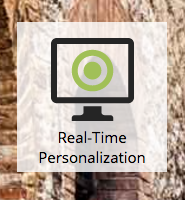
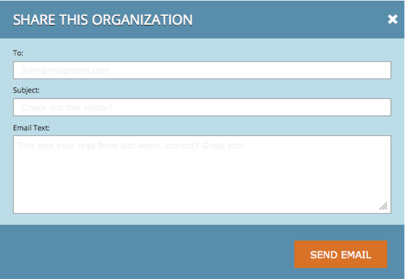
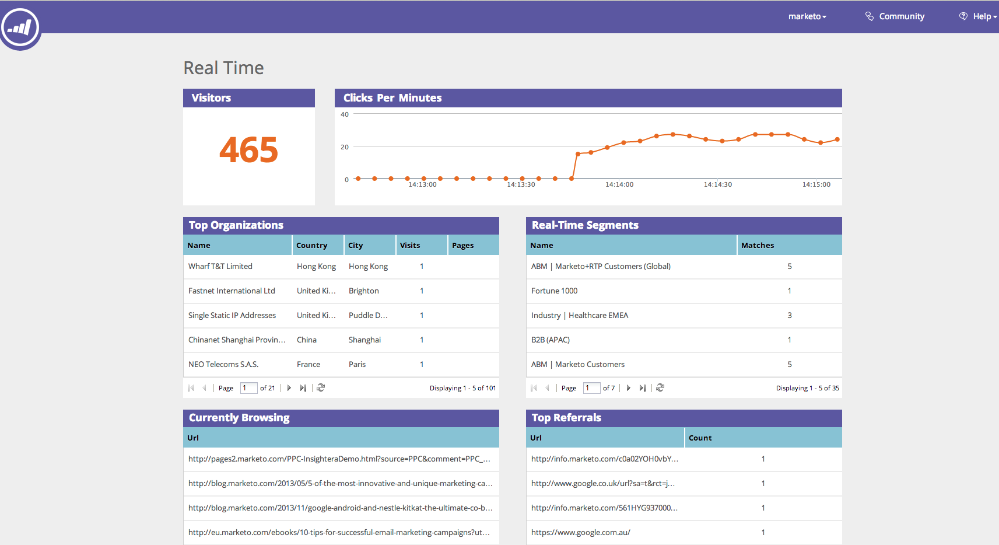

# Web Personalization Overview {#web-personalization-overview}

### What's in this article? {#whats-in-this-article}

[Introduction](#introduction)  
[Organizations](#organizations)  
[Visitors](#visitors)  
[Real-Time](#real-time)

#### Introduction {#introduction}

For new Marketo customers, Real-Time Personalization is divided into four apps, accessed using these two tiles: Web Personalization and Content`AI`.

 

>[!NOTE]
>
>Web Personalization and Content`AI` are available in all Marketo-supported languages (English, French, German, Japanese, Portuguese, Spanish).

Existing customers continue to access the apps through the Real-Time Personalization tile until renewal, at which time they will use the login above.

When you click the Web Personalization tile, the Dashboard page appears. Click the Content`AI` tile and you go directly to the Content Recommendations page.

The four apps are:

* Web Personalization
* Account-Based Web Marketing
* Website Retargeting
* Content`AI`

The** Web Personalization **tile is your access point for** **creating personalized web campaigns.** **Account-Based Web Marketing and Web Retargeting. You can add content on the Content Analytics page.

**Account-Based Web Marketing** works with Web Personalization and features Named Accounts. The Named Accounts page provides graphical information on existing customers, total engagements, and organizational trends, as well as a list of the accounts. You can create new named accounts there as well.

**Website Retargeting** gives you the power to remarket to segmented audiences. You can set segments, but can’t use Named Accounts in the filter.

**Content`AI`** is the place to give content recommendations. You can add content easily to the Content Recommendations page.

>[!NOTE]
>
>To access Account-Based Web Marketing or Website Retargeting, you must click the Web Personalization tile, even if you don’t have the Web Personalization app.

#### Organizations {#organizations}

The Organizations tab displays all the details (name, location, activity and time stamp) of organizations that visited your website during a given period. The table can be sorted and organized by time, location, domain and via a free text search.

>[!TIP]
>
>‘Most Active’ vs. ‘Latest’ - The table is organized by identified Organizations and then Internet Service Providers (denoted by an ISP icon). It can be sorted according to:
>
>* Most Active: the most active organizations in the table, based on number of page views
>* Latest: the most recent organizations in the table (default)
>* For valuable insights, filter according to most active
>

**Organizations - Right-hand Panel**

The right-hand panel of the Organizations page offers the following features and insights:

<table> 
 <tbody> 
  <tr> 
   <td>
<strong>Spreadsheet icon</strong>: Situated at the top right of the panel, the icon downloads the Organizations table in CSV format for offline use

<strong>Set Email Alert</strong>: Sends the logged in user an email every time the selected organization visits the website

<strong>Leads</strong>: Opens the leads table for the selected organization

<strong>Share</strong>: Opens a pop-up window to email and share the details of the organization that visited the webpage

<strong>Location Icon</strong>: Displays the country and city of the selected organization

<strong>Links</strong>: Jigsaw, Whois, Linkedin, Google, Twitter opens a new window with additional information from the respective webpage offering additional insight into the selected organization

<strong>Search</strong>: Displays the keyword used if the visitor arrived via a search engine

<strong>Referrers</strong>: Shows the URL link of the page that referred the traffic to your site

<strong>Visitors</strong>: Displays the number of visits, the number of pages viewed by the selected organization and their email address (if they completed a submit form) and the time and date of the last visit

<strong>Clickstream</strong>: Displays a table of the user activity and URL path on the site and how long they visited each page
</td> 
   <td></td> 
  </tr> 
 </tbody> 
</table>

**Share Organizations**

Want to share the information of your website visitor to a colleague? Click on an Organization and then click on the Share link on the right-hand side panel.

This actives the Share this Organization overlay, where you can send an email sharing the name and details of the organization that visited the website.

#### Visitors {#visitors}

The Visitors page displays all the details and online behavior of each visitor that arrived on your site within the given time period. The page offers a deep insight into each individual visitor's activities and online behavior. Visitor data in the table is updated within 24-48 hours.

The right-hand panel of the Visitors page provides the following insights:

<table> 
 <thead> 
  <tr> 
   <th colspan="1" rowspan="1">Name</th> 
   <th colspan="1" rowspan="1">Description</th> 
  </tr> 
 </thead> 
 <tbody> 
  <tr> 
   <td colspan="1" rowspan="1"><strong>Spreadsheet icon</strong></td> 
   <td colspan="1" rowspan="1">Situated at the top right of the panel, the icon downloads the Visitors table in CSV format for offline use</td> 
  </tr> 
  <tr> 
   <td colspan="1" rowspan="1">
<strong>Organization Name</strong>
</td> 
   <td colspan="1" rowspan="1"> </td> 
  </tr> 
  <tr> 
   <td colspan="1" rowspan="1"><strong>Set Campaign</strong></td> 
   <td colspan="1" rowspan="1">Allows you to set up a Campaign CTA associated with the selected visitor</td> 
  </tr> 
  <tr> 
   <td colspan="1"><strong>Location</strong></td> 
   <td colspan="1">Displays the visitor's country, state and city</td> 
  </tr> 
  <tr> 
   <td colspan="1" rowspan="1"><strong>Clickstream</strong></td> 
   <td colspan="1" rowspan="1">Displays a table of the visitor's activity and URL path on the site and how long they visited each page</td> 
  </tr> 
 </tbody> 
</table>

#### Real-Time {#real-time}

The Real-Time page displays visitors on your website in real-time, measuring the activity as it happens.&nbsp;

The Real-time page is split into 6 informative tables of onsite visitor details:

<table> 
 <thead> 
  <tr> 
   <th colspan="1" rowspan="1">Name</th> 
   <th colspan="1" rowspan="1">Description</th> 
  </tr> 
 </thead> 
 <tbody> 
  <tr> 
   <td colspan="1" rowspan="1"><strong>Visitors</strong></td> 
   <td colspan="1" rowspan="1">&nbsp;Represents the number of visitors currently on your website</td> 
  </tr> 
  <tr> 
   <td colspan="1" rowspan="1">
<strong>Clicks per minute</strong>
</td> 
   <td colspan="1" rowspan="1"> A live line graph showing the number of clicks on your site per minute</td> 
  </tr> 
  <tr> 
   <td colspan="1" rowspan="1"><strong>Top Organizations</strong></td> 
   <td colspan="1" rowspan="1">A short version of the Organizations table</td> 
  </tr> 
  <tr> 
   <td colspan="1"><strong>Real-Time Segment</strong></td> 
   <td colspan="1">The number of visitors currently onsite that match designated segments</td> 
  </tr> 
  <tr> 
   <td colspan="1"><strong>Currently Browsing</strong></td> 
   <td colspan="1">The URL of the pages currently being viewed by onsite visitors</td> 
  </tr> 
  <tr> 
   <td colspan="1" rowspan="1"><strong>Top Referrals</strong></td> 
   <td colspan="1" rowspan="1">The referral URL that brought the visitor to your site</td> 
  </tr> 
 </tbody> 
</table>

