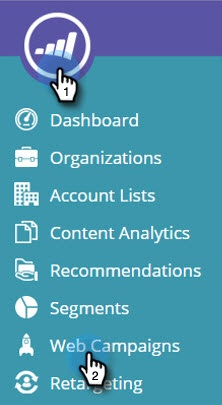
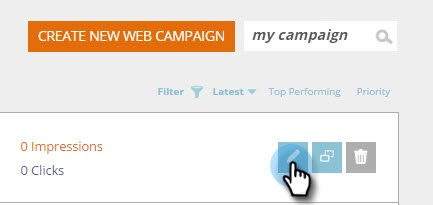
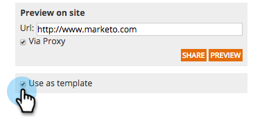
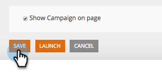

# Save your Campaign as a Template {#save-your-campaign-as-a-template}

Have you ever spent time creating the perfect web campaign? You can now save it as a template for easy re-use in the future.

##### 1. Go to Web Campaigns. {#go-to-web-campaigns}

##### 2. Search for the campaign you want to save as a template. {#search-for-the-campaign-you-want-to-save-as-a-template}

  

##### 3. Click the Edit icon. {#click-the-edit-icon}

  

##### 4. Check Use as template and click Save. {#check-use-as-template-and-click-save}

     

##### 5. That's it! Next time you create a campaign and select template, check My Templates in the Set Campaigns page to see the templates you saved. {#thats-it-next-time-you-create-a-campaign-and-select-template-check-my-templates-in-the-set-campaigns-page-to-see-the-templates-you-saved}

