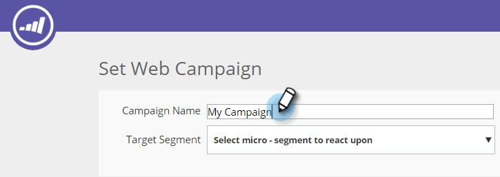
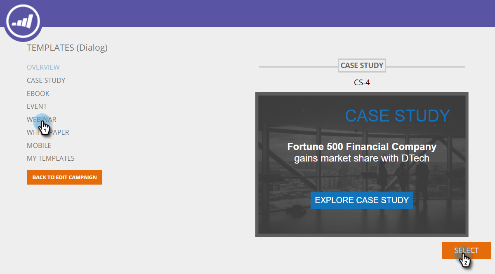
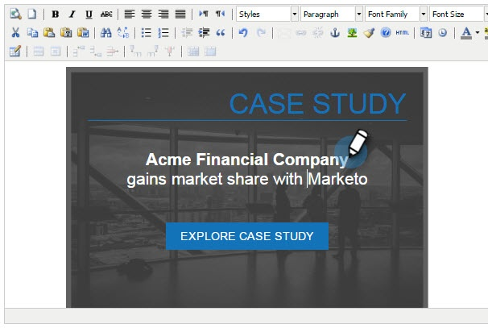
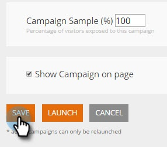

# Using Templates to Create Web Campaigns {#using-templates-to-create-web-campaigns}

Speed up and simplify your web campaign creation process by using our built in templates or by [saving your own](save-your-campaign-as-a-template.md).

>[!NOTE]
>
>Templates are optimized for all devices and browsing experiences for both desktop and mobile.

1. Go to **Web Campaigns**.

   

1. Click **Create New Web Campaign**.

   

1. Name your campaign.

   

1. Select a Target Segment.

   

1. Click **Templates**.

   

1. Select the appropriate area for your campaign to see and select a template that works for you.

   >[!NOTE]
   >
   >There are some cool templates to choose from, and we will add more in the future.

   

   >[!TIP]
   >
   >For mobile campaigns select a template from the **mobile** section.

1. Customize the template.

   

1. Click **Save**.

   

Nicely done! Did you see how much time you saved by using a template?

>[!MORELIKETHIS]
>
>[Save a Campaign as a Template](/help/marketo/product-docs/web-personalization/using-templates/save-your-campaign-as-a-template.md)
