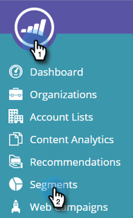
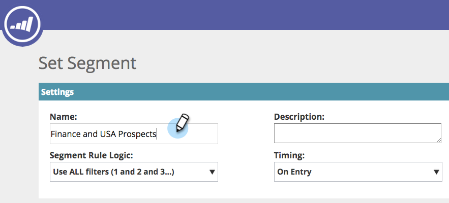
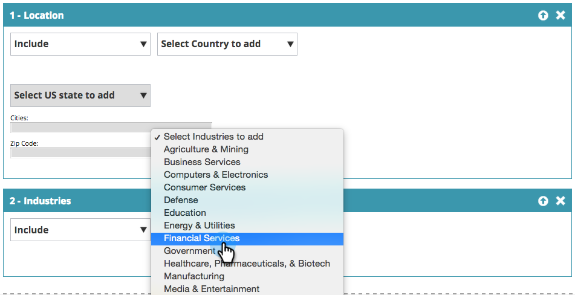
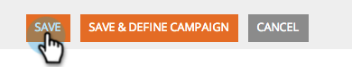

# Create a Basic Web Segment {#create-a-basic-web-segment}

Let's create a basic segment targeting all web visitors from the U.S., and the financial services industry.

1. Go to **[!UICONTROL Segments]**.

   

1. Click **[!UICONTROL Create New]**.

   

1. Enter the segment name.

   

1. Drag **[!UICONTROL Location]** from the right-hand menu and drop it into the segment editor.

   

1. Select a country to add from the drop-down. Select the **United States**.

   

   >[!NOTE]
   >
   >The number of cities is limited to 300 per segment.

1. Drag **[!UICONTROL Industries]** from the right-hand menu and drop it into the segment editor.

   

1. Select [!UICONTROL Industries] to add from the drop-down. Select the **[!UICONTROL Financial Services] Industry**.

   

   You have now set up a basic segment for all prospects visiting your website from the USA and the Finance Industry.

1. Click **[!UICONTROL Save]** to save the segment or **[!UICONTROL Save & Define Campaign]** to go to the Campaigns page.

   

Now you have segmented your visitors from the United States, go ahead and add the financial services industry.

>[!MORELIKETHIS]
>
>[Web Segments](/help/marketo/product-docs/web-personalization/using-web-segments/web-segments.md)
