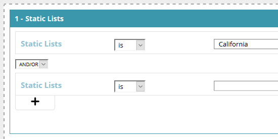

# Create a Segment Using a Static List {#create-a-segment-using-a-static-list}

Segment known web visitors when they visit your website based on if they're in or not in one of your Marketo [static lists](/help/marketo/product-docs/core-marketo-concepts/smart-lists-and-static-lists/static-lists/understanding-static-lists.md).

1. Go to **Segments**.

   

1. Click **Create New**.

   

1. Enter a segment Name.

   

1. In Known Leads, drag **Static Lists** over to the canvas.

   

1. Click the drop-down to select **is** or **is not** (depending on what you want), and type in the name of your static list.

   

1. If you want to add multiple lists, you need to create a new line for each one by clicking the **+**. If you only want one list, skip to [Step 8](#eight).

   

1. For multiple lists (or multiple "is not" lists), repeat the steps you learned in [Step 5](#five).

   

   >[!NOTE]
   >
   >The and/or drop-down is just that. Click it to select **and**, **or**, or **and/or**.

1. Click **Save** to save the segment or **Save & Define Campaign** to save and go to the Campaigns page.

   
