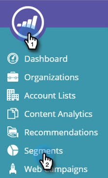
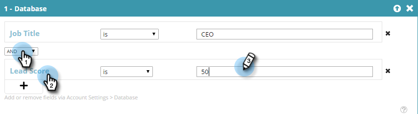

# Create a Segment Using Known Person Data {#create-a-segment-using-known-person-data}

Here's how to create a segment using Known Person Data values.

>[!PREREQUISITES]
>
>[Manage Person Data](manage-person-data.md)

1. Go to **Segments**.

   

1. Click **Create New**.

   

1. Enter a segment Name.

   

1. In Profile Segmentation, drag **Database **over to the canvas.

   

1. Select a person data field from the drop-down.

   

1. Enter a Person Data value.

   

   There can be only one value for each field. For example, if you want to add multiple values for the job title field, you need to create a new line with the same field name for each value. Be sure to use the OR value to ensure that any value captures a match.

   

## Selecting Multiple Person Data Fields {#selecting-multiple-person-data-fields}

1. Click **+** to add another person data field.

   

1. Select the AND / OR operator. Select the field to add. Select a Person Data Field. Enter Person Data Value.

   

1. Click **Save** to save the segment or **Save & Define Campaign **to save and go to the Campaigns page.

   

   You have now set up a segment targeting Known Person data.

