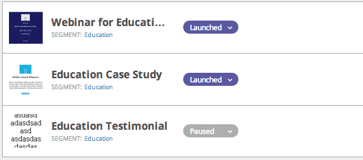

# Find Web Campaigns that are Using a Specific Segment {#find-web-campaigns-that-are-using-a-specific-segment}

Looking for web campaigns that use a specific segment?

1. Go to **Segments**.

   

1. Search for a **Segment**. Select the **Segment Name**. In the right hand panel, click on **Associated Campaigns** to view the campaigns that are associated this specific segment.

   

1. View the **Campaigns** associated with the selected segment.

   

>[!MORELIKETHIS]
>
>Learn more about [segments](/help/marketo/product-docs/web-personalization/using-web-segments/web-segments.md) and how to [create a basic segment](/help/marketo/product-docs/web-personalization/using-web-segments/create-a-basic-web-segment.md).
