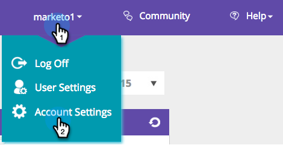
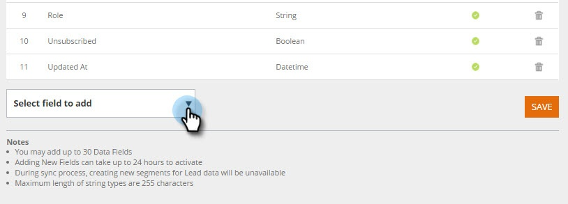
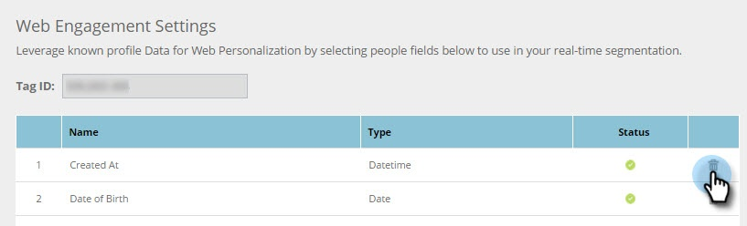

# Manage Person Data {#manage-person-data}

Leverage Person Data for Web Personalization by selecting person fields to use in your segmentation.

1. Go to **Account Settings**.

   

1. Go to **Database**.

   

## Adding a New Person field {#adding-a-new-person-field}

1. Select **Field to add** from the drop-down to add a person data field to the list.  
  
   

   >[!NOTE]
   >
   >A new field is added in a pending state and can take up to 24 hours to activate.

## Deleting a Person Field {#deleting-a-person-field}

1. Click the delete icon ( ) to remove a field from the list. Click **Yes** to confirm you want to delete the field.  
  
   

   >[!NOTE]
   >
   >**Managing your Person Data fields**
   >
   >* Only Person Data Fields can be included
   >* You may add up to 30 Person Data Fields
   >* Adding New Fields can take up to 24 hours to activate
   >* Maximum length of string types are 255 characters
   >* Hidden fields will be removed automatically

<table> 
 <tbody> 
  <tr> 
   <th>
REST API Name
</th> 
   <th>
SOAP API Name
</th> 
   <th>
Friendly Name
</th> 
  </tr> 
  <tr> 
   <td>
department
</td> 
   <td>
Department
</td> 
   <td>
Department
</td> 
  </tr> 
  <tr> 
   <td>
title
</td> 
   <td>
Title
</td> 
   <td>
Job Title
</td> 
  </tr> 
  <tr> 
   <td>
rating
</td> 
   <td>
Rating
</td> 
   <td>
Rating
</td> 
  </tr> 
  <tr> 
   <td>
leadScore
</td> 
   <td>
LeadScore
</td> 
   <td>
Score
</td> 
  </tr> 
  <tr> 
   <td>
leadStatus
</td> 
   <td>
LeadStatus
</td> 
   <td>
Status
</td> 
  </tr> 
  <tr> 
   <td>
priority
</td> 
   <td>
Priority
</td> 
   <td>
Priority
</td> 
  </tr> 
  <tr> 
   <td>
leadRole
</td> 
   <td>
LeadRole
</td> 
   <td>
Role
</td> 
  </tr> 
  <tr> 
   <td>
unsubscribed
</td> 
   <td>
Unsubscribed
</td> 
   <td>
Unsubscribed
</td> 
  </tr> 
 </tbody> 
</table>

The following lead fields are provided out of the box for new Web Personalization accounts:

>[!MORELIKETHIS]
>
>[Create a Segment Using Known Person Data](/help/marketo/product-docs/web-personalization/using-web-segments/create-a-segment-using-known-person-data.md)
