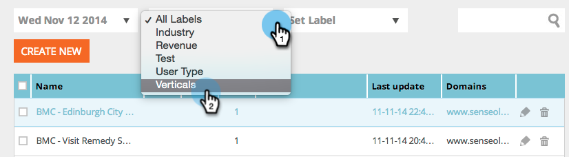
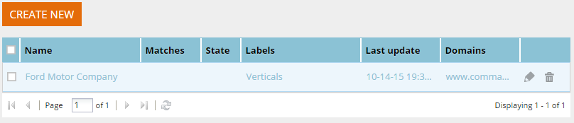

# View Segments from a Specific Label {#view-segments-from-a-specific-label}

Looking to view and filter your segments according to a specific label?

#### Filter by Existing Labels {#filter-by-existing-labels}

##### Under the labels drop-down select the label of your choice. {#under-the-labels-drop-down-select-the-label-of-your-choice}

##### Super cool, notice now we only show you the segments that are associated to the selected label? {#super-cool-notice-now-we-only-show-you-the-segments-that-are-associated-to-the-selected-label}

