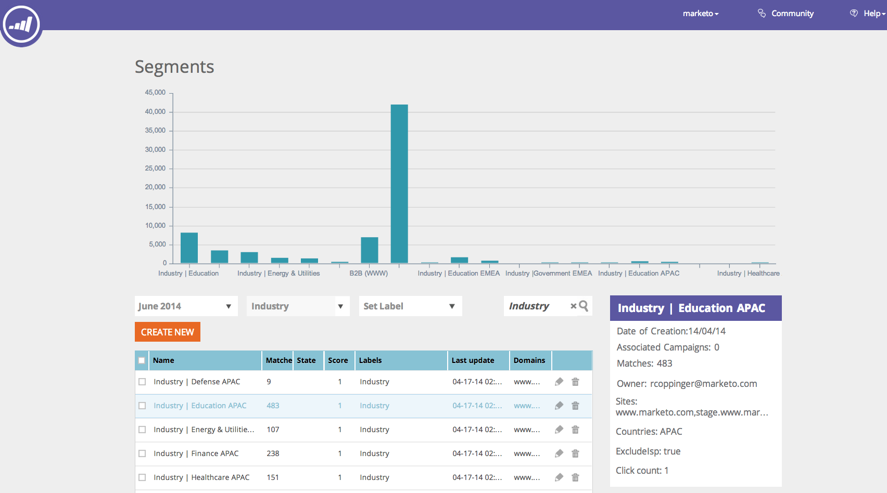
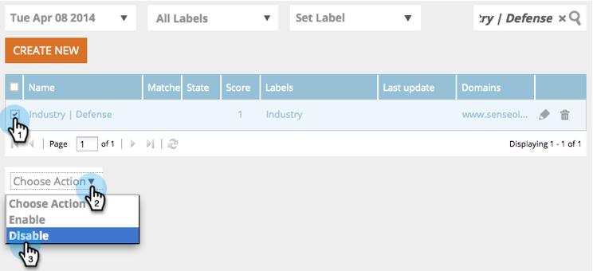
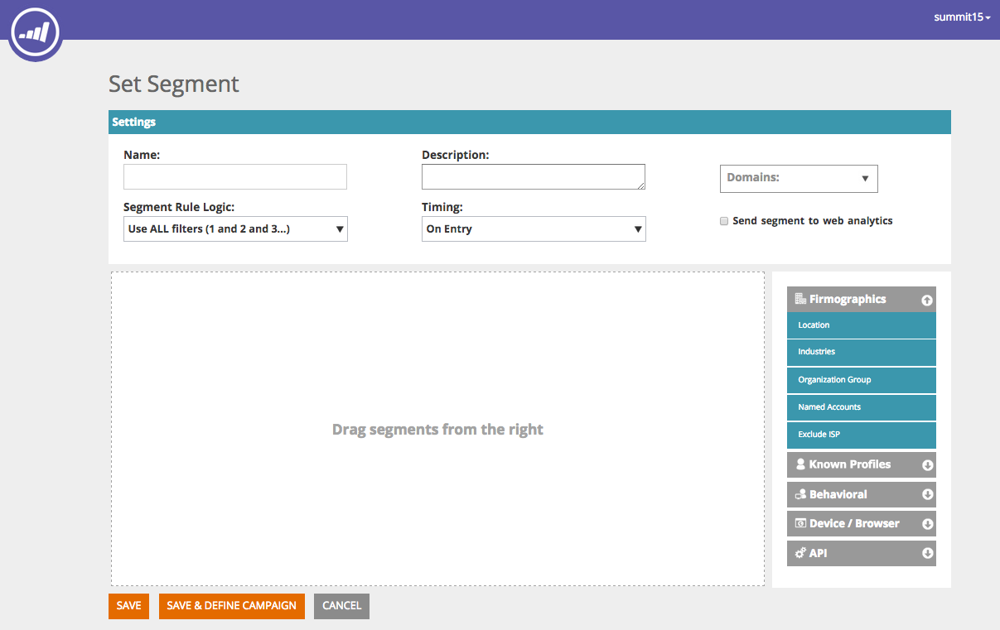
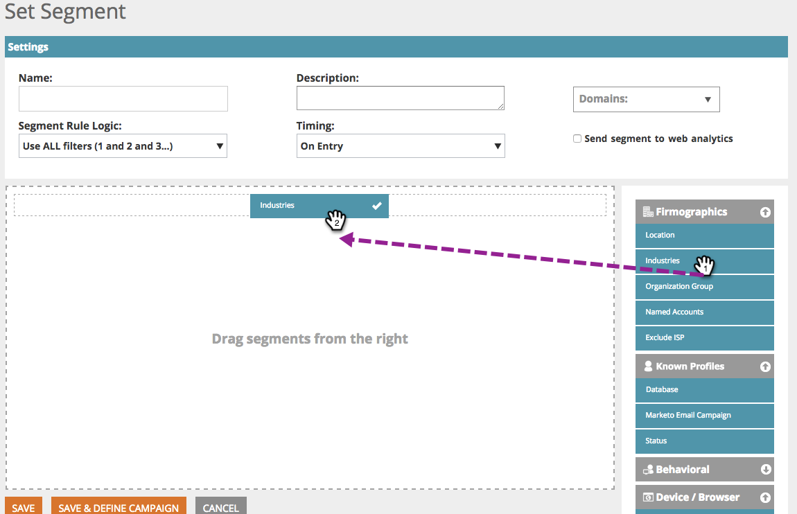
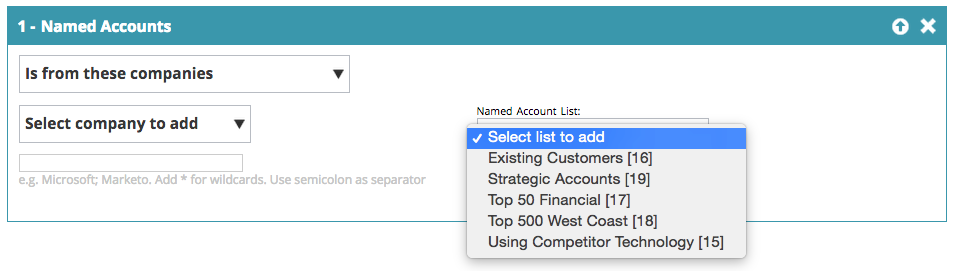
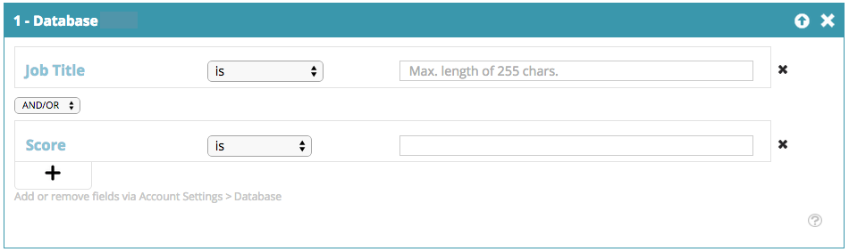
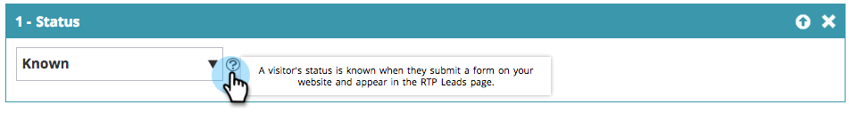
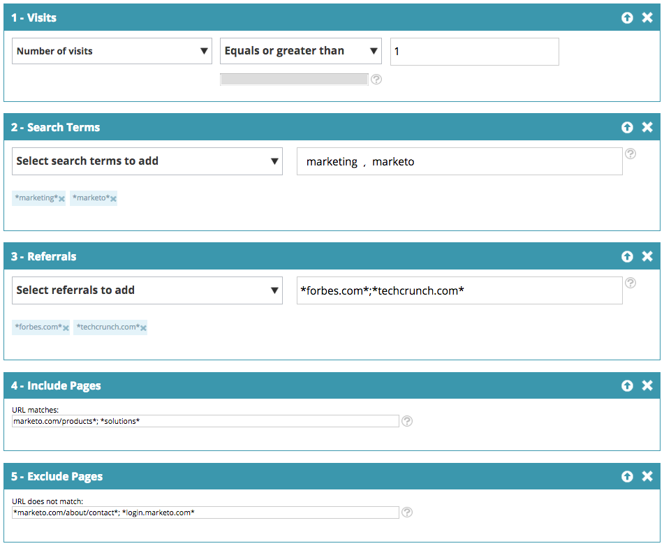
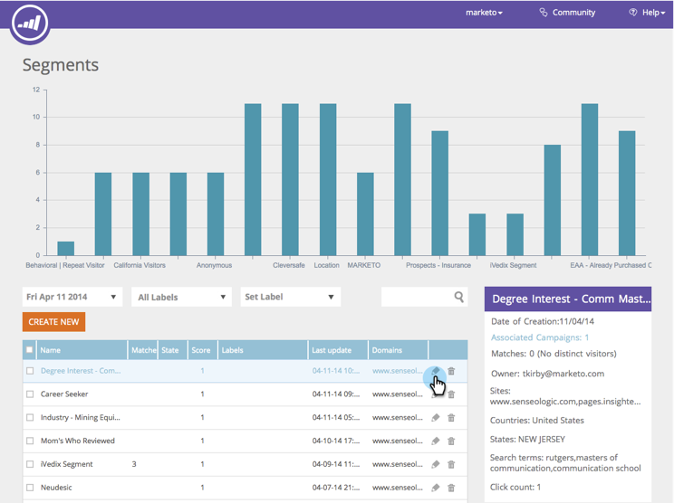

# Web Segments {#web-segments}

## View Segment {#view-segment}

The Segments tab displays all of the custom defined segments that you set up based on various attributes.&nbsp; **A segment is a collection of visitors that meet the specified criteria defined in the ‘Set a Segment’ page.** &nbsp;A segment can be visitors from a specific industry, location or based on the visitor's onsite activity.

In Web Personalization, a visitor can match more than one segment. For example, if there is a segment for USA visitors and a segment for finance companies, a web visitor from Bank of America would match **both** the segment for USA visitor and the segment for finance companies.

**GRAPH:** &nbsp;The Segments page displays a bar chart graph of the selected segments according to the number of visitors from the segment (y axis) and the segment name (x axis).

<table> 
 <thead> 
  <tr> 
   <th colspan="1" rowspan="1">Name</th> 
   <th colspan="1" rowspan="1">Description</th> 
  </tr> 
 </thead> 
 <tbody> 
  <tr> 
   <td colspan="1" rowspan="1"><strong>Name</strong></td> 
   <td colspan="1" rowspan="1">The title of the segment</td> 
  </tr> 
  <tr> 
   <td colspan="1" rowspan="1">
<strong>Matches</strong>
</td> 
   <td colspan="1" rowspan="1">The number of visitors meeting the customized, defined criteria of the segment</td> 
  </tr> 
  <tr> 
   <td colspan="1" rowspan="1"><strong>Set Campaign</strong></td> 
   <td colspan="1" rowspan="1">Allows you to set up a Campaign CTA associated with the selected search term</td> 
  </tr> 
  <tr> 
   <td colspan="1"><strong>Visitors</strong></td> 
   <td colspan="1">A preview of the visitors table associated with the selected search term</td> 
  </tr> 
  <tr> 
   <td colspan="1" rowspan="1"><strong>Clickstream</strong></td> 
   <td colspan="1" rowspan="1">Displays a table of the visitor's activity and URL path on the site and how long they visited each page </td> 
  </tr> 
 </tbody> 
</table>

See [how to create and view segment labels](label-your-segment.md)

**Segments - Right-hand Panel**

Selecting a segment in the table reveal additional details about the segment in the right-hand panel.

These details include:

* Segment's name
* Segment's date of creation
* The associated campaigns showing the campaigns operating with the segment. Clicking the number of reactions takes you to the campaigns page displaying the Campaign CTA (Call to Action) for the segment
* The number of matches (amount of visitors that met the segment criteria) for the segment and the number of distinct (unique) visitors that matched the segment. Clicking on the unique visitor link takes you to the visitor's page displaying the results of the segment
* The owner/user creator of the segment
* The domain sites associated with the segment
* A short summary of the selected criteria of the segment

## Enable or Disable a Segment {#enable-or-disable-a-segment}

To enable or disable a segment, select the checkbox of that Segment in the table and in the "Choose Action" drop-down&nbsp;box at the bottom of the table, select the action "Enable" or "Disable". When a segment is disabled, the word "disable" displays under the State column.

## Create Segments {#create-segments}

The segment you create meets whatever specific criteria you define in the **Set Segment** page. You can customize your segments based on a combination of criteria as well, targeting a specific audience in your campaign.

To create a new segment

From the **Segments** page, click **Create New** under the graph. The following screen appears.

Define general parameters to your segment:

1.

    * **Name:** &nbsp;Name your segment.
    * **Description:** &nbsp;Provide a more detailed explanation of the segment criteria.
    * **Domains:** &nbsp;Select the domain/s you want to include in the segment.
    * **Segment Rule Logic:** &nbsp;Select an AND / OR logic to build each segmentation attribute
    * **Timing:** Define the level of visitor engagement you want in your campaign

        * **On Entry**: Engage from the visitor arrives on the website
        * **After 1st - 9th Click**: Engage the visitor after a specific amount of clicks on the website

>[!TIP]
>
>**Segment Rule Logic**
>
>There are three filter options:
>
>1. Use All Filters (1 and 2 and 3...)
>1. Use Any Filters (1 or 2 or 3...)
>1. Advanced Filters (using and / or expressions) >
>    1. >    
>       Advanced filters allows you to control the segment condition. Enter the filter numbers separated by "and" and "or".  >
>        * 1 and 2 and 3
>        * 1 or 2 or 3
>
>       Mixing "and" and "or" requires parenthesis to clarify logic intention. e.g. "1 or 2 and 3" must be written as one of the following:  >
>        * 1 and (2 or 3)
>        * (1 and 2) or 3
>
>       Nested parenthesis are accepted for more complicated logic.e.g.  >
>        * (1 and 2) or (3 and 4)
>        * 1 and (2 or (3 and 4))
>
>       Check your logic after any insert, delete or reorder. 
>

Drag and drop Segment attributes from the right hand side column into the segment editor on the left side:

### Firmographics {#firmographics}

**Location**

Drag and drop **Location **into the segment editor.

* Select from the following parameters:

    * **Include **- Select whether you want the campaign to include or exclude a location.
    * **Select country to add** &nbsp;- From the drop-down box, select the country you wish to include in the segment. The country name appears to the right. You can choose multiple countries.

Once the country is added, you can specify the state, city and zip code of the segment as well.&nbsp;

* **Select State or Province to add** - From the drop-down box, select the U.S. state or Canadian Province you wish to include. You can make multiple selections.
* **Zip Code** - Enter the zip code you wish to include in your segment.
* **Cities** - Enter the city or cities you wish to include. Use a semicolon between cities.

>[!TIP]
>
>**What segment conditions do I choose? ‘AND’ or ‘OR’? **OR functions as an additional option within each field. Prospects need only fulfill one criteria of the multiple criteria selected within each field in order to qualify for the segment. (For example, prospects can either be from the U,S. *or* from the Defense industry). AND functions as an additional mandatory parameter which must be met for this segment. (For example, prospects must both be from the U.S. and from the Defense industry). Within each segmentation profile, each separate field can function as both, either an “AND” or “OR” depending on the Segment Condition selected.

**Industries** Under the **Profile Segmentation** section, check the box next to **Industry**.

* Select from the following parameters:

    * **Includes** - Select whether you want the segment to include or exclude an industry.
    * **Select Industries to add** - Select the industry you wish to include in the segment. The industry appears below the drop-down box. You can choose multiple industries.

**Organization Group**

Under the **Profile Segmentation** section, check the box next to **Organization Group.**

* From the drop-down box, select from the following choices:

    * Fortune 500 - Includes only Fortune 500 companies in this segment
    * Fortune&nbsp;1000 - Includes only Fortune 1000 companies in this segment
    * Global 2000 - Includes the Global 2000 companies in this segment
    * Enterprise - Includes organizations with more than 1,000 employees and revenue greater than $250M
    * SMB - Includes only small and medium businesses in this segment

**Named Accounts**

**Organizations**

*

    * **Is from these companies (specific names)**

        * Select company to target from the 'Select company to add' drop-down.
        * You can type the exact organization name you wish to target. *It is *always *recommended to use Named Account Lists instead of typing the names manually for better matches (see below).*

**Named Account List**

Select from a [Named Account List](../../../product-docs/web-personalization/account-based-web-marketing/create-a-new-account-list.md) to segment key targeted accounts

>[!NOTE]
>
>The number in the brackets next to the Named Account List name is used as an index reference for the list for Web Personalization [Read API](http://developers.marketo.com/documentation/websites/rtp-js-api/).

**Exclude ISP**

Excludes Internet Service Providers (ISPs) from the segment.

### Known People {#known-people}

**Database**

Web Personalization integrates with your Marketo Database, allowing you to segment and personalize campaigns by known person attributes and data.

Select Database, and select a person data field from the drop-down. Select the   **+** to add fields from the drop-down.

You can add or remove person data fields from Account Settings > Database

>[!TIP]
>
>Create your Segment criteria according to all person data fields from Marketo people such as Job Title; Score; Role; etc...
>
>Eg. "Job Title equals CMO" and "Score is less than or equals to 50"

**Marketo Email Campaign** Segment and personalize campaigns by email referral from a visitor clicking on a Marketo email and arriving on site. Segment by Marketo Program Name or Campaign Name and continue the conversation from email to web. Select the  +  to add fields from the drop-down.

**Status**

Define your segment according to a prospect’s status: known or anonymous.

*

    * Known - Select this option from the drop-down box for known visitors. A visitor is known when they submit a form on your website and appear in the Web Personalization People page.
    * Anonymous&nbsp;- Select this option from the drop-down box for anonymous visitors.

 

### Behavioral {#behavioral}

**Visits -** Define your segment according to visitor behavior or identify.

*

    * Number of Visits - Select this option from the drop-down box to specify the number of visits for prospects on the website.

        * Select Equals, Equals or Greater Than, or Equals or Less Than from the drop-down box.

    * Specific Visits - Select this option from the drop-down box to specify a specific visitor.

        * In the text box to the right, enter the visitor number you wish to track. The unique Web Personalization visitor identification number can be found when clicking on a visitor (in the visitors page) and the Set Campaign on the right side panel. The Visitor ID is located in the Advanced Settings section. The visitor ID can also be found in the URL (e.g. VISITOR=JZZJIFJNUI60PZ8Y97BHTY9BL8PKWS).

**Search Terms** - Define a segment according to a prospect’s search terms.

*

    * The visitor searched for - From the drop-down list, select the terms you want to track from your visitors search, or add your own search terms. (There is no need for the &#42; wildcard on search terms as it is set as default to include phrases that contain the search term).

**Referrals** -&nbsp;Add URLs that the visitor was referred by.

*

    * Select referrals to add - From the drop-down list, select the referral sites you wish to track or add your own referral. Once selected, the referrals will appear in the box below. (Using &#42; as a wildcard is permitted)

**Include Pages** - Track specific pages prospects visited on your website.

*

    * URL matches - Add the URL of specific web pages you wish to track. You can add multiple URLs by separating them with a semicolon. (Using &#42; as a wildcard is permitted).

**Exclude Pages** - Exclude specific pages that you do not want to match in the segment. (Using &#42; as a wildcard is permitted).

*

    *

        * URL does not match - Add the URL of specific web pages you wish to exclude from tracking. You can add multiple URLs by separating them with a semicolon

### Device / Browser {#device-browser}

**Mobile OS**

Drag and drop the Mobile OS into the Segment editor

* **Visitor type ** 
  **Mobile OS** - From the drop-down box, select from one or more mobile OS listed. The selected mobile OS appear below.

    * The visitor is using any mobile device ** **
    * The visitor is using this specific device/OS
    * The visitor is not using any mobile device

* **Device** &nbsp;- From the drop-down list, select from one or more devices (Apple, Samsung, LG, HTC, Nexus, Blackberry etc...). The selected devices appear below.

**Browser**&nbsp;

Target visitor that use specific browser types and/or versions.

*

    * Browser&nbsp;Type - From the drop-down box, select one or more Internet browsers . The selected browsers appear below.
    * Browser Version - Enter the browser version you wish to add to the segment. You can select multiple versions by separating each with a comma. (Using &#42; as a wildcard is permitted).

### API {#api}

**Data Events** - Segment visitors that trigger specific Custom Data Events

Add the Event value you want to target. E.g. from third party data sources.

**User Context API**

Web Personalization API call  [read more about it here.](http://developers.marketo.com/documentation/websites/rtp-user-context-api/)

>[!TIP]
>
>**Using Wildcards - **When you would like to include any search term or URL that contains something within it i.e. “ [google.com](http://google.com)” or “search term product”, we call this a wildcard and it should be inputted with an asterisk - this little guy&#42; - on each end. So anything coming from [google.com](http://google.com) should be inputted as &#42; [google.com](http://google.com)&#42;

## Edit Segments {#edit-segments}

You can edit a segment that has been created.

1. To edit a Segment, go to **Segments**.

2. In the **Segments** table, click on the edit icon ( ) of the segment you wish to edit. The **Set Segment** page opens with the selected segment.

3. Apply any edits or changes you wish to make on the segment.

4. Click **Save**.

## Delete Segments {#delete-segments}

You can delete segments you have created.

1. From the **Segments** page above, select a segment.

2. Click the delete icon (  ) of the segment** **you wish to delete.

3. A confirmation message appears, confirming that you are about to delete the **Segment**.

>[!NOTE]
>
>You cannot delete a segment that is associated with a campaign. First you need to delete the campaign and then the segment.

Great! Now that you understand the Segments section, let's learn about campaigns. 

>[!NOTE]
>
>**Related Articles**
>
>* [Create a Basic Web Segment](create-a-basic-web-segment.md) 
>* [Create a New Dialog Web Campaign](../../../product-docs/web-personalization/working-with-web-campaigns/create-a-new-dialog-web-campaign.md) 
>* [Create a New In Zone Web Campaign](../../../product-docs/web-personalization/working-with-web-campaigns/create-a-new-in-zone-web-campaign.md) 
>* [Create a New Widget Web Campaign](../../../product-docs/web-personalization/working-with-web-campaigns/create-a-new-widget-web-campaign.md) 
>

