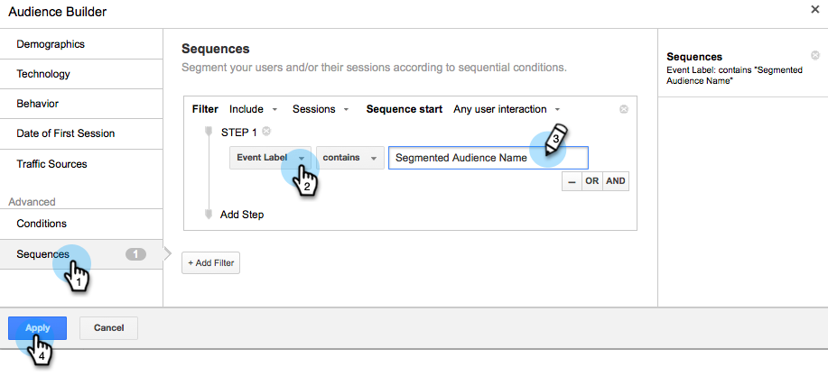
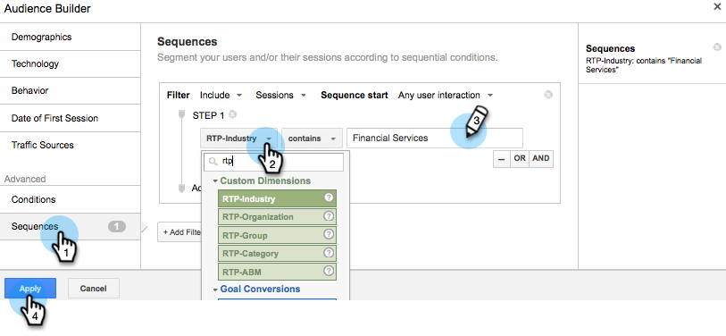
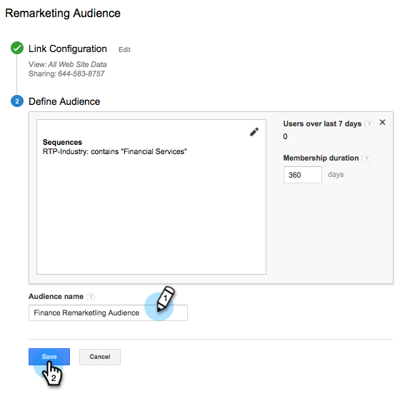
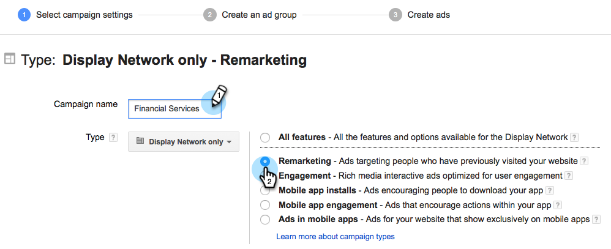
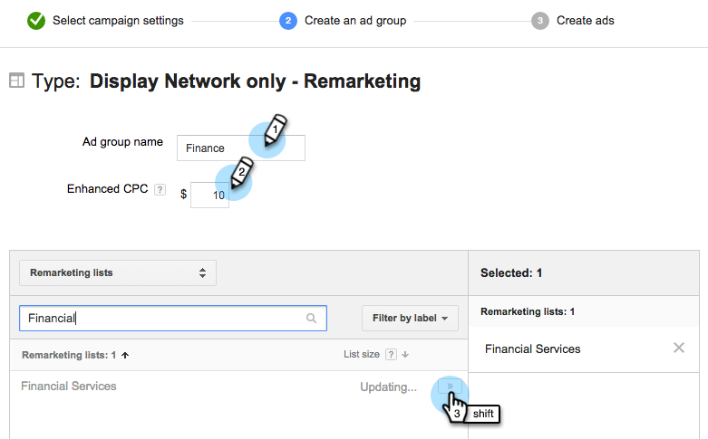

# Personalized Remarketing in Google {#personalized-remarketing-in-google}

### 

Personalized Remarketing lets you re-engage with your users using RTP data and the power of Google Analytics with the reach of the Google Display Network.

>[!NOTE]
>
>**Prerequisites**
>
>* Complete the [Retargeting with Web Personalization Data](retargeting-with-web-personalization-data.md) configuration
>* Review [Remarketing with Google Analytics Help](https://support.google.com/analytics/topic/2611283?hl=en&ref_topic=3413645) documentation
>

## Creating a Remarketing Audience in Google {#creating-a-remarketing-audience-in-google}

Login to your Google Analytics. Click **Admin**, **Account**, **Property**. Click on **Audience Definitions** and **Audiences**.

Click **+New Audience**.

**Link Configuration**: Link to your Google Adwords account   **Define Audience**: Click **Create New**.      In the Audience Builder, Click on **Sequences** and **Find the RTP Data** under Custom Dimensions, Custom Variables, Events. 

>[!TIP]
>
>How to find the RTP data in Analytics to build your audience?
>
>In Google Analytics:
>
>* Custom Variables: Organization, Industry
>* Event Category: Segment, Insightera-CTA, RTP-Remarketing
>* Event Label: Segment Name, Campaign Name, Segmented Audience Name  
>
>In Google Universal Analytics:
>
>* Custom Dimensions: Organization, Industry, Category (Fortune 500,1000, Global 2000), Group (Enterprise, SMB), ABM List (Named Account List)
>* Event Category: RTP-Segment, RTP-Campaign RTP-Remarketing
>* Event Label: Segment Name, Campaign Name, Segmented Audience Name
>

**Example of Remarketing Audience from RTP Segmented Audience Data**

1. Click **Sequences.**
1. Select** Event Label.**
1. Enter** Name of Segmented Audience **(as it appears in RTP).
1. Click **Apply**.

   **Example of Audience from RTP Industry Data** 

1. Click **Sequences**.
1. Select** RTP-Industry**.
1. Enter **Name of Industry** (eg. Financial Services, Education...).
1. Click **Apply**.

Enter an **Audience Name**. Click** Save**.     

## Create a Remarketing Ad Campaign in Google Adwords {#create-a-remarketing-ad-campaign-in-google-adwords}

Login to **Google Adwords**. Click on **Campaigns**, select **Display Network only**.

Enter **Campaign Name**, Select **Type Remarketing.**

Enter **Ad Group Name, **enter **Enhanced CPC**, Select** Remarketing List. **

Click Save and continue.

Add your Image or Text Ad and start your remarketing campaign. 

**  

**

>[!NOTE]
>
>**Related Articles**
>
>* [Retargeting with Web Personalization Data](retargeting-with-web-personalization-data.md)
>* [Personalized Remarketing in Facebook](personalized-remarketing-in-facebook.md)
>

