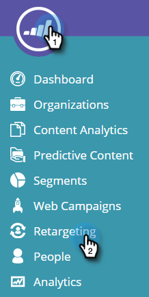
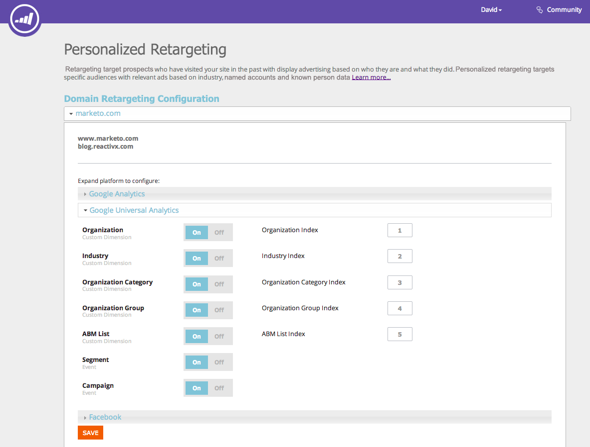
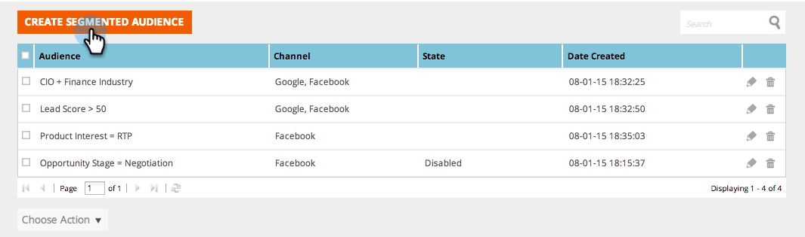
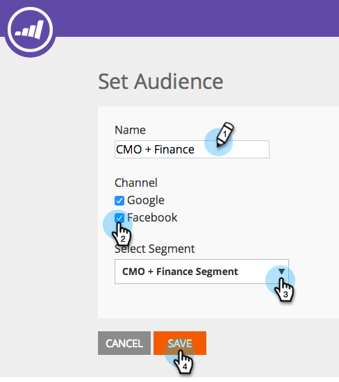

# Retargeting with Web Personalization Data {#retargeting-with-web-personalization-data}

>[!AVAILABILITY]
>
>Website Retargeting now falls under the Web Personalization tile. If you only purchased Retargeting, you will see this tile and access the Web Personalization product with **only** Retargeting features enabled. This gives you access to account settings, the Retargeting page, segments, and additional tracking pages.

Remarketing targets prospects who have visited your site in the past with display advertising based on who they are and what they did. Personalized retargeting targets specific audiences with relevant ads based on industry, named accounts, and known person data.

Web Personalization currently appends data to the following remarketing platforms:

* [Google](/help/marketo/product-docs/web-personalization/website-retargeting/personalized-remarketing-in-google.md)
* [Facebook](/help/marketo/product-docs/web-personalization/website-retargeting/personalized-remarketing-in-facebook.md)

Web Personalization sends the following data through to the remarketing platforms to create audiences and run remarketing ad campaigns:

<table> 
 <tbody> 
  <tr> 
   <th colspan="1">Web Personalization Data</th> 
  </tr> 
  <tr> 
   <th>
Industry
</th> 
  </tr> 
  <tr> 
   <th>
Group (Enterprise, SMB)
</th> 
  </tr> 
  <tr> 
   <th>
Category (Fortune 500/1000, Global 2000)
</th> 
  </tr> 
  <tr> 
   <th>
ABM List (Named Account Lists)
</th> 
  </tr> 
  <tr> 
   <th>
Segmented Audience (Based on Segments)
</th> 
  </tr> 
  <tr> 
   <th>
Web Campaigns Clicked
</th> 
  </tr> 
 </tbody> 
</table>

## Remarketing Configuration {#remarketing-configuration}

1. Go to **Retargeting**.

   

   >[!NOTE]
   >
   >The Retargeting Configuration is per domain or subdomain. Activate the other domains if you want to send data from those domains through to the retargeting platform.

1. Activate Settings for Google Analytics or Google Universal Analytics per domain.

   >[!NOTE]
   >
   >You need to have the Google Retargeting Tag implemented on your website.
   >
   >If you already setup your Integration with Web Personalization and Google Analytics, you do not need to edit this part as it is the same configuration under Account Settings.

   

1. Activate the configuration for Facebook. Click and expand the Facebook accordion, Click **On** to send the respective Event and data through to Facebook Audience Manager. Click **Save**.

   >[!NOTE]
   >
   >You need to have [Facebook Custom Audience Pixel](https://developers.facebook.com/docs/ads-for-websites/website-custom-audiences/getting-started#install-the-pixel)installed your website for this feature to work.

   

## Creating Segmented Audience {#creating-segmented-audience}

A Segmented Audience allows you to select an existing Segment as an audience to use for retargeting campaigns. For example, selecting your Known Person segments.

>[!TIP]
>
>There is no need to create a Segmented Audience for industry or other data that has already been sent through in the Domain Configuration. It's best to use Segmented Audiences for segments based on known person data.

1. Click **Create Segmented Audience**.

   

1. Enter audience Name, select Channels, and select Segment from the list of existing Segments.

   

1. Click **Save**.

   You have now completed the Retargeting Setup in Web Personalization, login to your retargeting platforms and create your audiences based on this data and set up your retargeting ad campaigns.
