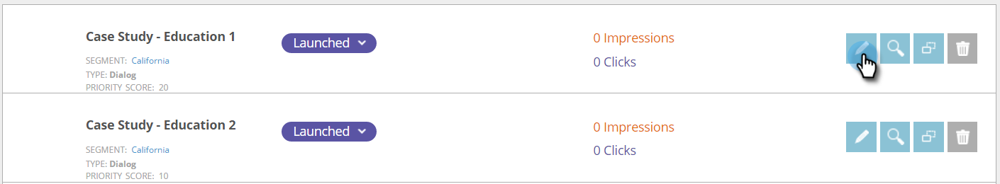
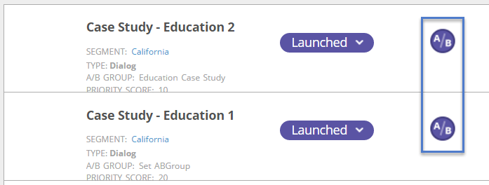

# AB Test Your Web Campaign {#ab-test-your-web-campaign}

Testing is a great way to optimize your web campaigns for better engagement. Here's how to get started.

To A/B test your personalized campaigns, you can select two or more campaigns, associate them to the same **[!UICONTROL Split Test]** group, and select **[!UICONTROL Auto Tune]** to automatically continue with the best performing campaign.

>[!TIP]
>
>If you'd prefer to manually calculate and see which campaign is performing better, do not enable [!UICONTROL Auto Tune].

## How to Set up a Split A/B Test {#how-to-set-up-a-split-a-b-test}

1. Go to **[!UICONTROL Web Campaigns]**.

   

   >[!NOTE]
   >
   >To make it easier to find the campaign you want, use the [filter feature](/help/marketo/product-docs/web-personalization/working-with-web-campaigns/filter-web-campaigns.md).

1. Select the first campaign you want to A/B test. Click **[!UICONTROL Edit]**.

   

1. In the campaign page, select **[!UICONTROL Split Testing]** and click **[!UICONTROL Create New]**.

   

1. Enter the **Split Testing Group Name**, click **[!UICONTROL Create]**. Select **[!UICONTROL Auto Tune]**.

   

1. **[!UICONTROL Save]** or **[!UICONTROL Launch]** the campaign.

   >[!TIP]
   >
   >Selecting **[!UICONTROL Auto Tune]** allows the [!DNL Web Personalization] platform to automatically recognize the better performing split test campaign, and continues with the highest converting campaign while pausing the others.

1. Repeat the above process with the second campaign.

1. Select the second campaign you want to A/B test. Click **[!UICONTROL Edit]**.

   

1. In the **[!UICONTROL Set Campaign]** page, select **Split Testing** and choose the **Group** from the drop-down. Select **[!UICONTROL Auto Tune]**.

   

1. **[!UICONTROL Save]** or **[!UICONTROL Launch]** the campaign.

1. Repeat this process for a third or fourth campaign to test.

1. In **[!UICONTROL Web Campaigns]** you can see the split test campaigns denoted by the A/B icon.

   

>[!TIP]
>
>1. You can test as many campaigns as you want. Best practice is two to three campaigns
>1. Make sure each split test group is associated with the same segment. You want to test towards the same audience.
>1. Try different content pieces (Case Study A vs. Case Study B), change the messaging and creatives, colors, sizes, or call to actions.
>1. Optimize and enjoy your personalized content!

>[!MORELIKETHIS]
>
>* [Create a Dialog Campaign](/help/marketo/product-docs/web-personalization/working-with-web-campaigns/create-a-new-dialog-web-campaign.md)
>* [Create a RTP In Zone Campaign](/help/marketo/product-docs/web-personalization/working-with-web-campaigns/create-a-new-in-zone-web-campaign.md)
>* [Create a RTP Widget Campaign](/help/marketo/product-docs/web-personalization/working-with-web-campaigns/create-a-new-widget-web-campaign.md)
