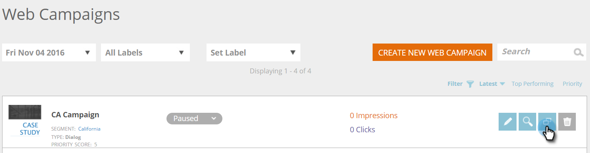

# Clone a Web Campaign {#clone-a-web-campaign}

Use the clone feature on the Web Campaigns page to copy the campaign settings and change the content for split testing optimization, or clone a campaign with the same content and target it toward a different segment. Create web campaigns in seconds!

## Create a Clone Campaign {#create-a-clone-campaign}

1. Go to **Web Campaigns**.

   

   >[!NOTE]
   >
   >To make it easier to find the web campaign you want, use the [filter feature](/help/marketo/product-docs/web-personalization/working-with-web-campaigns/filter-web-campaigns.md).

1. For the web campaign, click **Clone**.

   

1. The campaign cloning process copies all the content from the existing web campaign into the new cloned campaign. The new cloned web campaign is entitled, "[CAMPAIGN NAME] Copy".

   

   >[!TIP]
   >
   >All content in the web campaign is copied into the clone campaign except split testing, so don't forget to add a split test group to the cloned campaign if you want to test it against others.

>[!MORELIKETHIS]
>
>* [Create a Dialog Campaign](/help/marketo/product-docs/web-personalization/working-with-web-campaigns/create-a-new-dialog-web-campaign.md)
>* [Create a RTP In Zone Campaign](/help/marketo/product-docs/web-personalization/working-with-web-campaigns/create-a-new-in-zone-web-campaign.md)
>* [Create a RTP Widget Campaign](/help/marketo/product-docs/web-personalization/working-with-web-campaigns/create-a-new-widget-web-campaign.md)
