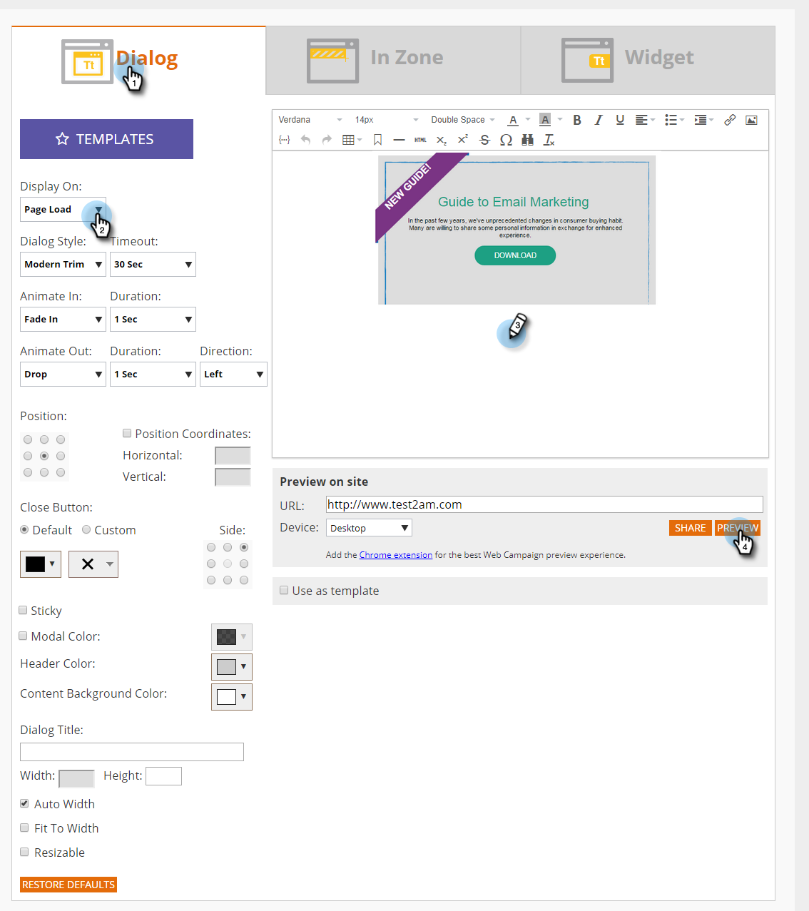
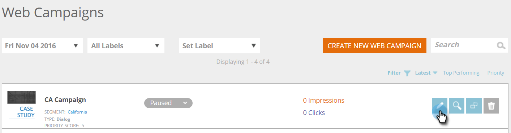
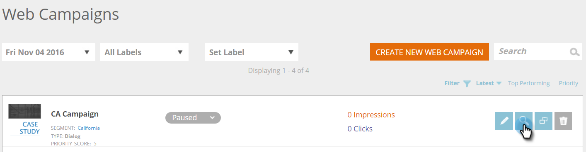
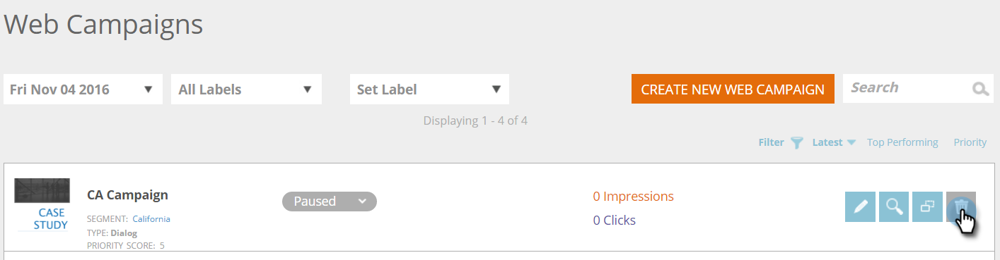

# Create a New Dialog Web Campaign {#create-a-new-dialog-web-campaign}

## Create a Dialog Web Campaign {#create-a-dialog-web-campaign}

Create a web campaign to personalize your web content in real-time and provide the right message, to the right user at the right time.

A web campaign is a customized reaction associated with a specific segment. The reaction can be a dialog box on your website, an [in zone replacement](create-a-new-in-zone-web-campaign.md), a [widget feature](create-a-new-widget-web-campaign.md)or an email alert.

1. Go to **Web Campaigns**.

   

1. Select **Create New Web Campaign**.

   

1. Select the **Dialog** web campaign type. Design and add your creative in the editor. Click **Preview** to see how the web campaign will react on your site.

   

<table> 
 <thead> 
  <tr> 
   <th colspan="1" rowspan="1">Name</th> 
   <th colspan="1" rowspan="1">Description</th> 
  </tr> 
 </thead> 
 <tbody> 
  <tr> 
   <td colspan="1"><strong>Display On</strong></td> 
   <td colspan="1">Allows you to <a href="https://docs.marketo.com/display/DOCS/Set+How+Your+Web+Campaign+Displays" rel="nofollow">customize when and how</a> your web campaign displays.</td> 
  </tr> 
  <tr> 
   <td colspan="1" rowspan="1"><strong>Dialog Style</strong></td> 
   <td colspan="1" rowspan="1"> 
    <ul> 
     <li>Modern Trim - A stylish and distinctive dialog with semi-transparent black trim and rounded corners</li> 
     <li>Modern Trim II - A stylish and distinctive dialog with a light shadow trim and rounded corners and close button</li> 
     <li>Transparent - A fully transparent dialog box, ideal for transparent (png) images for your call to actions. </li> 
     <li>Basic - A simple style dialog, with thicker title header space fulfilling your basic dialog box needs.</li> 
    </ul></td> 
  </tr> 
  <tr> 
   <td colspan="1"><strong>Animate In/Out</strong></td> 
   <td colspan="1">Set on dialog entry and/or exit. Select effect (drop, blind, slide, fade, no effect), duration (in seconds), and direction (up, down, left, right).</td> 
  </tr> 
  <tr> 
   <td colspan="1" rowspan="1">
<strong>Position</strong>
</td> 
   <td colspan="1" rowspan="1">Select one of the 9 options for the dialog box's position on the page. For example, selecting the middle box displays the dialog box in the middle of the screen.</td> 
  </tr> 
  <tr> 
   <td colspan="1" rowspan="1">
<strong>By Coordinates</strong>

 
</td> 
   <td colspan="1" rowspan="1">For additional positioning options of the dialog box, select the checkbox ‘Position Coordinates’ and enter the exact screen coordinates (Horizontal, Vertical) where you would like the dialog to appear.</td> 
  </tr> 
  <tr> 
   <td colspan="1"><strong>Button Fill</strong></td> 
   <td colspan="1">Customize the modal's close button using color, style, and position. You can also use your own button by linking to it in the Image URL box.</td> 
  </tr> 
  <tr> 
   <td colspan="1"><strong>Sticky</strong></td> 
   <td colspan="1">By selecting the sticky checkbox the dialog box remains in position, without any time limit, until closed by the user and will appear on all pages throughout the visitor's session.</td> 
  </tr> 
  <tr> 
   <td colspan="1"><strong>Modal</strong></td> 
   <td colspan="1">Provides more focus on the dialog box and launches it with a darkened background behind the dialog window, increasing the user awareness of the dialog box.</td> 
  </tr> 
  <tr> 
   <td colspan="1"><strong>Modal Color</strong></td> 
   <td colspan="1">Customize the modal's color as well as opacity.</td> 
  </tr> 
  <tr> 
   <td colspan="1"><strong>Timeout </strong></td> 
   <td colspan="1">The number of seconds the dialog box is activated before fading out.</td> 
  </tr> 
  <tr> 
   <td colspan="1"><strong>Header color</strong></td> 
   <td colspan="1">Set the header bar of the dialog to your preferred color. The color can be chosen from a color chart or entered as a Hex color code. </td> 
  </tr> 
  <tr> 
   <td colspan="1"><strong>Content background color </strong></td> 
   <td colspan="1">Set the background color of the dialog box to your preferred color. The color can be chosen from a color chart or entered as a Hex color code. </td> 
  </tr> 
  <tr> 
   <td colspan="1"><strong>Dialog title</strong></td> 
   <td colspan="1">Add a title to the header title bar of the dialog box.</td> 
  </tr> 
  <tr> 
   <td colspan="1"><strong>Width and height</strong></td> 
   <td colspan="1">Select the pixel sizing of the dialog box.</td> 
  </tr> 
  <tr> 
   <td colspan="1"><strong>Width Auto</strong></td> 
   <td colspan="1">Selecting this check box allows the dialog box to auto fit to the content width.</td> 
  </tr> 
  <tr> 
   <td colspan="1"><strong>Resizable </strong></td> 
   <td colspan="1">Selecting the resizable checkbox allows the dialog box to be resized by the user.</td> 
  </tr> 
  <tr> 
   <td colspan="1"><strong>Rich Text Editor</strong></td> 
   <td colspan="1">
The rich text editor allows for text formatting, linking and image insertion. <a href="using-the-web-personalization-rich-text-editor.md">Read more here</a>.
</td> 
  </tr> 
  <tr> 
   <td colspan="1"><strong>Preview on site</strong></td> 
   <td colspan="1">Preview campaigns before they are launched.  
    <ul> 
     <li>URL - Enter an example URL where the campaign would run to see a preview example of how the campaign would look live.</li> 
     <li>Device - Preview how your campaign will appear by device: Desktop, Mobile Portrait, Mobile Landscape, Tablet Portrait, Portrait Landscape. </li> 
     <li>Preview - Click <strong>Preview </strong>to open a new window of the example URL to see how the campaign reacts. </li> 
     <li>Share - Use the Share button to send an email to a colleague with a link to see the proxy campaign.</li> 
    </ul></td> 
  </tr> 
 </tbody> 
</table>

   >[!TIP]
   >
   >Speed up and simplify your campaign creation process by using our [built in templates](../../../product-docs/web-personalization/using-templates/using-templates-to-create-web-campaigns.md) or by [saving your existing campaign](../../../product-docs/web-personalization/using-templates/using-templates-to-create-web-campaigns.md) as a template for reuse.

## Edit a Web Campaign {#edit-a-web-campaign}

1. From the **Web** **Campaigns** page, click **Edit** on the web campaign.

>[!NOTE]
>
>To make it easier to find the web campaign you want, use the [filter feature](filter-web-campaigns.md).

## Preview a Web Campaign {#preview-a-web-campaign}

1. From the **Web Campaigns** page, click **Preview** on the web campaign you wish to view.

## Clone a Web Campaign {#clone-a-web-campaign}

See [Clone a Web Campaign](clone-a-web-campaign.md).

## Delete a Web Campaign {#delete-a-web-campaign}

1. From the **Web Campaigns** page, click **Delete **on the web campaign you wish to delete.

   

1. A confirmation message appears to confirm if you want to delete the web campaign.

>[!MORELIKETHIS]
>
>* [Create a New In Zone Web Campaign](create-a-new-in-zone-web-campaign.md)
>* [Create a New Widget Web Campaign](create-a-new-widget-web-campaign.md)
