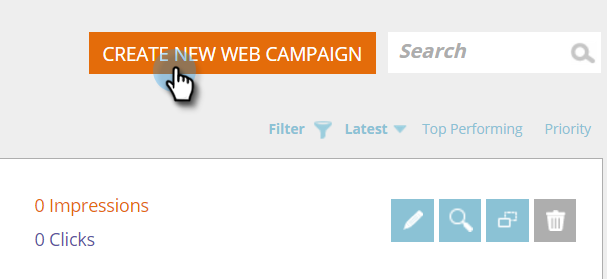
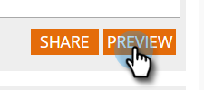
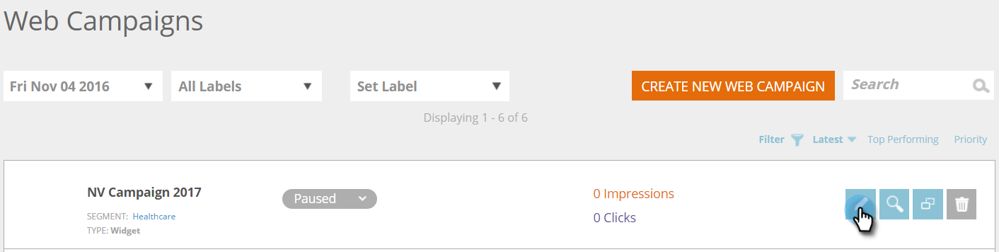
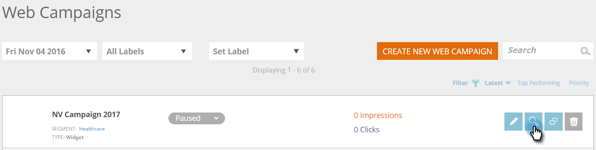
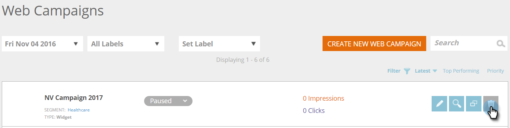

# Create a New Widget Web Campaign {#create-a-new-widget-web-campaign}

A web campaign is a customized reaction associated with a specific segment and can be a [dialog box](create-a-new-dialog-web-campaign.md) on your website, an [in zone replacement](create-a-new-in-zone-web-campaign.md), a widget feature, or an email alert. The Widget web campaign is a text or banner that appears on the vertical side of your web page with the ability to expand and contract, while remaining fixed on the website page throughout the visit.

## Create a Widget Web Campaign {#create-a-widget-web-campaign}

1. Go to **Web Campaigns**.

   

1. Select **Create New Web Campaign**.

   

1. Select the **Widget** campaign type.

   &nbsp;

1. Use the multiple options to customize your widget.

   

1. &nbsp;Click **Preview **to see how the web campaign will react on your site.

   

<table> 
 <thead> 
  <tr> 
   <th colspan="1" rowspan="1">Name</th> 
   <th colspan="1" rowspan="1">Description</th> 
  </tr> 
 </thead> 
 <tbody> 
  <tr> 
   <td colspan="1"><strong>Templates</strong></td> 
   <td colspan="1">Choose from one of several pre-made templates.</td> 
  </tr> 
  <tr> 
   <td colspan="1"><strong>Display On</strong></td> 
   <td colspan="1">Allows you to <a href="http://docs.marketo.com/display/DOCS/Set+How+Your+Web+Campaign+Displays" rel="nofollow">customize when and how</a> your web campaign displays.</td> 
  </tr> 
  <tr> 
   <td colspan="1"><strong>Animate In/Out</strong></td> 
   <td colspan="1">Set on dialog entry and/or exit. Select effect (drop, blind, slide, fade, no effect), duration (in seconds), and direction (up, down, left, right).</td> 
  </tr> 
  <tr> 
   <td colspan="1"><strong>Position</strong></td> 
   <td colspan="1">Select one of the four options for the widget's position on the page: Right, Left, Top, Bottom. Position % is the percentage of the positioning as to where the Widget will appear in the browser page (e.g., "50% Bottom" will cause the widget appear halfway down the bottom of the page, "10% Left" will cause the widget to appear near the top left of the page, etc.). </td> 
  </tr> 
  <tr> 
   <td colspan="1" rowspan="1"><strong>Widget Color</strong></td> 
   <td colspan="1" rowspan="1">
Select the widget color from a color chart or enter it as a RGB color code. You can also select the transparency level of the widget background by moving the bar on the bottom in either direction.
</td> 
  </tr> 
  <tr> 
   <td colspan="1" rowspan="1">
<strong>Widget Button</strong> 
</td> 
   <td colspan="1" rowspan="1">Customize the widget button itself. Arrow: Allows you to choose from multiple different icons in the right drop-down menu. The left drop-down determines its color. Custom: Insert the URL of any hosted image. File types accepted - .JPEG, .GIF (including animated), .PNG, .APNG, .SVG, .BMP. Text: Widget can be text - customize its color, size, and font.</td> 
  </tr> 
  <tr> 
   <td colspan="1"><strong>Sticky</strong></td> 
   <td colspan="1">Selecting this assures the widget will appear on all the web pages throughout the visitor’s session.</td> 
  </tr> 
  <tr> 
   <td colspan="1"><strong>Minimize Widget on Campaign Display</strong></td> 
   <td colspan="1">Inserts widget but keeps it minimized, requiring the user to click it to maximize it.</td> 
  </tr> 
  <tr> 
   <td colspan="1"><strong>Restore Default </strong></td> 
   <td colspan="1">Restores the original default setting for the widget, by setting the widget color to the default transparent grey option.</td> 
  </tr> 
  <tr> 
   <td colspan="1"><strong>Preview on site </strong></td> 
   <td colspan="1">Preview campaigns before they are launched.  
    <ul> 
     <li>URL - Enter an example URL where the campaign would run to see a preview example of how the campaign would look live.</li> 
     <li>Preview -&nbsp;Click&nbsp;<strong>Preview&nbsp;</strong>to open a new window of the example URL to see how the campaign reacts (Add the&nbsp;<a href="https://chrome.google.com/extensions/detail/ldiddonjplchallbngbccbfdfeldohkj?hl=en" rel="nofollow">Chrome extension</a>&nbsp;for the best Web Campaign preview experience.). </li> 
     <li>Share&nbsp;- Use the Share button to send an email to a colleague with a link to see the proxy&nbsp;campaign.</li> 
    </ul></td> 
  </tr> 
 </tbody> 
</table>

   >[!NOTE]
   >
   >**Want to A/B test your web campaigns?** One or more web campaigns can be [A/B tested for optimal results](ab-test-your-web-campaign.md). With the Auto-Tune feature, the platform automatically recognizes the better performing campaigns, continues with the highest converting campaigns and pauses the other ones.

   ## Edit a Web Campaign {#edit-a-web-campaign}

   From the Web Campaigns&nbsp;page, click **Edit** on the Campaign.

   

   >[!NOTE]
   >
   >To make it easier to find the campaign you want, use the [filter feature](filter-web-campaigns.md).

   ## Clone a Web Campaign {#clone-a-web-campaign}

   See [Clone a Web Campaign](clone-a-web-campaign.md).

   ## Preview a Web Campaign {#preview-a-web-campaign}

   From the&nbsp;Web Campaigns&nbsp;page, click **Preview** on the web campaign you wish to preview

   

   ## Delete a Web Campaign {#delete-a-web-campaign}

1. From the Web Campaigns page, click **Delete **on the web campaign you wish to delete.

   

   2. A confirmation message appears to confirm if you want to delete the web campaign.

>[!NOTE]
>
>**Related Articles**
>
>* [Create a New In Zone Web Campaign](create-a-new-in-zone-web-campaign.md)
>* [Create a New Dialog Web Campaign](create-a-new-dialog-web-campaign.md)
>

