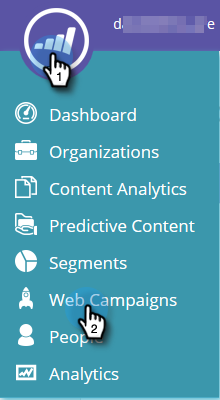
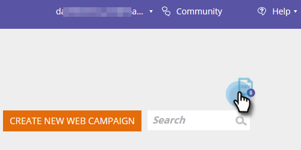
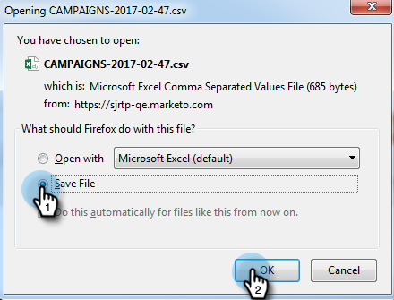
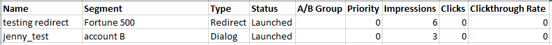

# Export Web Campaign Data {#export-web-campaign-data}

Follow these simple steps to export your web campaign data.

1. Go to **Web Campaigns**.

   

1. On the top-right of the page, click the Export CSV icon.

   

1. Open or Save your file.

   

1. View your file to look at helpful statistics.

   
