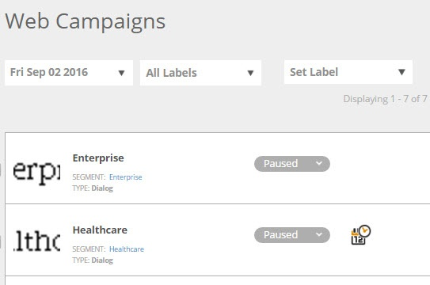

# Filter Web Campaigns {#filter-web-campaigns}

After you've created hundreds of Web Personalization campaigns, it really helps to be able to use filters to view only the ones you're interested in.

1. Go to **Web Campaigns**.

   

1. On the Web Campaigns page, click **Filter**.

   

1. Check the checkbox for the Status and/or Type of campaign you want to filter for, for example, **Paused** or **Dialog**. Click **Apply**.

   

   >[!TIP]
   >
   >Use the **Select All** checkbox to choose all or the **Clear** link to clear all checkboxes.

1. Now, only campaigns that match your filter are displayed.

   

   Piece of cake!
