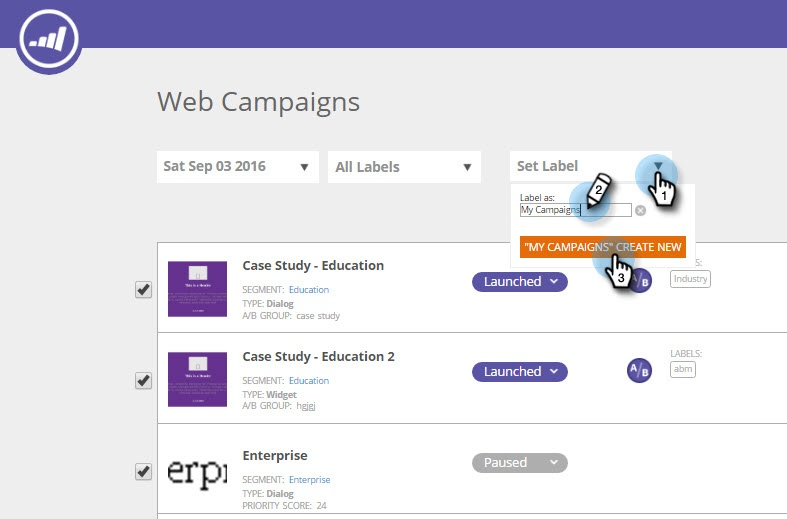

# Label Your Web Campaigns {#label-your-web-campaigns}

Do you have so many campaigns that scrolling is becoming cumbersome? Use labels to tag your campaigns, so you can sort them and find them quickly.

## Add a Label to a Web Campaign {#add-a-label-to-a-web-campaign}

1. Log into Web Personalization and go to the Web Campaigns area. 

   

   >[!NOTE]
   >
   >To make it easier to find the campaign you want, use the [filter feature](filter-web-campaigns.md).

1. Select the campaigns you want to tag with a label.

   

1. Enter the desired label name and click Create New.

>[!TIP]
>
>If the label already exists, select it, and don't create a new one.

Cool! You now know how to create labels and assign them to campaigns.

## Filter by Existing Labels {#filter-by-existing-labels}

1. Under the labels drop-down, select the label you want to use as a filter.

   

1. Now we only show you the campaigns that are associated to the selected label.

   

>[!NOTE]
>
>**Related Articles**
>
>* [L](create-a-new-in-zone-web-campaign.md) [abel a Segment](../../../product-docs/web-personalization/using-web-segments/label-your-segment.md)
>

