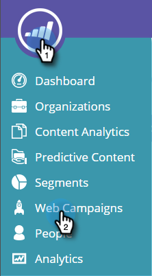
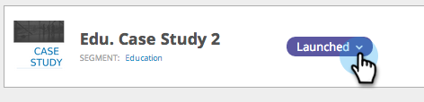
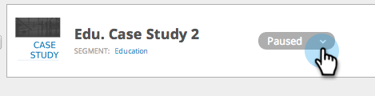
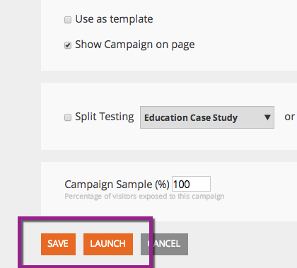

# Launch/Pause a Web Campaign {#launch-pause-a-web-campaign}

A web campaign is a customized reaction associated with a specific segment and can be a [dialog box](/help/marketo/product-docs/web-personalization/working-with-web-campaigns/create-a-new-dialog-web-campaign.md) on your website, an [in zone replacement](/help/marketo/product-docs/web-personalization/working-with-web-campaigns/create-a-new-in-zone-web-campaign.md), a widget feature, or an email alert.

You can launch or pause a web campaign in two ways from the Web Campaigns page or Set Web Campaigns page.

1. Click **Web Personalization**.

   

1. Go to **Web Campaigns**.

   

1. If the campaign is launched, click **Launched** to change the campaign's status to **Paused**, to pause the campaign.

   

1. If the campaign is paused, click **Paused** to change the campaign's status to **Launched**. This will activate and launch the campaign.

   

   >[!NOTE]
   >
   >You can also change the campaign status in the Set Campaign Page.

1. In the campaign, click **Edit**.

   

1. Click **Save** to save and pause the campaign. Click **Launch** to launch and activate the campaign.

   

>[!MORELIKETHIS]
>
>* [Create a Dialog Campaign](/help/marketo/product-docs/web-personalization/working-with-web-campaigns/create-a-new-dialog-web-campaign.md)
>* [Create a RTP In Zone Campaign](/help/marketo/product-docs/web-personalization/working-with-web-campaigns/create-a-new-in-zone-web-campaign.md)
>* [Create a RTP Widget Campaign](/help/marketo/product-docs/web-personalization/working-with-web-campaigns/create-a-new-widget-web-campaign.md)
