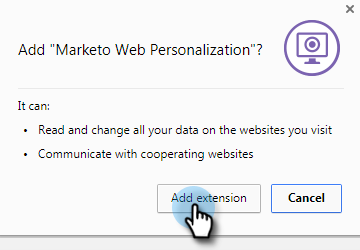

# Preview and Test a Web Campaign {#preview-and-test-a-web-campaign}

This article shows you different ways to preview a web campaign, and also how to test it using a sandbox segment live on your website.

## Preview a Web Campaign on the Creation Page {#preview-a-web-campaign-on-the-creation-page}

1. Go to **Web Campaigns**.

   

1. Click **Create New Web Campaign** or the icon to edit an existing campaign.

   

1. In Preview on site, add the page URL and click **Preview**. A new window/tab opens showing the campaign preview.

   

   >[!TIP]
   >
   >Click **Share** to open an email with a fixed URL of the campaign preview.

   >[!NOTE]
   >
   >You also have the option of installing a browser plug-in (either [Chrome](https://chrome.google.com/webstore/detail/marketo-web-personalizati/ldiddonjplchallbngbccbfdfeldohkj) or [Firefox](https://rtp-static.marketo.com/rtp/libs/mwp-0.0.0.8.xpi)) for the best experience previewing your campaign. See the section below.

## Preview a Web Campaign on the Creation Page Using the Browser Plug-In {#preview-a-web-campaign-on-the-creation-page-using-the-browser-plug-in}

1. Follow steps 1 & 2 from the section above.

1. Click the link to the browser plug-in (in this case we're using Chrome).

   

1. A new window/tab opens. Click **Add to Chrome**.

   

1. Click **Add Extension**.

   

1. Go back to Marketo. Add the page URL and click **Preview**.

   

1. A new window/tab opens which allows you to preview how your campaign looks on a desktop, phone, or tablet.

   

## Preview a Web Campaign on the Web Campaigns Page {#preview-a-web-campaign-on-the-web-campaigns-page}

1. While looking at the listing of your web campaigns, simply choose a campaign and click the **Preview** icon.

   

   Easy!

## Preview a Web Campaign on your Website {#preview-a-web-campaign-on-your-website}

Create a sandbox segment and campaign.

1. Go to **Segments**.

   

1. Click **Create New**.

   

1. Name the segment.

1. Under Behavioral, drag Include Pages onto the canvas. Add the value &#42;sandbox=1&#42;. Click **Save & Define Campaign**.

   

1. On the Set Web Campaign page, change the Target Segment to the sandbox segment by selecting it from the list.

   

1. Complete the campaign creative and Click **Launch**.

   

1. Go to your website, add the URL parameter "?sandbox=1" at the end of the URL. Example: `www.marketo.com?sandbox=1`.

1. See the campaign react on your website.

>[!NOTE]
>
>Campaigns react only once during a visitor session. To see the campaign again, clear your browser cookies.

>[!NOTE]
>
>Redirect campaigns cannot be previewed. The only way to test them is by using a sandbox segment (that targets by specific pages - &#42;sandbox=redirect&#42;)
