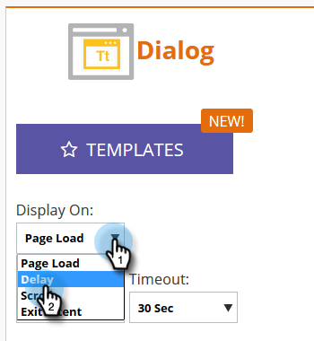
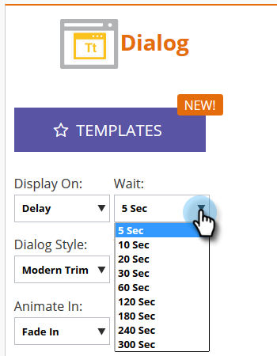
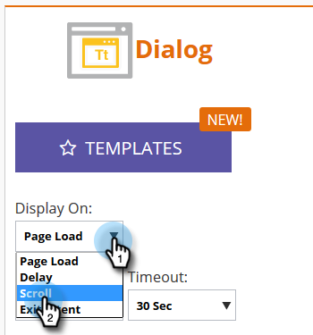
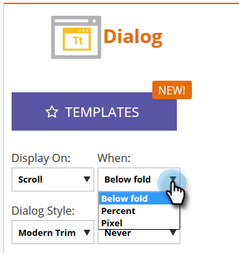
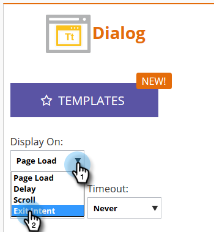

# Set How Your Web Campaign Displays {#set-how-your-web-campaign-displays}

There are several methods to utilize when it comes to when/how your web campaign displays.

## Page Load {#page-load}

Selected by default, this choice simply displays the campaign upon page load.

## Delay {#delay}

Specify a time delay (in total seconds) for web campaigns to react on your website.

1. Click the **Display On** drop-down and select **Delay**.

   

1. Click the **Wait** drop-down and select the desired amount of time.

   

## Scroll {#scroll}

1. Click the **Display On** drop-down and select **Scroll**.

   

1. Click the **When** drop-down and select when you want your web campaign to display.

   

<table> 
 <tbody> 
  <tr> 
   <td><strong>Below fold</strong></td> 
   <td>Displays campaign when visitor scrolls below the fold. Campaign disappears when visitor scrolls back above the fold.</td> 
  </tr> 
  <tr> 
   <td><strong>Percent</strong></td> 
   <td>Displays campaign when visitor scrolls to predetermined percentage of the page.</td> 
  </tr> 
  <tr> 
   <td><strong>Pixel</strong></td> 
   <td>
Displays campaign when visitor scrolls to predesignated top pixel on the page.
</td> 
  </tr> 
 </tbody> 
</table>

## Exit Intent {#exit-intent}

Exit intent will display the web campaign upon mouse cursor exit of the browser.

1. Click the **Display On** drop-down and select **Exit Intent**.

   

1. A message appears reminding you Exit Intent is not compatible with mobile.

   

>[!TIP]
>
>Wanna see how your chosen effects will look ahead of time? Check them out via an [Web Campaign Preview](/help/marketo/product-docs/web-personalization/working-with-web-campaigns/preview-and-test-a-web-campaign.md).
