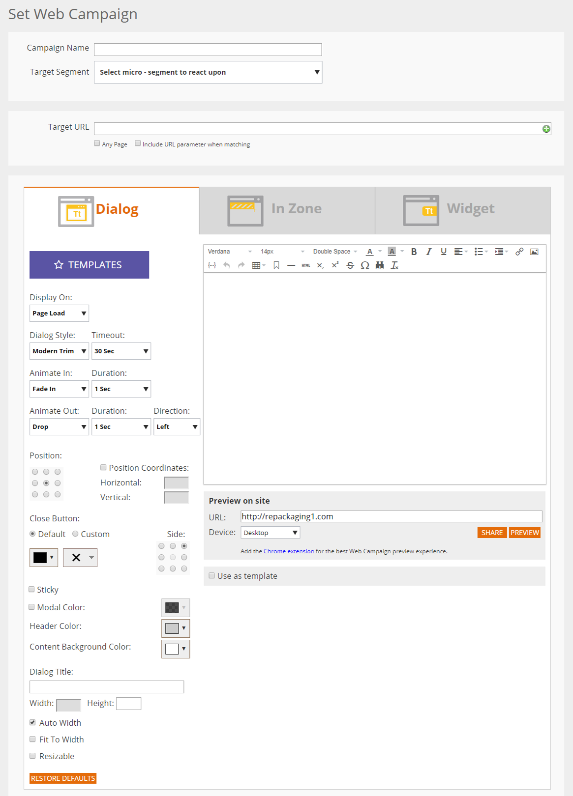
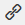

# Using the Web Personalization Rich Text Editor {#using-the-web-personalization-rich-text-editor}

The Web Personalization rich text editor found in the Set Campaigns page allows for text formatting, linking and image insertion. It includes formatting options similar to standard word processors.

The important icons in the rich text editor include:

<table> 
 <tbody> 
  <tr> 
   <td colspan="1"></td> 
   <td colspan="1"><strong>Edit HTML Source</strong></td> 
   <td colspan="1">Enables you to view the HTML source code</td> 
  </tr> 
  <tr> 
   <td colspan="1"></td> 
   <td colspan="1">
<strong>Insert/Edit Image</strong> 
</td> 
   <td colspan="1">Inserts an image URL for graphical images to appear in the editor</td> 
  </tr> 
  <tr> 
   <td colspan="1"></td> 
   <td colspan="1"><strong>Insert Image from Design Studio</strong></td> 
   <td colspan="1"><em>After</em> clicking the <strong>Insert/Edit Image</strong> icon, use this to select images from your Marketo Design Studio</td> 
  </tr> 
  <tr> 
   <td colspan="1"></td> 
   <td colspan="1">
<strong>Insert/Edit Link</strong> 
</td> 
   <td colspan="1">Use to add hyperlinks to text or images</td> 
  </tr> 
  <tr> 
   <td colspan="1"></td> 
   <td colspan="1"><strong>Insert/Edit Token</strong></td> 
   <td colspan="1">Use company or person tokens to personalize your web campaign</td> 
  </tr> 
 </tbody> 
</table>

>[!NOTE]
>
>Web Tokens use [people data](https://docs.marketo.com/display/DOCS/Manage+Person+Data) from your Marketo Database that is managed in Web Personalization under Account Settings > Database. If the web token is a new database field not yet in Account Settings > Database, it will automatically be added and can take up to 24 hours to activate.

>[!MORELIKETHIS]
>
>[Using the Rich Text Editor](https://docs.marketo.com/display/docs/using+the+rich+text+editor#usingtherichtexteditor-features)

