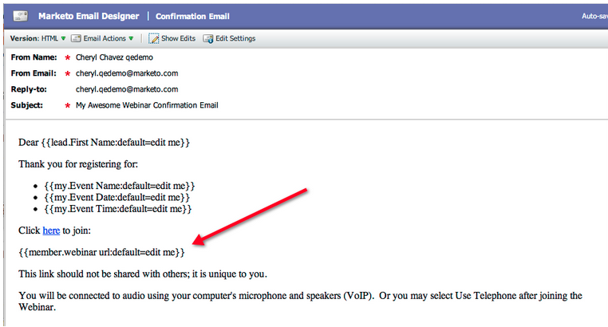
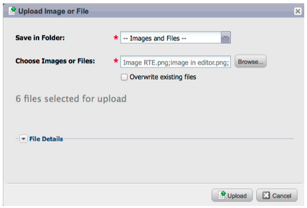

# Release Notes: April 2012 {#release-notes-april}

## Segmentation Filters and Triggers {#segmentation-filters-and-triggers}

>[!NOTE]
>
>**Deep Dive**
>
>For other releases, see the [Release Notes](http://docs.marketo.com/display/docs/release+notes) deep dive.

Do you target the same group of leads consistently? If so, use segmentation in your smart lists for targeting leads. With segmentation, your entire lead database is always segmented and it can be re-used across your programs for consistency. Segmentation results are pulled quickly because they do not require the smart list to run at the time of the request.

## Insert External Values into Email Content, and other Flow Steps, through Expanded API Capabilities {#insert-external-values-into-email-content-and-other-flow-steps-through-expanded-api-capabilities}

* The Request Campaign API now allows you to send in values for My Tokens for that particular run of the campaign - this is particularly useful for populating email content via the API
* New Upload To List and Schedule Campaign APIs support the above for lists of leads and batch campaigns ([http://community.marketo.com/MarketoArticle?id=kA050000000Kyr5](#))

## Easier Confirmation Emails for GoToWebinar and WebEx (Adobe Connect and ON24 Coming Soon!) {#easier-confirmation-emails-for-gotowebinar-and-webex-adobe-connect-and-on-coming-soon}

We’ve simplified the confirmation URL by creating a member token that displays the unique registration confirmation URL for each lead. You will no longer have to create this URL using different tokens. This is currently available for GoToWebinar and WebEx customers, and will be available for Adobe Connect and ON24 in our next release.

## Upload Multiple Images and Files with a Single Click! {#upload-multiple-images-and-files-with-a-single-click}

Save time and be more efficient when importing images and files into Marketo! If you use Firefox or Google Chrome, you can multi-select files and upload them all at once. Although there is no limit to the number of files you can upload, the individual size limit per file is 50MB.

Note: At this time, this feature is not supported on Internet Explorer, due to limitations of the browser.

## Move Text in an Email {#move-text-in-an-email}

You can re-order text blocks in an email. Within the text editor select a text block; when you click the edit icon,you will see the option to move the block up or down.

## Salesforce References Removed for Non-Salesforce Users {#salesforce-references-removed-for-non-salesforce-users}

If you are not syncing your subscription with Salesforce, you will notice that all folders and flow actions that reference Salesforce are removed.

## Marketo Revenue Cycle Analytics {#marketo-revenue-cycle-analytics}

**Enhanced Gate Stages in the Revenue Cycle Modeler**

Allows users to define an order for their transition rules.

