# Release Notes: June 2012 {#release-notes-june}

>[!NOTE]
>
>**Deep Dive**
>
>For other releases, see the [Release Notes](http://docs.marketo.com/display/docs/release+notes) deep dive.

## Marketo Lead Management Enhancements {#marketo-lead-management-enhancements}

### Rename {#rename}

You can rename your Smart Lists, static lists, and campaigns. If you are using these assets in filters, triggers, or flows, the name will automatically update there as well. You have always been able to rename your emails, forms, and folders.

And, as a bonus, we improved the entering and viewing of description text for assets.

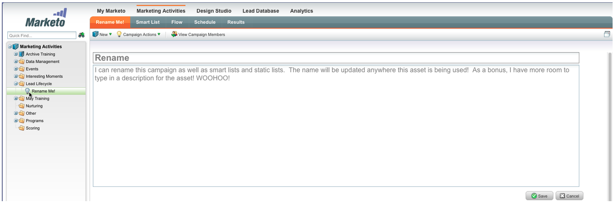

## Import Field Mapping {#import-field-mapping}

We made importing a list into Marketo much easier! During the import process, you can map the name of the Marketo field to the column header name in the import file. Furthermore, in Admin you can set up alias names that are mapped to the field name in Marketo, ensuring your users select the correct field every time.

As you continue to import and map fields, Marketo will remember and display the mappings during import, for ease of use. And to make life even easier, you can click the Sample Value header to see the different values that would populate in the field. This helps ensure you map the correct field every time!

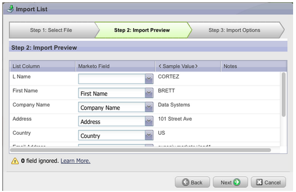

## Summary Page for Smart Lists and Static Lists {#summary-page-for-smart-lists-and-static-lists}

Have you ever wondered where your lists are being used? Or who created the list, or last modified it? The new summary page available on Smart Lists and static lists, will provide you with these important details.

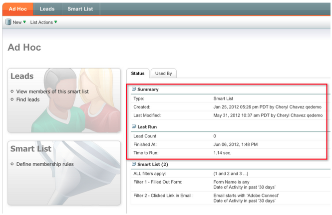

On the existing Program and Campaign summary pages, we added the Created Date/User and the Last Modified date/User information as well!

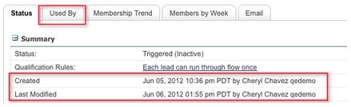

## Used By for Assets {#used-by-for-assets}

We added a new tab to our asset Summary Pages, called Used by!

Example: Used By for Static Lists

## Landing Page Gridlines {#landing-page-gridlines}

The addition of landing page gridlines makes aligning text, graphics, and forms on your landing page a whole lot easier. Turn it on and off for any given landing page, and also adjust the width between the lines!

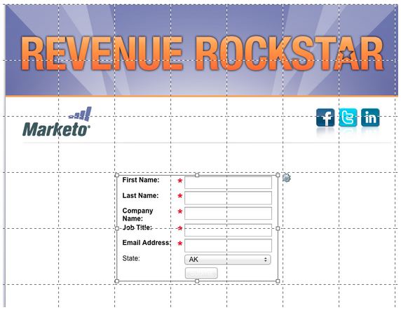

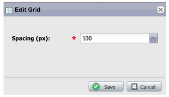

## Leads Blocked from Mailings {#leads-blocked-from-mailings}

When scheduling a campaign, you can click on the link to see the list of leads that are blocked from your mailing.

## Wait Step - Lead Token and My Token {#wait-step-lead-token-and-my-token}

In our May release, we added advanced options to the Wait flow step. With these changes, you can specify a business day, date, and time. In this release, we added the ability to use a token in the wait step. For example, you may want to use `{{lead.Birthday}}` to send an email on their Birthday, or use `{{my.Event Date}}` to send a final webinar reminder.

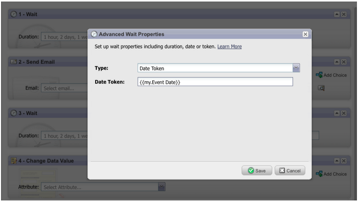

## View as Thumbnails in Design Studio {#view-as-thumbnails-in-design-studio}

Switch your view from a list of images to a thumbnail view!

Note: As of this release, previous sorting on smart list grids will not apply to the next smart list you view. For example, if you sort a smart list by Company Name, we will not automatically sort the next smart list viewed by this same field.  

Reminder: Email Performance Report upgrade is in progress!

## Marketo Revenue Cycle Analytics Enhancements {#marketo-revenue-cycle-analytics-enhancements}

### New Metrics in Program Opportunity Analysis  {#new-metrics-in-program-opportunity-analysis}

You can now get insights into the average number of marketing touches before opportunities are created or closed, as well as the average value of a marketing touch.

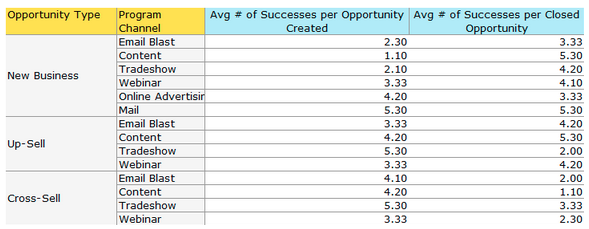

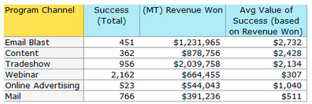

## Displaying Multi-Charts {#displaying-multi-charts}

The multi-chart feature allows you to display multiple charts in a single Revenue Cycle Explorer report. For example, you can use this feature when you want to display the same data over different months. This feature also prevents you from having to create separate filters and reports.

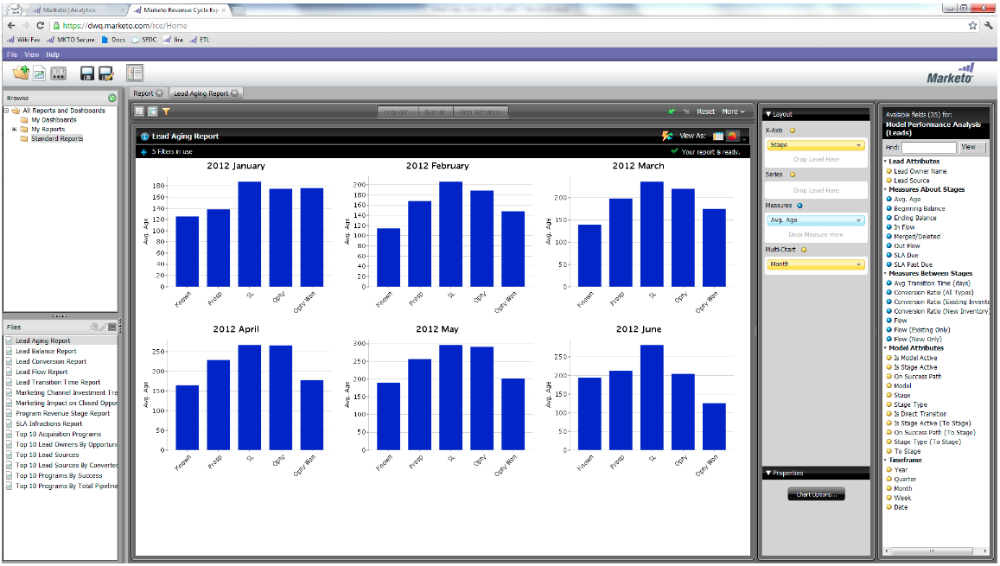

## Heat Grid Chart Type  {#heat-grid-chart-type}

Heat Grids allow you the ability to visualize data so you can identify patterns of Marketing performance. This visualization type will color-code your results so you view complex business analysis in an easy-to-understand visualization.

## Scatter Chart Type  {#scatter-chart-type}

Scatter charts help you visualize data on multiple dimensions in one graph. This visualization type will plot a bubble on a graph based on the attributes used. You can then use a measure to color-code the bubble and/or use a measure to specify the size of the bubble.

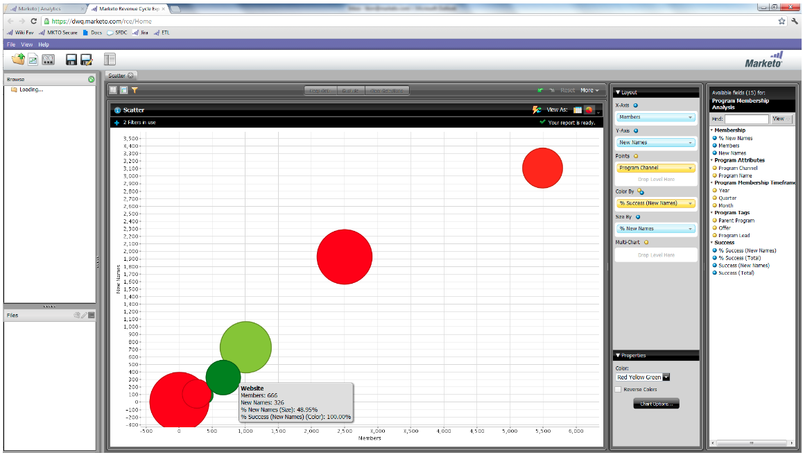
