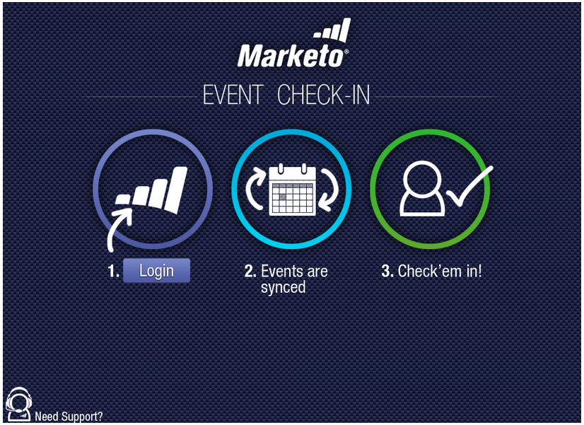

# Release Notes: May 2012 {#release-notes-may}

>[!NOTE]
>
>**Deep Dive**
>
>For other releases, see the [Release Notes](http://docs.marketo.com/display/docs/release+notes) deep dive.

## Email Performance Report Redesign {#email-performance-report-redesign}

Note: this will be a staged roll-out, beginning with the May release

We made the Email Performance and Campaign Email Performance reports run faster. We’ve also improved the definitions of certain metrics and consolidated the "Messages Sent" and "Leads Sent" metrics to a single metric, "Sent”. We've merged “Messages Delivered” and “Leads Delivered” to “Delivered”.

## Wait Step Enhancements {#wait-step-enhancements}

Using the new Advanced Wait properties, you can configure the wait step in a Smart Campaign Flow action to “wait until” a specific day of the week, the next business day, a specific date or time. These enhancements ensure your nurture emails arrive in the Inbox during business hours!

Figure 1. Specify the Wait Step to end on a Business Day

## Archived Assets Hidden {#archived-assets-hidden}

Archived assets are automatically filtered from autosuggest, drop downs, and reports making it easier to find what you are looking for!

Figure 2. Example of the Archived Email Filter

## New Event Check-in App for iPad {#new-event-check-in-app-for-ipad}

Simplify your event check-in process using our new iPad app! The Event Check-in app syncs with your Marketo Program and allows you to easily check registrants into an event, as well as add new leads on the fly.

Requires iOS 5.1 or later; iPad only.

Figure 3. Event Check-In Home Page

Figure 4. Event Check In: Select your Event!

Figure 5. Check them in

## Enhanced Webinar Confirmation URL {#enhanced-webinar-confirmation-url}

Now available for ON24 and Adobe Connect! Include a unique link in the confirmation email for each registered attendee using the new `{{member.webinar URL}}` token. Adobe Connect enhancements also include the ability to turn on/off the Adobe account information email that includes the login ID and password for the user.

Figure 6. Get people to your webinar

## Template Preview {#template-preview}

Looking for a specific template while building your email or landing page, but not sure what it looks like? With the new template preview capability, you can verify the selected template prior to saving a new asset!

Figure 7. Preview your chosen template

## Configurable Form Prefill {#configurable-form-prefill}

Control pre-population of form data at the subscription level and overwrite at the landing page level. Without pre-population, you can ensure the lead provides the most up-to-date information.

Figure 8. Form Prefill Configuration in Admin

Figure 9. Edit Form Prefill Setting on a Landing Page

## Marketo Treasure Chest {#marketo-treasure-chest}

Gain access to experimental features developed by Marketo Engineers to enhance your user experience. This release includes Email Undo, plus the ability to enter comments and collaborate with other users on your landing pages.

\

Figure 10. Manager Treasure Chest Features in Admin

## Microsoft Dynamics® CRM Integration {#microsoft-dynamics-crm-integration}

Sync Accounts, Contacts, and Leads between Marketo and Microsoft Dynamics CRM Online using our new pre-built integration!

Figure 11. Microsoft Dynamics configuration

## Marketo Sales Insight Enhancements {#marketo-sales-insight-enhancements}

**Unsubscribe Footer Options**

Configure when and if the unsubscribe footer displays for emails sent through Sales Insight.

Figure 12. Sales Insight Settings in Admin

## Folders for Sales Email Templates {#folders-for-sales-email-templates}

You can now organize the email templates shared with Marketo Sales Insight into specified folders, making it easier for your sales reps to find the right email.

Figure 13. Choose a folder for your emails

## Access Opportunity Analyzer from Sales Insight {#access-opportunity-analyzer-from-sales-insight}

Provide your Sales Reps with insight into which marketing activities are driving engagement, using direct access to the Opportunity Analyzer from Marketo Sales Insight. Note. Requires Revenue Cycle Analytics license.

## Custom field for Contact Status {#custom-field-for-contact-status}

You can now map a custom field in Salesforce to populate the Status field for Contacts in the My Best Bets, My Team’s Best Bets and custom views.

Figure 14. Map a custom field to Contacts

See Pages Visited by Anonymous Leads

Drill down to the pages viewed by an anonymous lead from the Anonymous Web Activity view.

Figure 15. See Anonymous web activity

## Enhanced Lead and Contact Subscribe {#enhanced-lead-and-contact-subscribe}

Follow a lead or contact any time using the new Subscribe button on the record detail page.

