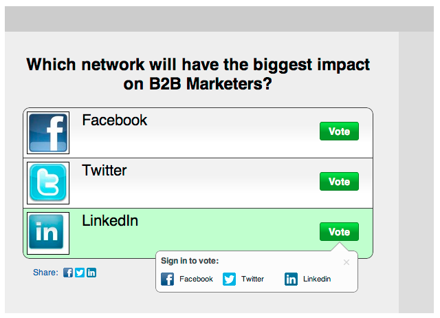

# Release Notes: October 2012 {#release-notes-october}

The October release includes more exciting new features! Social features are available as an add-on or as part of selected bundles.

>[!NOTE]
>
>[Import Programs and Program Exchange](#import-programs-and-program-exchange)  
>[Notifications](#notifications)  
>[Polls](#polls)  
>[Track Social Activities](#track-social-activities)  
>[Social Profiles](#social-profiles)  
>[Revenue Explorer Report Subscriptions](#revenue-explorer-report-subscriptions)

#### Import Programs and Program Exchange {#import-programs-and-program-exchange}

A program can be imported from one Marketo subscription to another. For instance, you can create a program in a sandbox and then import it into your live subscription. Also, you can import a pre-built program from the Marketo Program Library.

>[!NOTE]
>
>Only Marketo users who have been granted permission by a Marketo admin user can import programs. 
>
>Contact Marketo Support to connect a sandbox account your live subscription.

#### Notifications {#notifications}

Notifications keep you up-to-date on system events happening in your Marketo subscription. For example, the system will automatically notify you when a campaign fails or your CRM sync needs attention. Notifications are available on the My Marketo tab. Furthermore, you can subscribe to a notification so that you can receive them in real time, in your email.

#### Polls {#polls}

Create polls to engage your leads in your content! They can vote for their favorite network or movie, and then share the poll with friends through their social networks. You can gather rich analytics about what your leads voted for.

#### Track Social Activities {#track-social-activities}

Find out who's been sharing your content and voting in your polls by creating smart lists based on specific social activities. For example, create a smart campaign to bump up the score for the leads who are sharing your content the most!

#### Social Profiles {#social-profiles}

You can now gather information about your leads when they share content or fill out forms using their social profiles. This includes Facebook, LinkedIn and Twitter handles, the number of friends they have, and more.

#### Revenue Explorer Report Subscriptions {#revenue-explorer-report-subscriptions}

Create report subscriptions and send Revenue Explorer reports on a periodic basis to your key stakeholders, including non-Marketo users. The email contains a preview of your report data table or charts, and an Excel spreadsheet with all of the report data.

>[!NOTE]
>
>Only available for users who have Revenue Explorer by purchasing Revenue Cycle Analytics with the Enterprise or the Select Edition.

