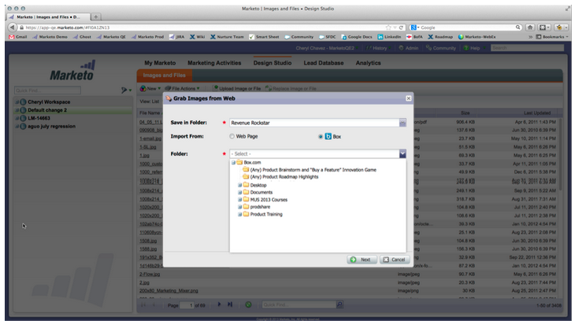

# Release Notes: April 2013 {#release-notes-april}

The following features are included in the April release. Please check your [Marketo Edition](http://docs.marketo.com/display/docs/assets/pricing.php) for feature availability.

After the release, be sure to check out the [New Release](release-notes-december-2013.md) tab in the Community for detailed Knowledge Base articles for each feature!

## Box Integration {#box-integration}

Connect Marketo with your Box account to easily copy files into the design studio.

## Gmail Plugin {#gmail-plugin}

If you use Marketo Sales Insight, as well as Gmail, you can install our new Gmail plugin through the Chrome store. The plugin allows you to log messages with Marketo, load Marketo email templates, and send messages with Marketo tracking features.

## Email Analysis {#email-analysis}

Create advanced email reports in Revenue Explorer such as the Click Activity Heat Grid report. This report will give insight into the day and time people are clicking links in your emails.

The Email Analysis feature as a whole will be turned on in phases during April and May as we migrate your 2012 and 2013 email data. In other words, some customers will have access to this feature sooner than others.

## Program APIs {#program-apis}

Support for programs in the SOAP API call, including read-only access to program data such as: program membership counts, acquired by, success, settings, channels, tags, tokens and costs. Please see the SOAP API documentation for more details.

## ON24 Enhancement {#on-enhancement}

Job Title and Company Name will sync to ON24 from your Marketo registration form.
