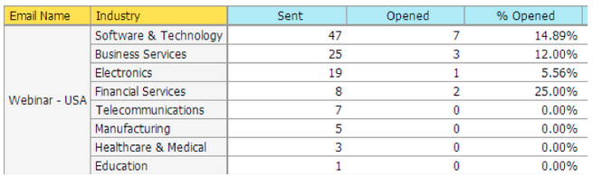

# Release Notes: December 2013 {#release-notes-december}

The following features are included in the December release. Please check your [Marketo Edition](https://docs.marketo.com/display/docs/assets/pricing.php) for feature availability.

After the release, be sure to check out the New Release tab in the Community for detailed Knowledge Base articles for each feature!

## Sweet Background Photos {#sweet-background-photos}

We have started to express our creative flair in the application. Each quarter, a new artist will be featured. To kick us off, we selected [Trey Ratcliff](https://stuckincustoms.smugmug.com/).

## Email Program {#email-program}

Sending an email has never been easier. Use the new [email program](/help/marketo/product-docs/email-marketing/email-programs/creating-an-email-program/understanding-email-programs.md) to send a batch email, instead of the Default Program. Define the smart list, email, schedule it, and you are off!

Also check out the new [Email Metrics Dashboard](/help/marketo/product-docs/email-marketing/email-programs/email-program-data/view-the-email-program-dashboard.md) to see how your email performed.

## Email A/B Testing {#email-a-b-testing}

In the new Email Program, run an [A/B test](/help/marketo/product-docs/email-marketing/email-programs/email-program-actions/email-test-a-b-test/add-an-a-b-test.md) on a percentage of the overall email send population. Choose from 4 different types of tests: Subject line, From Address, Date/Time, and Whole Email. You can even choose to manually promote the winner, or let the system promote it based on a pre-defined winning criteria. The new Email program, including A/B test, can be nested in Events and the default Program to make that email send so simple!

## Email Champion/Challenger Testing {#email-champion-challenger-testing}

[Champion/Challenger testing](/help/marketo/product-docs/email-marketing/general/functions-in-the-editor/email-tests-champion-challenger/add-an-email-champion-challenger.md) is similar to A/B test, but the difference is that it is used for triggered emails and you don’t automatically send a winner. This test allows you to challenge an established way of doing something, called the Champion, and you test if it is still the best by introducing a Challenger. In addition, Champion/Challenger Email Tests can be used inside Engagement program streams.

## Lead Details in Email Analysis {#lead-details-in-email-analysis}

We introduced additional lead and company attributes in Email Analysis. You can now view your email stats grouped by new attributes such as Industry and Lead Source.

## Enhanced BrightTALK Event Adapter {#enhanced-brighttalk-event-adapter}

Now you can pull registrants into Marketo from your BrightTALK channel and event. You can use this information to inform other marketing campaigns!
