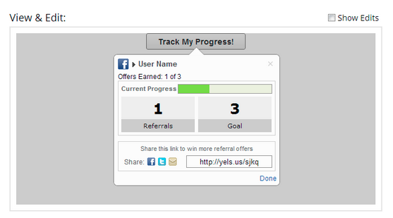
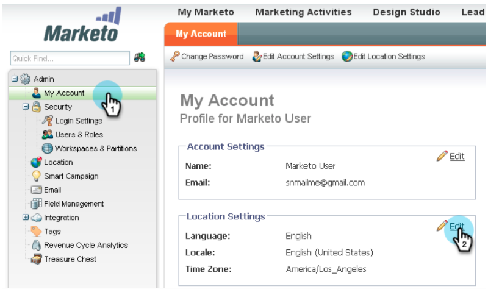
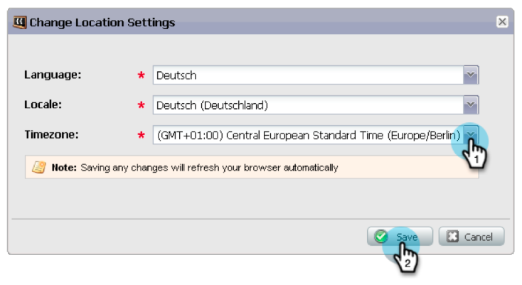
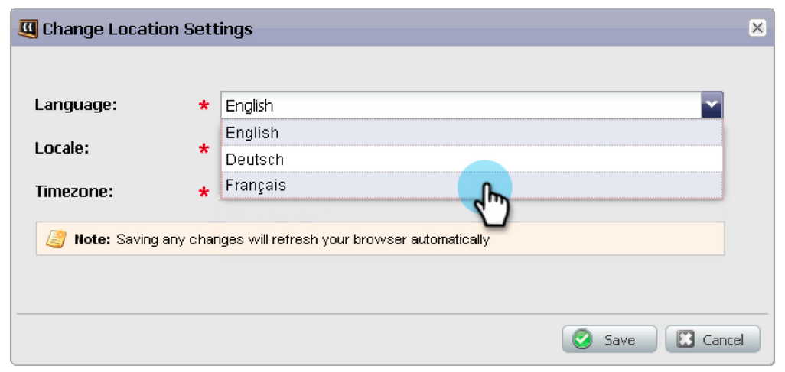
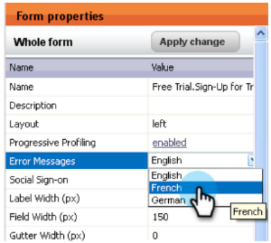
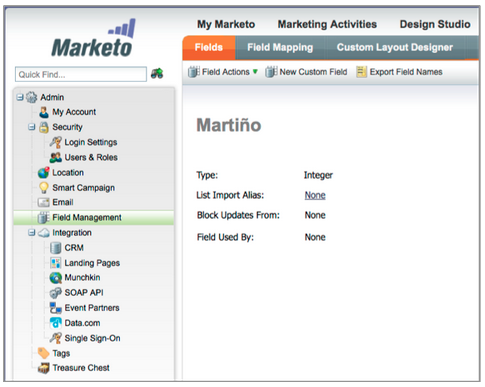
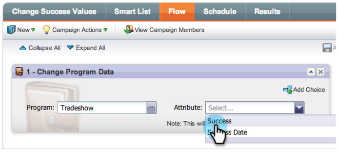

# Release Notes: January 2013 {#release-notes-january}

The January release expands our social offering with **Referral Offers**. In addition, Marketo Lead Management users can set their time zone, language, and locale preference. Please note that features marked with an &#42; are available only in the Select Edition.

## Referral Offers {#referral-offers}

A **Referral Offer** gives your leads an incentive to refer their friends. Create goals and rewards for successful referrals. You can use it on landing pages, your website, and even Facebook.

## Time Zone Preference {#time-zone-preference}

You can change the default time zone for your personal Marketo account. For example, even if the default for the subscription is Pacific Time, you can change it to Eastern Time for your own account.

## Select your Marketo Lead Management Language {#select-your-marketo-lead-management-language}

You can change the default language for your Marketo user account. Even if the default for the subscription is in English, you can change it to German or French for your own use.

## Multi-Lingual Form Error Messages {#multi-lingual-form-error-messages}

When a lead fills out a Marketo form, some validation messages are automatically built in. You may want to select a different display language for these error messages. We now support English, German, and French.

An example of a French form:

## Select your Sales Insight Language (Salesforce Only) {#select-your-sales-insight-language-salesforce-only}

If your Salesforce language preference is set to either French or German, Marketo Sales Insight will honor this preference. Download the latest MSI package to get this functionality (available the week of January 14).

## Field Display Name {#field-display-name}

Field Display Names can display text in different languages (e.g. multi-byte characters are supported).

 

## Change Program Data {#change-program-data}

The Change Program Data flow step allows you to change the Success status and Success Date of a program member manually through a campaign. You can use this flow step to correct a mistake, or to manually change a member who may not have participated in the program as intended.

