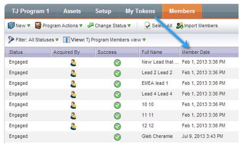

# Release Notes: July 2013 {#release-notes-july}

The following features are included in the July release which is scheduled for a Friday, July 26 rollout.

## Exhausted Content Widget on the Dashboard {#exhausted-content-widget-on-the-dashboard}

Provides information on when leads will exhaust the content within the Stream. The system will provide you with information on how many leads are about to reach exhausted content, or how long leads have been exhausted.

## Communication Limits {#communication-limits}

Want to stop over-emailing leads? Now it's easy to automatically limit frequency to each individual. Simply set a daily and weekly communication limit, and the system will do the rest. Available in Select, Enterprise, and with the Add-On package for Standard customers.

## Cobalt User Interface {#cobalt-user-interface}

Over the next few months, you will notice more of our new theme rolling out in different parts of the application. No functionality will be moved or removed.

## Program Member Date Column {#program-member-date-column}

View and sort the member grid by the date that the lead was added.

## Changes to Spell Check in WYSIWYG Editor {#changes-to-spell-check-in-wysiwyg-editor}

The service utilized by the WYSIWYG editor for spell check was discontinued. We removed the Spell Check button from the editor until we find a replacement.
