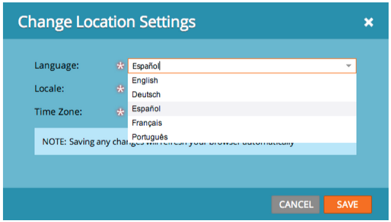

# Release Notes: June 2013 {#release-notes-june}

The following features are included in the June release.

## Additional User Languages {#additional-user-languages}

View the Marketo Lead Management interface in your preferred language -- now supporting Spanish and Portuguese.

## Cobalt User Interface {#cobalt-user-interface}

Over the next few months you will notice a new theme rolled out in different parts of the application; impacting modal windows for example.

## Subfolder Cloning {#subfolder-cloning}

Clone assets into subfolders.

## Multiple Models {#multiple-models}

A top idea for Revenue Cycle Analytics (RCA) in the Community, this feature allows you to create multiple models to have a more detailed understanding of your revenue funnel by product line, business unit, or region. The Leads by Revenue Stage, Success Path Analyzer, Program Analyzer and Revenue Explorer reports now supports the ability to select a specific model for reporting.

By default, two models are available for Select SMB Edition and fifteen models for Enterprise Edition. You may purchase additional models also.

