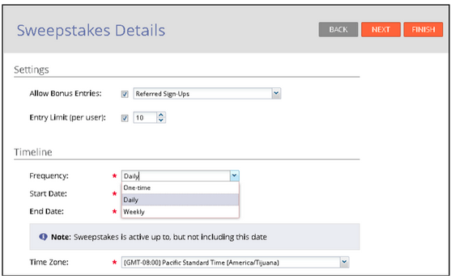
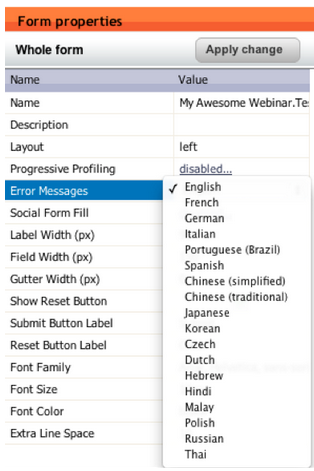

# Release Notes: March 2013 {#release-notes-march}

The following features are included in the March release. Please check your [Marketo Edition](http://docs.marketo.com/display/docs/assets/pricing.php) for feature availability.

After the release, be sure to check out the [New Release](release-notes-december-2013.md) tab in the Community for detailed Knowledge Base articles for each feature!

### What's in this article? {#whats-in-this-article}

[Marketo Calendar Files](#marketo-calendar-files)  
[Wait Until +/-](#wait-until)  
[Social Sweepstakes](#social-sweepstakes)  
[Additional Form Error Message Languages](#additional-form-error-message-languages)  
[Support News and Alerts](#support-news-and-alerts)

#### Marketo Calendar Files {#marketo-calendar-files}

Create a calendar file as a **My Token** to be used in your event confirmation and reminder emails. This integrated calendar file (e.g. .ics file) will render all tokens, including My Tokens and the {{member.webinar URL}} token.

#### Wait Until +/- {#wait-until}

Create Wait Steps that can execute a specified number of days before or after a date token. For example, you can create a wait step that will wait 3 days before the event date and then send a reminder!

You can create a wait step that will wait 14 days before the lead’s birthday. By selecting “use next anniversary of this date” the system will automatically ignore the year associated with the date, and use the current or next calendar year instead.

#### Social Sweepstakes {#social-sweepstakes}

A sweepstakes gives your leads a chance to win a prize and tell their friends about you. You select random winners from the participants and send them email.

#### Additional Form Error Message Languages {#additional-form-error-message-languages}

More than a dozen languages have been added to the form error messages!

#### Support News and Alerts {#support-news-and-alerts}

Stay connected to Marketo Customer Support by subscribing to Support News and Alerts for P1 Alerts, Known Issues, Hints and Tips from our Support Experts, and updates from Marketo Customer Support.
