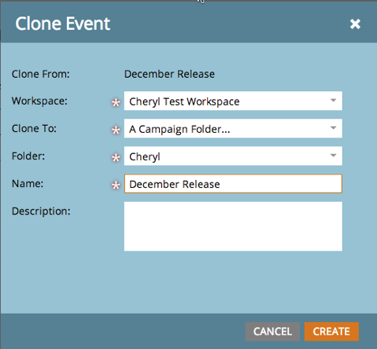

# Release Notes: December 2014 {#release-notes-december}

The following features are included in the December 2014 release. Please check your Marketo Edition for feature availability. After the release, be sure to come back to find links to detailed articles for each feature!

## Sales Insight Reports {#sales-insight-reports}

The [Sales Insight Email Performance Report](../../product-docs/marketo-sales-insight/msi-for-salesforce/features/performance-reports/sales-insight-email-performance-report.md) allows you to see email metrics by email and Sales Representative. It supports emails sent out through Salesforce, Microsoft Dynamics, the Outlook plug-in and the Gmail plug-in.

## Facebook Custom Audiences {#facebook-custom-audiences}

Once your Marketo admin has added [Facebook via Admin > Launchpoint](../../product-docs/demand-generation/ad-network-integrations/add-facebook-custom-audiences-as-a-launchpoint-service.md), you can easily create, update or [replace a Facebook Custom Audience with leads from a Marketo static or smart list](../../product-docs/demand-generation/facebook/create-a-custom-audience-in-facebook.md). Look for the new Facebook icon along the bottom of the lead grid of any static or smart list.

## Improved Cloning Across Workspaces  {#improved-cloning-across-workspaces}

[Cloning a program](../../product-docs/core-marketo-concepts/programs/working-with-programs/clone-a-program.md) to another workspace has never been easier! When you click clone, you select the destination workspace. No more cloning into a folder and then moving the folder!

>[!NOTE]
>
>This new clone feature is only available for programs at this time.

## Reference Smart List {#reference-smart-list}

[Smart lists that are shared with another workspace can be referenced](../../product-docs/core-marketo-concepts/smart-lists-and-static-lists/using-smart-lists/reference-a-list-or-smart-list-across-workspaces.md)when building a smart list or flow.

## List Import Improvements {#list-import-improvements}

[Import files](../../getting-started/quick-wins/import-a-list-of-people.md) encoded in UTF-16, Shift-JIS, or EUC-JP. We continue to support UTF-8 encoded files.

## Link Tracking in Email Scripting {#link-tracking-in-email-scripting}

Links within email scripts will now be tracked and available within the Email Link Performance report.

## Token Encoding Setting {#token-encoding-setting}

We’ve rolled out a new security feature to automatically HTML encode tokens, which will be enabled by default in March 2015. Until then, toggle this functionality in Field Management to test the behavior ahead of time. All lead and company tokens will be encoded when inserted into emails or landing pages. Options will also be available for individual fields.

## New ReST API Calls {#new-rest-api-calls}

Three new calls for the Lead & Activity ReST API:

· Get Lead Partitions

· Associate Lead

· Merge Lead

Full details will be available after the release at [developers.marketo.com](http://developers.marketo.com/)

## Munchkin Javascript Compatibility Enhancements {#munchkin-javascript-compatibility-enhancements}

We’ve made several minor enhancements to Munchkin to ensure it continues to load quickly and function as desired in cases with other JavaScript on the page.

Rollout will be staged starting in mid-December and continuing for the next several months.

## Revenue Explorer Upgraded Look and Feel {#revenue-explorer-upgraded-look-and-feel}

## RTP: Named Account List Module {#rtp-named-account-list-module}

Manage and monitor your key high-yield accounts in the new Named Accounts page. Upload new lists of named accounts to identify and target these organizations. We’ve automated the process providing you more control and flexibility to implement your account-based marketing plans and target your key accounts across different channels (web and advertising).

## RTP: Sliding Effect for In Zone Campaigns {#rtp-sliding-effect-for-in-zone-campaigns}

We’ve added a new Sliding effect for In Zone campaigns to allow for your personalized content to slide into place upon page load.

