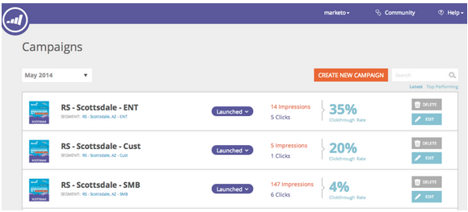

# Release Notes: June 2014 {#release-notes-june}

Release Notes: June 2014 - Marketo Docs - Product Documentation

The following features are included in the June 2014 release. Please check your Marketo Edition for feature availability.

### What's in this article? {#whats-in-this-article}

[Updated UI - Coming Soon!](#updated-ui-coming-soon)  
[Sales Insight plugin for Outlook 2013](#sales-insight-plugin-for-outlook)  
[Token Resolution](#token-resolution)  
[Customize Percentages for Stars and Flames](#customize-percentages-for-stars-and-flames)  
[Lead ReST API](#lead-rest-api)  
[Marketo Real-Time Personalization (RTP) Campaigns Page Update](#marketo-real-time-personalization-rtp-campaigns-page-update)  
[Web Analytics Integrations](#web-analytics-integrations)

#### Updated UI - Coming Soon! {#updated-ui-coming-soon}

A new look and feel, including navigation for Marketo Lead Management is coming soon in a later release!

#### Sales Insight plugin for Outlook 2013 {#sales-insight-plugin-for-outlook}

This will require a download of the new plug-in. You can download it from [here](../../product-docs/marketo-sales-insight/msi-outlook-plugin/install-the-marketo-email-add-in-for-outlook-with-a-registration-code.md).

#### Token Resolution {#token-resolution}

When you send a test email from Sales Insight, currently tokens in the email do not resolve and the default value is sent. This enhancement will ensure that tokens resolve in test emails.

#### Customize Percentages for Stars and Flames {#customize-percentages-for-stars-and-flames}

[Set the percentage](../../product-docs/marketo-sales-insight/msi-for-salesforce/features/stars-and-flames/customize-stars-and-flames.md) of leads that get 1, 2, or 3 stars and flames.

#### Lead ReST API {#lead-rest-api}

Create, read, and update leads programmatically through our new ReST API. To get started with ReST you need to [create a custom service](../../product-docs/administration/additional-integrations/create-a-custom-service-for-use-with-rest-api.md) in Marketo. Then head over to the [developers site](http://developers.marketo.com/documentation/rest/) for details on using this API.

#### Marketo Real-Time Personalization (RTP) Campaigns Page Update {#marketo-real-time-personalization-rtp-campaigns-page-update}

RTP Campaigns now include a new design with thumbnail views and campaign performance. Additionally, you can [organize your campaigns](../../product-docs/web-personalization/working-with-web-campaigns/sort-web-campaigns-by-latest-or-top-performing.md) according to date or top performance.

#### Web Analytics Integrations {#web-analytics-integrations}

Append all your RTP data within your web analytics platform.

The integration with [Google Analytics](../../product-docs/web-personalization/reporting-for-web-personalization/web-analytics-integrations/integrate-rtp-with-google-analytics.md) (GA) is now enabled by default, so under Account Settings turn on the switch for which data you want to send through to GA custom variables and events.

We also completed the integration with [Adobe SiteCatalyst](../../product-docs/web-personalization/reporting-for-web-personalization/web-analytics-integrations/integrate-with-adobe-analytics.md).
