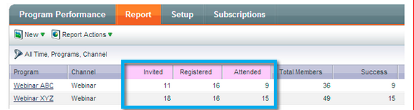
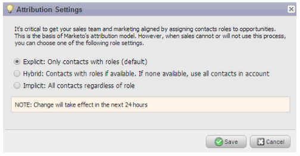

# Release Notes: March 2014 {#release-notes-march}

The following features are included in the March 2014 release. Please check your Marketo Edition for feature availability. After the release, be sure to come back for links to knowledge base articles for each feature.

## Email Program Dashboard Refresh Button {#email-program-dashboard-refresh-button}

Use the [refresh button](../../product-docs/email-marketing/email-programs/email-program-data/use-the-email-program-dashboard.md) to get up-to-the minute email metrics about your email send or your AB test!

## Undo/Redo in the Email Editor and Snippet Editor {#undo-redo-in-the-email-editor-and-snippet-editor}

[Undo or redo](../../product-docs/email-marketing/general/email-editor-2-0/edit-elements-in-an-email.md) up to 50 actions for the current session.

## Program Status Columns in Program Performance Report {#program-status-columns-in-program-performance-report}

When using the [program performance report](../../product-docs/core-marketo-concepts/programs/program-performance-report/add-program-status-columns-to-a-program-report.md), you can now see how many people are in which program statuses.

## Inclusive and Operational Programs for Analytics {#inclusive-and-operational-programs-for-analytics}

You can now [include programs without period costs](../../product-docs/reporting/revenue-cycle-analytics/program-analytics/make-a-program-without-a-period-cost-available-in-revenue-explorer-and-analyzers.md) in Revenue Explorer and Analyzers by setting the Analytics Behavior option to “Inclusive” when you edit Program Channels. You can also exclude operational programs from reporting all together by choosing “Operational”.

## Hybrid and Implicit Options for Lead Conversion {#hybrid-and-implicit-options-for-lead-conversion}

You can change the way Marketo ties contacts and opportunities for the lead conversion metrics in Lead Analysis. You can [change the attribution setting](../../product-docs/administration/settings/change-attribution-settings-for-analytics.md) to one of three choices. Changing this setting does not modify any Marketo or CRM data; it simply changes the way your reports run and it can be reverted at any time.

The Explicit setting will only treat contacts with roles in an opportunity as converted leads (default behavior). Implicit will treat all contacts associated to the account in the opportunity, regardless of role, as converted. Hybrid will treat contacts with roles as converted if available; if none, we treat all contacts in the account as converted.

As a reminder, this setting also changes program attribution metrics.

## Additional User Language {#additional-user-language}

Select Your [Marketo Application Language](../../product-docs/administration/settings/select-your-language-locale-and-time-zone.md). View the Marketo Lead Management interface in your preferred language -- now supporting Japanese.

## Marketo Developer Blog {#marketo-developer-blog}

The [Marketo Developer blog](http://developers.marketo.com/blog/) is dedicated to those web developers and software engineers who support the rapidly evolving needs of the modern marketer. You can subscribe to announcements on new integration options, API version updates, and a new series of how-to articles that include code samples and best practices on integration with the Marketo platform.

The [first article](http://developers.marketo.com/blog/retrieving-customer-and-prospect-information-from-marketo-using-the-api/) in this series will walk you through how to efficiently retrieve information on the people (customers/contacts/leads) that are stored within Marketo using the API.
