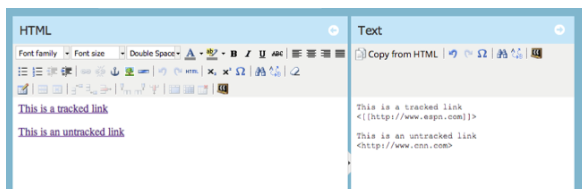
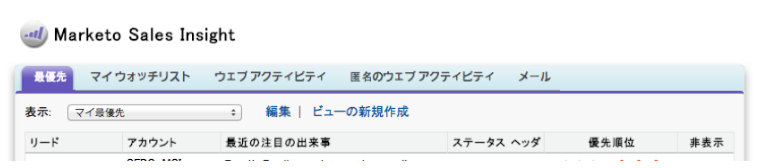

# Release Notes: May 2014 {#release-notes-may}

The following features are included in the May 2014 release. Please check your Marketo Edition for feature availability. After the release, be sure to come back to find links to detailed Knowledge Base articles for each feature!

## Delete Workspace {#delete-workspace}

Now you can [delete an unused workspace](../../product-docs/administration/workspaces-and-person-partitions/delete-a-workspace.md). Be sure to move all assets into another workspace before attempting to delete the workspace.

## Schedule First Cast {#schedule-first-cast}

In engagement programs, you can schedule the date for the [first cast to run](../../product-docs/email-marketing/drip-nurturing/engagement-program-streams/set-stream-cadence.md). For example, specify the cadence to be every 2 weeks and select the date of the first cast.

## Enhanced Engagement Programs {#enhanced-engagement-programs}

Now everyone gets multiple programs, streams and communication limits.

## Link Tracking in Text Emails {#link-tracking-in-text-emails}

[Add double square brackets](../../product-docs/email-marketing/general/functions-in-the-editor/add-tracked-links-to-a-text-email.md) around URLs in the text version of your emails to indicate when links should be converted into re-directed Marketo tracking links

>[!NOTE]
>
>**Example**
>
>[[[http://www.marketo.com](http://www.marketo.com)]]

By default, no links will be tracked in the text version of emails. Add this new syntax to indicate when a link should be converted into a tracking link. The behavior of HTML links is unchanged.  To add tracked links to your emails:

* **HTML version:** Just insert your link. It will be tracked by default.
* **Text version:** Enter the URL surrounded by double square brackets.

To add untracked links to your emails:

* **HTML version:** Insert your link and add the “mktNoTrack” class to the link.
* **Text version:** Just enter the URL. It will be untracked by default.

## Link Markup in Sample Emails {#link-markup-in-sample-emails}

See how your links will behave in emails ahead of time. Sample emails now display links exactly how they would appear to your leads. Preview which links have been converted to tracking links, giving you a better sense of how the message will actually appear to recipients.

## Abort Campaign {#abort-campaign}

Don’t panic! If you find a mistake, use the new [abort campaign](../../product-docs/core-marketo-concepts/smart-campaigns/using-smart-campaigns/abort-a-smart-campaign.md) button to immediately stop campaigns in their tracks. You’ll receive a notification outlining how many leads were pending in each flow step when the campaign was stopped.

## Sales Insight in Japanese, Portuguese and Spanish {#sales-insight-in-japanese-portuguese-and-spanish}

Download the latest version of Sales Insight from AppExchange so your Japanese, Portuguese and Spanish speaking sales agents view Sales Insight content in their preferred language.

## Program Status and Success Timeframe in Program Membership Analysis {#program-status-and-success-timeframe-in-program-membership-analysis}

View how many [members are in each Program Status](../../product-docs/reporting/revenue-cycle-analytics/program-analytics/build-a-program-membership-analysis-report-that-lists-leads.md) and when they changed to each status, including the date when they achieved Program Success.

## A/B Test Emails in Email Analysis {#a-b-test-emails-in-email-analysis}

Report on each of your [A/B test email variants](../../product-docs/reporting/revenue-cycle-analytics/email-analysis/build-an-email-analysis-report-that-shows-program-information.md) in Email Analysis.

## Analytics Packaging Changes {#analytics-packaging-changes}

Revenue Cycle Modeler and Success Path Analyzer are now included in MA Standard Edition.

## Mobile Platform Info {#mobile-platform-info}

[Segment and trigger](../../product-docs/reporting/basic-reporting/report-activity/build-a-people-performance-report-with-mobile-platform-columns.md) off of leads opening and clicking emails from their mobile devices.

>[!NOTE]
>
>Check out Previous [Marketo Release Notes](http://docs.marketo.com/display/docs/release+notes)

